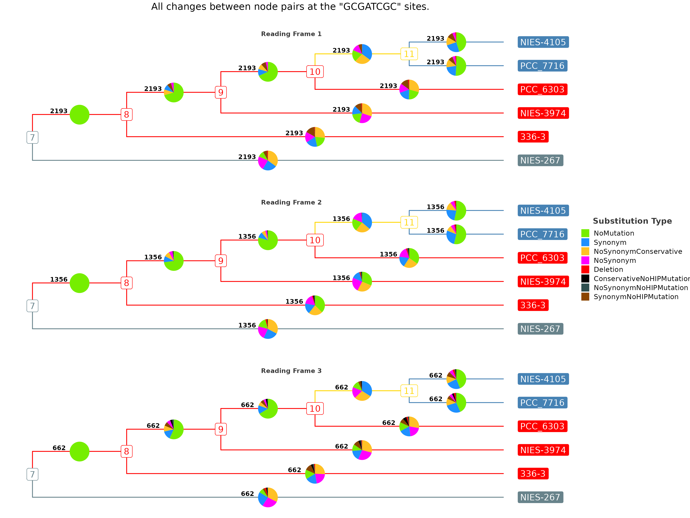

# Materials and methods 

## Case of interest 

This analysis focuses on the **Calothrix subclade**, which is composed of 6 species. The importance of this clade lies in the fact that the subclade with the species ***Calothrix sp. 336/3***, ***Calothrix sp. NIES 3974*** and ***Calothrix sp. PCC 6303*** contains a high abundance of **HIP1** sites while the subclade with the species ***Calothrix PCC 7716***, ***Calothrix sp. NIES 4071*** and ***Calothrix sp. NIES 4105*** has a very low or no abundance of sites. Not to mention that the last 3 species have a significant abundance of another palindrome (**GGCGCC**), which is found in very low (or null) abundance in the other three species (**Figure** \@ref(fig:FIG1x)). 

<div class="figure" style="text-align: center">

<p class="caption">(\#fig:FIG1x)**Phylogeny of the Calothrix clade**. In this figure, we can see the annotated phylogeny of the Calothrix clade. The heatmap included in the figure indicates the observed frequency per 1000 nts of each palindromic octamer in each of the species, while the barplot showcases the most abundant octamer.</p>
</div>

## General diagram 
<div class="figure" style="text-align: center">

<p class="caption">(\#fig:FIG2x)**General project diagram.**</p>
</div>

## Phylogeny 

To perform the analysis, phylogeny is needed. The phylogeny used in this analysis was constructed using 5 species from the Calothrix clade. To build this phylogeny, `orthofinder` software was used, which uses maximum likelihood to create it. The subclade with the species *Calothrix sp 336/3*, *Calothrix sp NIES 3974* and *Calothrix sp PCC 6303* (hereafter **H Subclade**) contain high abundance of HIP1 sites while the subclade with the species *Calothrix sp PCC 7716* and *Calothrix sp NIES 4105* (hereafter **L Subclade**) contains low abundance. The species *Calothrix sp NIES 4071* was omitted because this genome is almost identical to that of *Calothrix sp NIES 4105*. The species *Calothrix sp NIES-267* was also added as an outgroup (**Figure** \@ref(fig:FIG3x)). 

<div class="figure" style="text-align: center">

<p class="caption">(\#fig:FIG3x)*Calothrix subclades.* In this figure we can see the calothrix clade phylogeny. In red we see the subclade that contains an abundance of HIP1 sites and in blue the subclade with low abundance. In yellow the transition from node 9 to 10 is shown, which is of interest since it is the moment in which the abundances of the palindromes change. In gray the species Calothrix parasitica NIES 267 is shown as an outgroup.</p>
</div>


## Orthogroups 

Sites for this analysis were obtained from orthogroups among the 6 species in the phylogeny. 

### Pangenome 

In this part we identify the orthogroups families that make up the **pan-genome** of the 6 species of phylogeny. The pan-genome is defined as the set of all gene families. In turn, a subset of this is the core genome that contains only the genes present in all 6 genomes. 

To know the pan-genome, the `get_homologues.pl` pipeline (@{contreras2013get_homologues}) was used with the options: 
```
get_homologues.pl -d genomes_directory/ -t 0 -M -n PPN 
```

This left us with a total of **17451 orthogroups**.

### Core genome 

`get_homologues.pl` also compute consensus **core-genome** clusters from the solutions generated by the three clustering algorithms it implements, and consensus pan-genome clusters from COGtriangles and OMCL clustering results. The `get_homologues.pl` program options used are shown below: 

```
compare_clusters.pl -o pangenoma -m -d orthogroups_directory/
```

This creates a matrix of presence/absence of genes throughout the species (**Table** \@ref(tab:TAB1X)). Subsequently, all those orthogroups that are not useful are filtered out. This left us with a total of **2393 orthogroups**.  

<table class=" lightable-paper table table-striped table-condensed" style='font-family: "Arial Narrow", arial, helvetica, sans-serif; margin-left: auto; margin-right: auto; font-size: 11px; width: auto !important; margin-left: auto; margin-right: auto;'>
<caption style="font-size: initial !important;">(\#tab:TAB1X)**Matrix of presence/absence of genes.** The table shows the first 10 rows of the pangenomic matrix. A value of 1 indicates that the ortholog is present in the genome. A value of 0 indicates that the ortholog is absent.</caption>
 <thead>
  <tr>
   <th style="text-align:left;position: sticky; top:0; background-color: #FFFFFF;"> Gene </th>
   <th style="text-align:left;position: sticky; top:0; background-color: #FFFFFF;"> NIES.267 </th>
   <th style="text-align:left;position: sticky; top:0; background-color: #FFFFFF;"> X336.3 </th>
   <th style="text-align:left;position: sticky; top:0; background-color: #FFFFFF;"> NIES.3974 </th>
   <th style="text-align:left;position: sticky; top:0; background-color: #FFFFFF;"> NIES.4105 </th>
   <th style="text-align:left;position: sticky; top:0; background-color: #FFFFFF;"> PCC_6303 </th>
   <th style="text-align:left;position: sticky; top:0; background-color: #FFFFFF;"> PCC_7716 </th>
  </tr>
 </thead>
<tbody>
  <tr>
   <td style="text-align:left;font-weight: bold;"> 16222_response_regulator.faa </td>
   <td style="text-align:left;"> <span style="display: block; padding: 0 4px; border-radius: 4px; background-color: #ffa500">1</span> </td>
   <td style="text-align:left;"> <span style="display: block; padding: 0 4px; border-radius: 4px; background-color: #ffffff">0</span> </td>
   <td style="text-align:left;"> <span style="display: block; padding: 0 4px; border-radius: 4px; background-color: #ffa500">1</span> </td>
   <td style="text-align:left;"> <span style="display: block; padding: 0 4px; border-radius: 4px; background-color: #ffa500">1</span> </td>
   <td style="text-align:left;"> <span style="display: block; padding: 0 4px; border-radius: 4px; background-color: #ffffff">0</span> </td>
   <td style="text-align:left;"> <span style="display: block; padding: 0 4px; border-radius: 4px; background-color: #ffa500">1</span> </td>
  </tr>
  <tr>
   <td style="text-align:left;font-weight: bold;"> 16223_ATP-binding_protein.faa </td>
   <td style="text-align:left;"> <span style="display: block; padding: 0 4px; border-radius: 4px; background-color: #ffa500">1</span> </td>
   <td style="text-align:left;"> <span style="display: block; padding: 0 4px; border-radius: 4px; background-color: #ffffff">0</span> </td>
   <td style="text-align:left;"> <span style="display: block; padding: 0 4px; border-radius: 4px; background-color: #ffa500">1</span> </td>
   <td style="text-align:left;"> <span style="display: block; padding: 0 4px; border-radius: 4px; background-color: #ffffff">0</span> </td>
   <td style="text-align:left;"> <span style="display: block; padding: 0 4px; border-radius: 4px; background-color: #ffffff">0</span> </td>
   <td style="text-align:left;"> <span style="display: block; padding: 0 4px; border-radius: 4px; background-color: #ffffff">0</span> </td>
  </tr>
  <tr>
   <td style="text-align:left;font-weight: bold;"> 16224_ATP-binding_protein.faa </td>
   <td style="text-align:left;"> <span style="display: block; padding: 0 4px; border-radius: 4px; background-color: #ffffff">0</span> </td>
   <td style="text-align:left;"> <span style="display: block; padding: 0 4px; border-radius: 4px; background-color: #ffffff">0</span> </td>
   <td style="text-align:left;"> <span style="display: block; padding: 0 4px; border-radius: 4px; background-color: #ffa500">1</span> </td>
   <td style="text-align:left;"> <span style="display: block; padding: 0 4px; border-radius: 4px; background-color: #ffffff">0</span> </td>
   <td style="text-align:left;"> <span style="display: block; padding: 0 4px; border-radius: 4px; background-color: #ffffff">0</span> </td>
   <td style="text-align:left;"> <span style="display: block; padding: 0 4px; border-radius: 4px; background-color: #ffffff">0</span> </td>
  </tr>
  <tr>
   <td style="text-align:left;font-weight: bold;"> 16225_response_regulator_t...faa </td>
   <td style="text-align:left;"> <span style="display: block; padding: 0 4px; border-radius: 4px; background-color: #ffa500">1</span> </td>
   <td style="text-align:left;"> <span style="display: block; padding: 0 4px; border-radius: 4px; background-color: #ffffff">0</span> </td>
   <td style="text-align:left;"> <span style="display: block; padding: 0 4px; border-radius: 4px; background-color: #ffa500">1</span> </td>
   <td style="text-align:left;"> <span style="display: block; padding: 0 4px; border-radius: 4px; background-color: #ffa500">1</span> </td>
   <td style="text-align:left;"> <span style="display: block; padding: 0 4px; border-radius: 4px; background-color: #ffffff">0</span> </td>
   <td style="text-align:left;"> <span style="display: block; padding: 0 4px; border-radius: 4px; background-color: #ffa500">1</span> </td>
  </tr>
  <tr>
   <td style="text-align:left;font-weight: bold;"> 16226_bchB.faa </td>
   <td style="text-align:left;"> <span style="display: block; padding: 0 4px; border-radius: 4px; background-color: #ffa500">1</span> </td>
   <td style="text-align:left;"> <span style="display: block; padding: 0 4px; border-radius: 4px; background-color: #ffa500">1</span> </td>
   <td style="text-align:left;"> <span style="display: block; padding: 0 4px; border-radius: 4px; background-color: #ffa500">1</span> </td>
   <td style="text-align:left;"> <span style="display: block; padding: 0 4px; border-radius: 4px; background-color: #ffa500">1</span> </td>
   <td style="text-align:left;"> <span style="display: block; padding: 0 4px; border-radius: 4px; background-color: #ffa500">1</span> </td>
   <td style="text-align:left;"> <span style="display: block; padding: 0 4px; border-radius: 4px; background-color: #ffa500">1</span> </td>
  </tr>
  <tr>
   <td style="text-align:left;font-weight: bold;"> 16227_beta-ketoacyl-ACP_sy...faa </td>
   <td style="text-align:left;"> <span style="display: block; padding: 0 4px; border-radius: 4px; background-color: #ffffff">0</span> </td>
   <td style="text-align:left;"> <span style="display: block; padding: 0 4px; border-radius: 4px; background-color: #ffffff">0</span> </td>
   <td style="text-align:left;"> <span style="display: block; padding: 0 4px; border-radius: 4px; background-color: #ffa500">1</span> </td>
   <td style="text-align:left;"> <span style="display: block; padding: 0 4px; border-radius: 4px; background-color: #ffffff">0</span> </td>
   <td style="text-align:left;"> <span style="display: block; padding: 0 4px; border-radius: 4px; background-color: #ffffff">0</span> </td>
   <td style="text-align:left;"> <span style="display: block; padding: 0 4px; border-radius: 4px; background-color: #ffffff">0</span> </td>
  </tr>
  <tr>
   <td style="text-align:left;font-weight: bold;"> 16228_ATP-grasp_domain-con...faa </td>
   <td style="text-align:left;"> <span style="display: block; padding: 0 4px; border-radius: 4px; background-color: #ffffff">0</span> </td>
   <td style="text-align:left;"> <span style="display: block; padding: 0 4px; border-radius: 4px; background-color: #ffffff">0</span> </td>
   <td style="text-align:left;"> <span style="display: block; padding: 0 4px; border-radius: 4px; background-color: #ffa500">1</span> </td>
   <td style="text-align:left;"> <span style="display: block; padding: 0 4px; border-radius: 4px; background-color: #ffffff">0</span> </td>
   <td style="text-align:left;"> <span style="display: block; padding: 0 4px; border-radius: 4px; background-color: #ffffff">0</span> </td>
   <td style="text-align:left;"> <span style="display: block; padding: 0 4px; border-radius: 4px; background-color: #ffffff">0</span> </td>
  </tr>
  <tr>
   <td style="text-align:left;font-weight: bold;"> 16229_aromatic_ring-hydrox...faa </td>
   <td style="text-align:left;"> <span style="display: block; padding: 0 4px; border-radius: 4px; background-color: #ffa500">1</span> </td>
   <td style="text-align:left;"> <span style="display: block; padding: 0 4px; border-radius: 4px; background-color: #ffa500">1</span> </td>
   <td style="text-align:left;"> <span style="display: block; padding: 0 4px; border-radius: 4px; background-color: #ffa500">1</span> </td>
   <td style="text-align:left;"> <span style="display: block; padding: 0 4px; border-radius: 4px; background-color: #ffa500">1</span> </td>
   <td style="text-align:left;"> <span style="display: block; padding: 0 4px; border-radius: 4px; background-color: #ffffff">0</span> </td>
   <td style="text-align:left;"> <span style="display: block; padding: 0 4px; border-radius: 4px; background-color: #ffa500">1</span> </td>
  </tr>
  <tr>
   <td style="text-align:left;font-weight: bold;"> 16230_NYN_domain-containin...faa </td>
   <td style="text-align:left;"> <span style="display: block; padding: 0 4px; border-radius: 4px; background-color: #ffffff">0</span> </td>
   <td style="text-align:left;"> <span style="display: block; padding: 0 4px; border-radius: 4px; background-color: #ffffff">0</span> </td>
   <td style="text-align:left;"> <span style="display: block; padding: 0 4px; border-radius: 4px; background-color: #ffa500">1</span> </td>
   <td style="text-align:left;"> <span style="display: block; padding: 0 4px; border-radius: 4px; background-color: #ffffff">0</span> </td>
   <td style="text-align:left;"> <span style="display: block; padding: 0 4px; border-radius: 4px; background-color: #ffffff">0</span> </td>
   <td style="text-align:left;"> <span style="display: block; padding: 0 4px; border-radius: 4px; background-color: #ffffff">0</span> </td>
  </tr>
  <tr>
   <td style="text-align:left;font-weight: bold;"> 16231_pentapeptide_repeat-...faa </td>
   <td style="text-align:left;"> <span style="display: block; padding: 0 4px; border-radius: 4px; background-color: #ffffff">0</span> </td>
   <td style="text-align:left;"> <span style="display: block; padding: 0 4px; border-radius: 4px; background-color: #ffa500">1</span> </td>
   <td style="text-align:left;"> <span style="display: block; padding: 0 4px; border-radius: 4px; background-color: #ffa500">1</span> </td>
   <td style="text-align:left;"> <span style="display: block; padding: 0 4px; border-radius: 4px; background-color: #ffa500">1</span> </td>
   <td style="text-align:left;"> <span style="display: block; padding: 0 4px; border-radius: 4px; background-color: #ffa500">1</span> </td>
   <td style="text-align:left;"> <span style="display: block; padding: 0 4px; border-radius: 4px; background-color: #ffa500">1</span> </td>
  </tr>
  <tr>
   <td style="text-align:left;font-weight: bold;"> ... </td>
   <td style="text-align:left;"> ... </td>
   <td style="text-align:left;"> ... </td>
   <td style="text-align:left;"> ... </td>
   <td style="text-align:left;"> ... </td>
   <td style="text-align:left;"> ... </td>
   <td style="text-align:left;"> ... </td>
  </tr>
</tbody>
</table>


## Multiple Alignment and Paralogue Filtering 

To reconstruct ancestral genes, the amino acid sequences of the orthogroup need to be aligned. Subsequently, a codon alignment is made using the amino acid and nucleotide sequences. This codon alignment is what we will use to reconstruct the ancestral nucleotide sequences and finally to translate them into amino acid sequences. 

An important detail is that to do the ancestral reconstruction we need orthogroups with the same number of orthologs as species in the phylogeny used for the reconstruction. That is why those orthogroups that contained more than one orthologue (**paralogues**) for each species were omitted. This left us with a total of **2158 orthogroups** without paralogs. 

## Ancestral Reconstruction 

After obtaining the orthogroups, the ancestral reconstruction was done using the R package `phangorn`, which provides several methods to estimate ancestral character states with Maximum Parsimony (MP) or **Maximum Likelihood** (ML). In this case, we use ML. Additionally, we can assign the ancestral states according to the criterion of greatest posterior probability (“bayes”). Additionally, we used the **F81** nucleotide substitutions model.

## HIP1 Sites 

### HIP1 Site Counting and Filtering 

A 3rd order Markov model was used to count the sites. This count was done on the **2158** orthogroups of the core genome that remained after paralog filtering. Subsequently, all **orthogroups that did not contain HIP1** sites were removed. This left us with a total of **1842 orthogroups**. 

### Location of HIP1 sites 

Once all those orthogroups with HIP1 sites were obtained, the coordinates (that is, the beginning and end nucleotides of the site) of all the sites were searched for each ortholog of each species in all orthogroups.Finally, a list was made of all the sites and all those repeated coordinates were filtered.This left us with 4211 sites to analyze.


## Peptides by node 

To know what is happening with the peptides, the nucleotide sequences of each site were translated. Subsequently, the peptides were quantified for each species node in each reading frame. 

## Mutation analysis 

### Site classification according to the reading frame 

After obtaining the coordinates of the sites, they were classified according to the reading frame. This is to know if the abundance and types of substitutions occur in a specific framework. 

### Substitution types and codon completions 

The main objective of the reconstruction is to know what the HIP1 sites were like before and to understand how these sites are gained or lost and if this also affects the amino acid sequence. Therefore, the HIP1 sites were translated into amino acids and a count of the substitution types in the sites throughout the phylogeny that was made.

It is important to note that because the HIP1 sites contain only 8 nucleotides, nucleotides had to be added downstream or upstream of the site depending on the reading frame. This was done to complete the codons and have an amino acid sequence that spanned the entire HIP1 site. For reading frame 1, a nucleotide was added to the end to complete the 3rd codon. For reading frame 2, a nucleotide was added to the beginning to complete the first codon. Finally, for reading frame 3, 2 nucleotides were added to the beginning and two to the end of the sequence to complete the 1st and 4th codons. 

In total there are 8 types of substitutions which are obtained by observing the changes in the nucleotide and amino acid sequences between all parental and child nodes. These types of substitutions are explained below.

**NoMutation.** The AA sequence had no mutations. That is, the AA and nucleotide sequence passed unchanged to the child node. 

**Synonym.** The nucleotide sequence had mutations. However, the AA sequence did not change in the child node. 

**NoSynonymConservative.** The AA sequence changed in the child node. However, these changes are conservative according to the BLOSUM62 matrix score. 

**NoSynonym.** The AA sequence changed in the child node. 

**Deletion.** The AA sequence had one or more deletions. 

**ConservativeNoHIPMutation.** The AA sequence changed in the child node but has similarity according to the **BLOSUM62 score**. However, the change was off-site. That is, in some nucleotide added to the sequence to complete the codon. 

**NoSynonymNoHIPMutation.** The AA sequence changed in child node. However, the change was off-site. That is, in some nucleotide added to the sequence to complete the codon. 

**SynonymNoHIPMutation.** The nucleotide sequence had mutations. However, the AA sequence did not change in the child node because the change was out-of-site. That is, in some nucleotide added to the sequence to complete the codon. 

**Figure** \@ref(fig:FIG4x)**A** shows what happens to the nucleotide and amino acid sequences in each case and **Figure** \@ref(fig:FIG4x)**B**  shows some examples. 

<div class="figure" style="text-align: center">

<p class="caption">(\#fig:FIG4x)*Substitution examples.* The first column of Subfigure **A** shows the different types of substitution. On one side is the color code (colored circles to the left of the substitution types) that from now on will be used to associate it with the substitution types. The other columns indicate what happens to the sequences at the HIP1 site. The first column of figure A shows the different types of substitution. On one side is the color code (colored circles to the left of the substitution types) that from now on will be used to associate it with the substitution types. The other columns indicate what happens to the sequences at the HIP1 site. Subfigure **B** shows some examples. </p>
</div>

## Phylogenies Annotation

Once all substitutions at all sites in all orthogroups were quantified, a phylogeny was annotated to visualize the frequency of the type of changes that occurred at each node. This annotation was made for each reading frame. 

The phylogeny was annotated with pie charts on the branches between each pair of nodes (parents and children). This diagram corresponds to the proportions of the types of substitution that occurred from the parent node to the child node. That is, the proportions shown in the diagrams show the evolution of the sites between parent and child nodes. 

### Example of phylogeny annotation. 

A detailed explanation of how phylogenies are annotated is shown below using the **YbhN family protein orthogroup** which contains **3 HIP1 sites**, all in **reading frame 1**: 

* **Location of the site.** First, hip1 sites are placed in the orthogroup (**Figure** \@ref(fig:FIG5x)**A**). For each site there will be an annotated phylogeny with all changes between parent and child nodes. Therefore, for each site there is a change between each pair of parent and child nodes. Consequently, the number of total sites must be equal to the number of total changes between each pair of parent and child nodes. 

* **Assignment of sequences to nodes.** For each site, a phylogeny is annotated, assigning the sequences corresponding to each tip and node (**Figure** \@ref(fig:FIG5x)**B**). 

* **Counting of substitution types.** Once the sequences have been assigned to all the nodes and tips of the phylogeny, the type of change that occurred between each pair of parental and child nodes is observed and the types of substitutions that occurred between the nucleotide and amino acid sequences are counted (**Figure** \@ref(fig:FIG5x)**C**). 

* **Sum of all changes between nodes.** To have a complete analysis of the orthogroup in question, points 1-3 are repeated for all HIP1 sites of the orthogroup (**Figure** \@ref(fig:FIG5x)**D**). 

* **Phylogeny annotation.** Once all the counts are obtained, they are added, and a pie chart is created for each pair of parent and child nodes. For this example, there are only 3 sites, so consequently there are 3 annotated phylogenies and 3 transitions for each pair of parent and child nodes (**Number on the left of the diagram**)(**Figure** \@ref(fig:FIG5x)**E**). Therefore, the pie charts are divided into 3 pieces. 

In this example only one orthogroup was analyzed. However, for the results shown in this work this process was repeated for the **4211 sites** of the **1842 orthogroups**. 

<div class="figure">

<p class="caption">(\#fig:FIG5x)**Phylogeny annotation process.**</p>
</div>

## Subsets of interest 

Since one of the essential questions about HIP1 sites is how they are lost (or gained), we separated the counts of substitution types into 2 pairs of subsets which had to meet certain conditions of interest. 

### Parent and Only Parent Subsets 

The first subset of results (**Parent**) shows those cases in which we started from a sequence that did not contain HIP1. That is, those changes that occurred from a parental node in which there was a HIP1 sequence and later in the child node that sequence could have been conserved, changed or deleted (**Figure** \@ref(fig:FIG5x)**A1**). 

Additionally, from the Parent subset, all those cases in which the sequence with HIP1 was conserved in the child node were filtered. This was done to observe how the HIP1 sites were lost. This second subset was called **Only Parent** (**Figure** \@ref(fig:FIG5x)**A2**).

The third subset of results (**Child**) shows the cases in which a sequence with HIP1 was reached. That is, the sequence of the parental node could have been conserved, changed, but necessarily have ended with a sequence with HIP1 in the child node (**Figure** \@ref(fig:FIG5x)**B1**). 

Additionally, from the Child subset, all those cases in which there were sequences with HIP1 in the parental node were filtered. This was done to leave only those cases in which we started from a sequence without HIP1 and arrived at one with HIP1 and in this way be able to observe how the HIP1 sites were gained. This fourth subset was called **Only Child** (**Figure** \@ref(fig:FIG5x)**B2**). 

<div class="figure">

<p class="caption">(\#fig:FIG6x)**Subsets examples.**</p>
</div>

# Results

## HIP1 sites
Because the reconstruction requires specific characteristics in the set of sequences to be reconstructed. Several orthogroups were discarded. As a consequence, at the end of filtering the number of HIP1 sites in each species is significantly lower than in the complete genome. A summary of this filtering is shown in (**Table** \@ref(tab:TAB2X)). The column marked in orange (filtering) shows the remaining sites that were used in subsequent analyses.
<table class=" lightable-paper table table-striped table-condensed" style='font-family: "Arial Narrow", arial, helvetica, sans-serif; margin-left: auto; margin-right: auto; font-size: 11px; width: auto !important; margin-left: auto; margin-right: auto;'>
<caption style="font-size: initial !important;">(\#tab:TAB2X)**Number of HIP1 sites throughout the filtering of the sequences.** **Complete genome** shows all HIP1 sites in the genome. **Only chromosome** refers to sites that are found only on the chromosome and not on the plasmids. **Pangenome** shows the sites of the pangenome. **Core-genome** shows the sites of the **core-genome**. **Filtering** shows the sites remaining after filtering out paralogs and interrupted sites in the alignment.The column marked in orange (filtering) shows the remaining sites that were used in subsequent analyses</caption>
 <thead>
  <tr>
   <th style="text-align:left;position: sticky; top:0; background-color: #FFFFFF;"> Spp </th>
   <th style="text-align:left;position: sticky; top:0; background-color: #FFFFFF;"> Complete Genome </th>
   <th style="text-align:left;position: sticky; top:0; background-color: #FFFFFF;"> Only Chromosome </th>
   <th style="text-align:left;position: sticky; top:0; background-color: #FFFFFF;"> Pangenome </th>
   <th style="text-align:left;position: sticky; top:0; background-color: #FFFFFF;"> Core-genome </th>
   <th style="text-align:left;position: sticky; top:0; background-color: #FFFFFF;"> Filtering </th>
  </tr>
 </thead>
<tbody>
  <tr>
   <td style="text-align:left;font-weight: bold;color: black !important;background-color: white !important;font-weight: bold;color: white !important;"> <span style="     border-radius: 4px; padding-right: 4px; padding-left: 4px; background-color: darkgray !important;">Calothrix parasitica NIES 267</span> </td>
   <td style="text-align:left;font-weight: bold;color: black !important;background-color: white !important;"> <span style="display: block; padding: 0 4px; border-radius: 4px; background-color: #b9b7c3">991</span> </td>
   <td style="text-align:left;font-weight: bold;color: black !important;background-color: white !important;"> <span style="display: block; padding: 0 4px; border-radius: 4px; background-color: #b9b7c3">965</span> </td>
   <td style="text-align:left;font-weight: bold;color: black !important;background-color: white !important;"> <span style="display: block; padding: 0 4px; border-radius: 4px; background-color: #b9b7c3">880</span> </td>
   <td style="text-align:left;font-weight: bold;color: black !important;background-color: white !important;"> <span style="display: block; padding: 0 4px; border-radius: 4px; background-color: #b7bbc7">414</span> </td>
   <td style="text-align:left;font-weight: bold;color: black !important;background-color: white !important;font-weight: bold;background-color: #FFEC8B !important;"> <span style="display: block; padding: 0 4px; border-radius: 4px; background-color: #b7bbc7">326</span> </td>
  </tr>
  <tr>
   <td style="text-align:left;font-weight: bold;color: white !important;background-color: white !important;font-weight: bold;color: white !important;"> <span style="     border-radius: 4px; padding-right: 4px; padding-left: 4px; background-color: red !important;">Calothrix sp 336/3</span> </td>
   <td style="text-align:left;font-weight: bold;color: white !important;background-color: white !important;"> <span style="display: block; padding: 0 4px; border-radius: 4px; background-color: #ff0000">6202</span> </td>
   <td style="text-align:left;font-weight: bold;color: white !important;background-color: white !important;"> <span style="display: block; padding: 0 4px; border-radius: 4px; background-color: #ff0000">6112</span> </td>
   <td style="text-align:left;font-weight: bold;color: white !important;background-color: white !important;"> <span style="display: block; padding: 0 4px; border-radius: 4px; background-color: #ff0000">5457</span> </td>
   <td style="text-align:left;font-weight: bold;color: white !important;background-color: white !important;"> <span style="display: block; padding: 0 4px; border-radius: 4px; background-color: #ff0000">3036</span> </td>
   <td style="text-align:left;font-weight: bold;color: white !important;background-color: white !important;font-weight: bold;background-color: #FFEC8B !important;"> <span style="display: block; padding: 0 4px; border-radius: 4px; background-color: #ff0000">2414</span> </td>
  </tr>
  <tr>
   <td style="text-align:left;font-weight: bold;color: white !important;background-color: white !important;font-weight: bold;color: white !important;"> <span style="     border-radius: 4px; padding-right: 4px; padding-left: 4px; background-color: red !important;">Calothrix sp NIES 3974</span> </td>
   <td style="text-align:left;font-weight: bold;color: white !important;background-color: white !important;"> <span style="display: block; padding: 0 4px; border-radius: 4px; background-color: #f31e20">5328</span> </td>
   <td style="text-align:left;font-weight: bold;color: white !important;background-color: white !important;"> <span style="display: block; padding: 0 4px; border-radius: 4px; background-color: #f41b1d">5328</span> </td>
   <td style="text-align:left;font-weight: bold;color: white !important;background-color: white !important;"> <span style="display: block; padding: 0 4px; border-radius: 4px; background-color: #f31e20">4701</span> </td>
   <td style="text-align:left;font-weight: bold;color: white !important;background-color: white !important;"> <span style="display: block; padding: 0 4px; border-radius: 4px; background-color: #fb0a0a">2894</span> </td>
   <td style="text-align:left;font-weight: bold;color: white !important;background-color: white !important;font-weight: bold;background-color: #FFEC8B !important;"> <span style="display: block; padding: 0 4px; border-radius: 4px; background-color: #fd0303">2377</span> </td>
  </tr>
  <tr>
   <td style="text-align:left;font-weight: bold;color: white !important;background-color: white !important;font-weight: bold;color: white !important;"> <span style="     border-radius: 4px; padding-right: 4px; padding-left: 4px; background-color: red !important;">Calothrix sp PCC 6303</span> </td>
   <td style="text-align:left;font-weight: bold;color: white !important;background-color: white !important;"> <span style="display: block; padding: 0 4px; border-radius: 4px; background-color: #eb3235">4769</span> </td>
   <td style="text-align:left;font-weight: bold;color: white !important;background-color: white !important;"> <span style="display: block; padding: 0 4px; border-radius: 4px; background-color: #eb3336">4681</span> </td>
   <td style="text-align:left;font-weight: bold;color: white !important;background-color: white !important;"> <span style="display: block; padding: 0 4px; border-radius: 4px; background-color: #ec3134">4228</span> </td>
   <td style="text-align:left;font-weight: bold;color: white !important;background-color: white !important;"> <span style="display: block; padding: 0 4px; border-radius: 4px; background-color: #ec3134">2344</span> </td>
   <td style="text-align:left;font-weight: bold;color: white !important;background-color: white !important;font-weight: bold;background-color: #FFEC8B !important;"> <span style="display: block; padding: 0 4px; border-radius: 4px; background-color: #ed2f32">1887</span> </td>
  </tr>
  <tr>
   <td style="text-align:left;font-weight: bold;color: black !important;background-color: white !important;font-weight: bold;color: white !important;"> <span style="     border-radius: 4px; padding-right: 4px; padding-left: 4px; background-color: steelblue !important;">Calothrix sp PCC 7716</span> </td>
   <td style="text-align:left;font-weight: bold;color: black !important;background-color: white !important;"> <span style="display: block; padding: 0 4px; border-radius: 4px; background-color: #add8e6">66</span> </td>
   <td style="text-align:left;font-weight: bold;color: black !important;background-color: white !important;"> <span style="display: block; padding: 0 4px; border-radius: 4px; background-color: #add8e6">62</span> </td>
   <td style="text-align:left;font-weight: bold;color: black !important;background-color: white !important;"> <span style="display: block; padding: 0 4px; border-radius: 4px; background-color: #add8e6">62</span> </td>
   <td style="text-align:left;font-weight: bold;color: black !important;background-color: white !important;"> <span style="display: block; padding: 0 4px; border-radius: 4px; background-color: #add8e6">9</span> </td>
   <td style="text-align:left;font-weight: bold;color: black !important;background-color: white !important;font-weight: bold;background-color: #FFEC8B !important;"> <span style="display: block; padding: 0 4px; border-radius: 4px; background-color: #add8e6">4</span> </td>
  </tr>
  <tr>
   <td style="text-align:left;font-weight: bold;color: black !important;background-color: white !important;font-weight: bold;color: white !important;"> <span style="     border-radius: 4px; padding-right: 4px; padding-left: 4px; background-color: steelblue !important;">Calothrix sp NIES 4105</span> </td>
   <td style="text-align:left;font-weight: bold;color: black !important;background-color: white !important;"> <span style="display: block; padding: 0 4px; border-radius: 4px; background-color: #add5e3">125</span> </td>
   <td style="text-align:left;font-weight: bold;color: black !important;background-color: white !important;"> <span style="display: block; padding: 0 4px; border-radius: 4px; background-color: #add6e4">113</span> </td>
   <td style="text-align:left;font-weight: bold;color: black !important;background-color: white !important;"> <span style="display: block; padding: 0 4px; border-radius: 4px; background-color: #add6e3">109</span> </td>
   <td style="text-align:left;font-weight: bold;color: black !important;background-color: white !important;"> <span style="display: block; padding: 0 4px; border-radius: 4px; background-color: #add7e5">16</span> </td>
   <td style="text-align:left;font-weight: bold;color: black !important;background-color: white !important;font-weight: bold;background-color: #FFEC8B !important;"> <span style="display: block; padding: 0 4px; border-radius: 4px; background-color: #add7e5">6</span> </td>
  </tr>
</tbody>
</table>


## Peptides by node  

To find out what happens to the HIP1 sites of the orthogroups, we counted the peptides in the hip1 site. This was done for all three reading frames. 

The figures \@ref(fig:FIG7x),\@ref(fig:FIG8x) and \@ref(fig:FIG9x)  show the peptide count for each node. It is important to mention that those peptides with counts less than 1% of the total sites in the reading frame in question were filtered. This was done to observe the most relevant ones and the graphs were legible.

In the reading frame 1 the important thing is that we know that the **L subclade** species has a low or almost zero abundance of HIP1 sites and yet we can see in figure \@ref(fig:FIG7x) that the same peptide of the **H subclade** is found in **L subclade**. This suggests that the AA sequence is more important than the nucleotide sequence since the palindromic sites are lost but the peptide prevails. For reading frames 2 and 3, although there is more variation between the peptides, the differences between them may likely be largely conservative.To better understand this, an analysis of the substitutions between each pair of nodes was done.
<div class="figure">

<p class="caption">(\#fig:FIG7x)**Peptides by node in reading frame 1.**</p>
</div>

<div class="figure">

<p class="caption">(\#fig:FIG8x)**Peptides by node in reading frame 2.**</p>
</div>

<div class="figure">

<p class="caption">(\#fig:FIG9x)**Peptides by node in reading frame 3.**</p>
</div>

## Mutation analysis

### Changes between all parent and child nodes
<div class="figure">

<p class="caption">(\#fig:FIG10x)**Changes bee.**</p>
</div>

### Parent and Only Parent subsets


