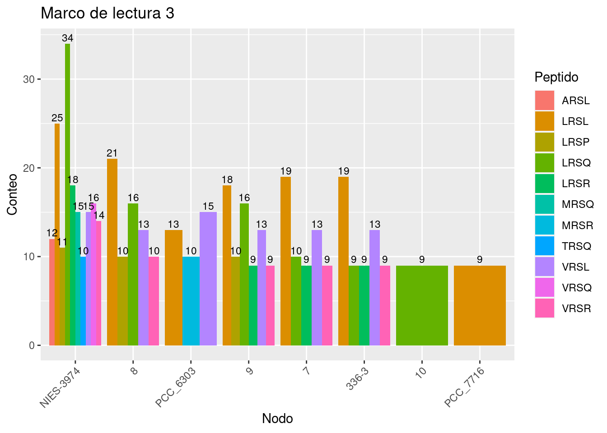
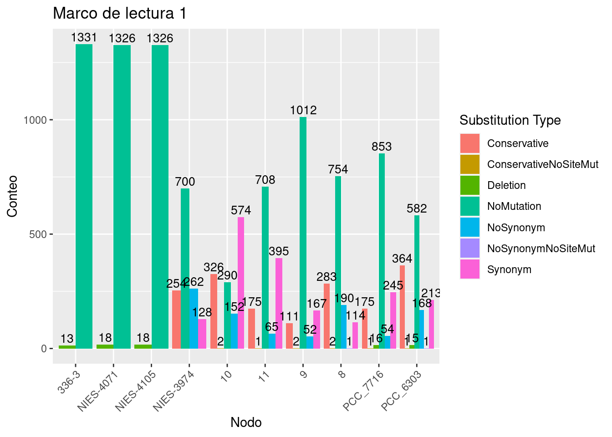
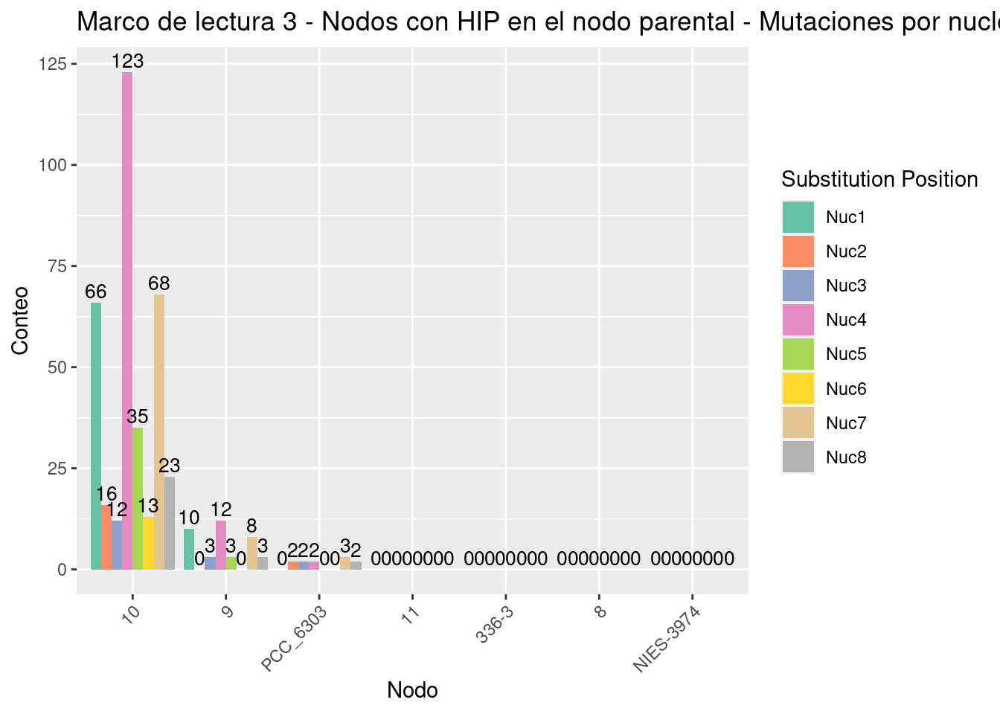
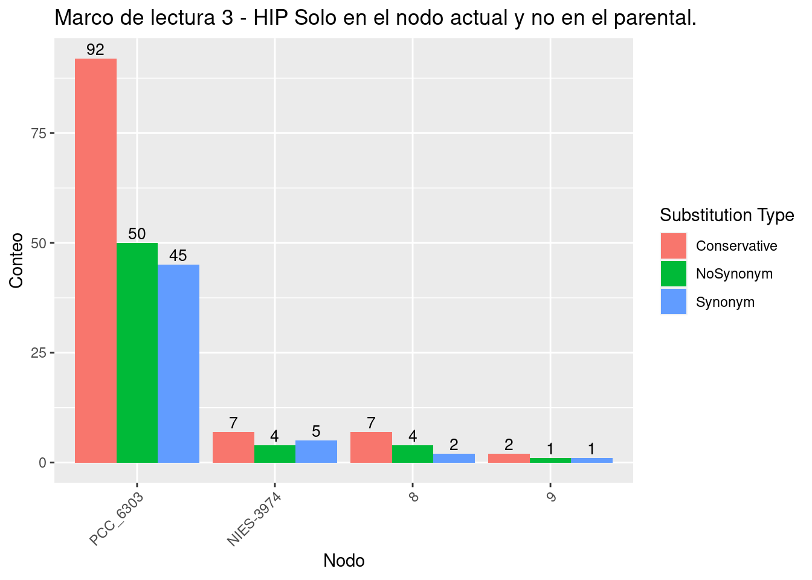
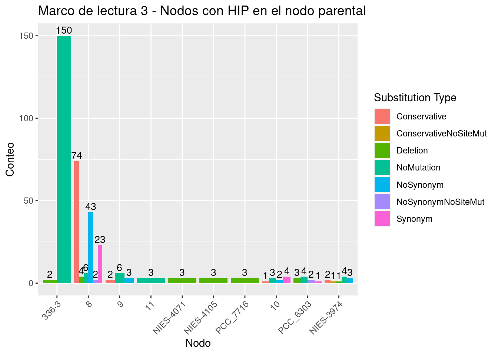
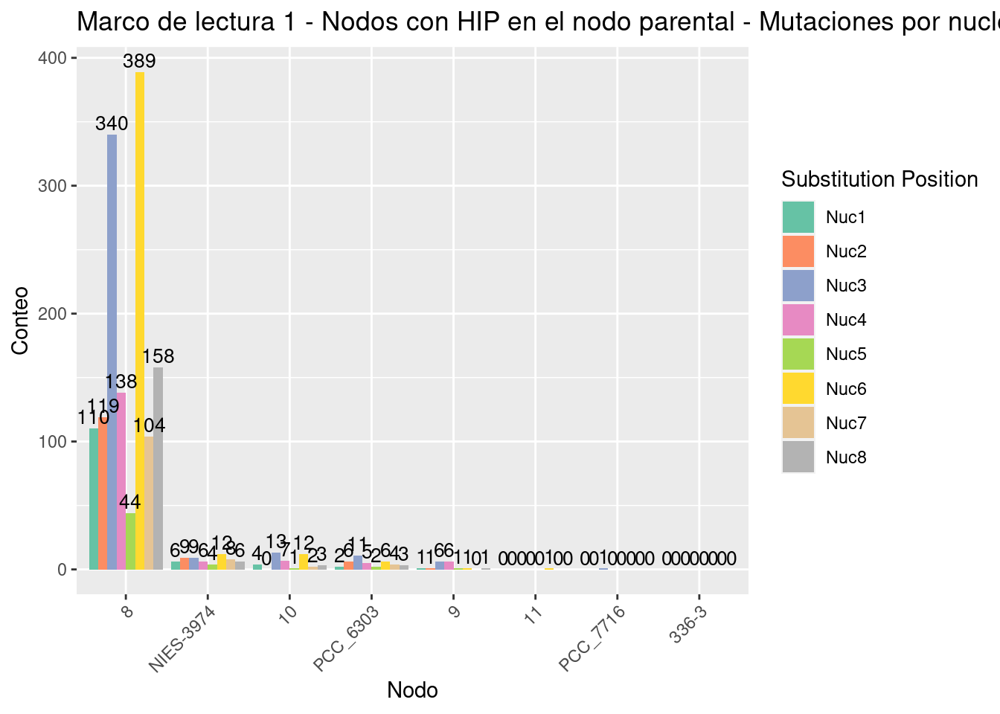
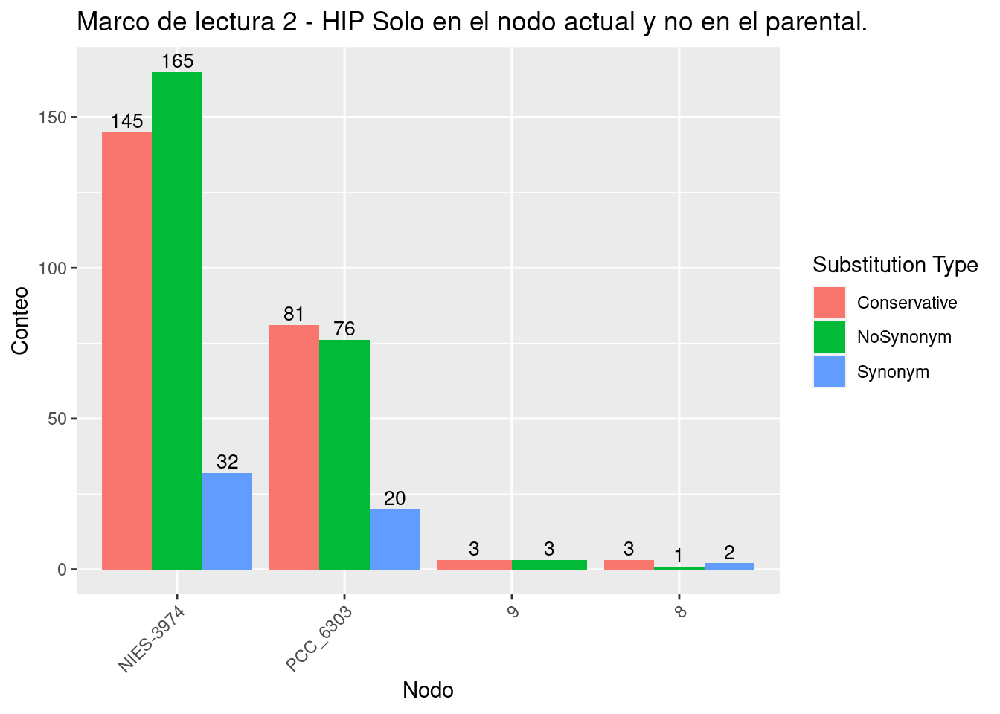
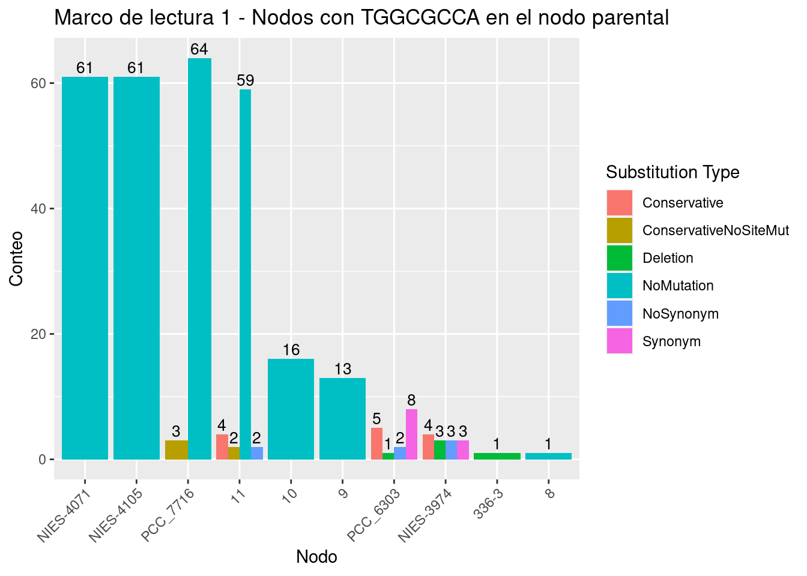
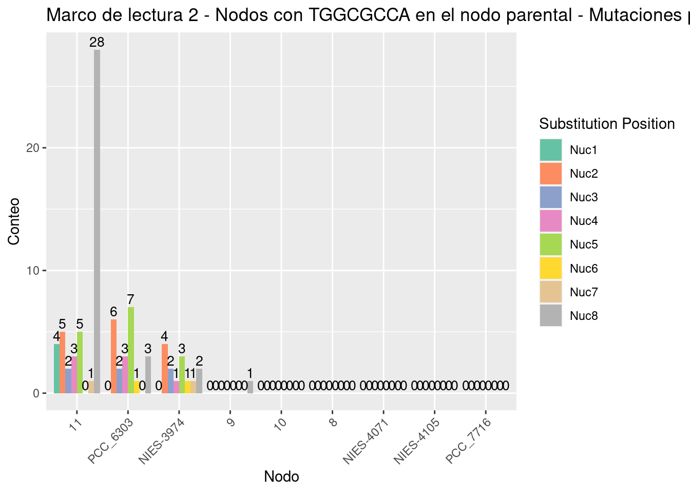
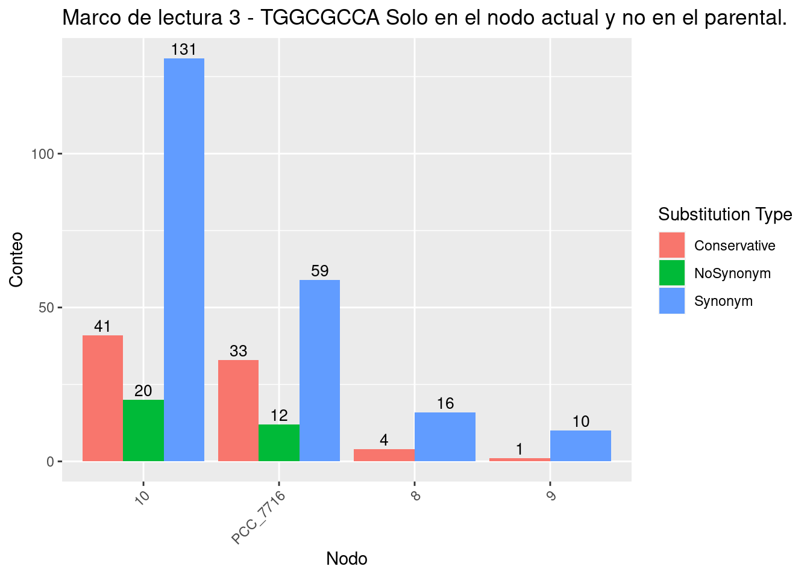

# Sección II {-}

## Clado Calothrix

El clado calothrix contiene 6 especies  y es de interes ya que segun la filogenia estan estrechamente relacionadas y muestra un cambio en el palindromo mas abundante, pasando de **GCGATCGC** a **TGGCGCCA** (Figure \@ref(fig:FIG12)).
<div class="figure" style="text-align: center">

<p class="caption">(\#fig:FIG12)**Filogenia anotada del clado Calothrix.** En esta imagen se muestra un cambio abrupto en la Frecuencia observada de **GCGCATCGC** en las especies NIES-4105, NIES-4071 y PCC\_7716.</p>
</div>

### Conjunto de sitios HIP1 usando la especie 336-3 como referencia

#### Red de transiciones 

Para hacer mas visual la reconstrucción, construimos una red de las transiciones entre los estados ancestrales. Esto lo hicimos en r usando la función ```Create_Transition_Table()```:


```r
source("ASR_Orth_Functions/NodeAndEdges.R")
Nodes.Edges <- Create_Transition_Table_No_Fit(SitesTable = "Clados/Callothrix_clade/PALINDROMES/GCGATCGC/336-3/Orthologues_Palindrome_sites.txt",
                                EvolutionModel = "F81",
                                Method = "bayes",
                                Phylogeny = "Clados/Callothrix_clade/SpeciesTree_rooted.txt",
                                OrthoPath = "Clados/Callothrix_clade/PALINDROMES/GCGATCGC/336-3/Only_ORTHOLOGUES/",
                                OutName = "All_RF")

```

Posteriormente creamos la red usando la función ```Create_Network()```:


y visualizamos dicha red .


Para visualizar la red usamos la paqueteria ```networkD3```. Hicimos 2 figuras, la (Figura \@ref(fig:FIG13)) muestra la red como una conexión de nodos a través de vertices con un grosor proporcional al numero de veces que ocurrió cada transición. En dicha red podemos ver algunos nodos con bordes muy gruesos como **GCGATTGC**, **GCAATTGC**, **GCTATCGC**, **GCTATTGC** (Tabla \@ref(tab:TAB6)).


<div class="figure" style="text-align: center">

```{=html}
<div class="forceNetwork html-widget html-fill-item-overflow-hidden html-fill-item" id="htmlwidget-9113ad52efebfd49b875" style="width:672px;height:480px;"></div>
<script type="application/json" data-for="htmlwidget-9113ad52efebfd49b875">{"x":{"links":{"source":[0,1,2,3,4,5,2,6,6,7,8,0,9,10,11,12,13,14,7,15,16,7,17,16,18,19,20,2,21,7,22,23,24,25,26,27,28,29,30,6,23,31,32,33,34,5,35,36,5,37,38,39,40,41,34,42,43,4,25,44,45,10,34,46,41,34,5,34,47,48,16,14,49,50,51,11,52,53,34,54,55,56,10,2,57,16,58,6,59,34,60,61,62,63,64,16,14,42,65],"target":[1,34,3,34,34,4,34,4,34,6,34,34,34,0,34,34,34,34,9,34,34,17,34,17,34,34,34,16,34,34,34,34,34,1,34,34,34,34,34,17,17,34,34,34,29,29,34,34,34,34,34,40,34,40,17,34,34,9,34,34,34,34,46,34,34,19,6,47,34,34,3,16,34,34,50,6,34,34,1,24,34,34,25,29,34,6,34,16,34,3,34,34,34,34,34,2,23,29,36],"value":[23,66,16,89,79,9,39,32,91,13,14,46,57,13,8,9,7,11,18,7,91,17,139,44,7,47,7,12,14,42,16,13,9,12,59,35,10,66,26,33,7,8,27,12,9,12,25,9,16,9,8,14,32,11,23,20,10,10,27,10,8,22,11,20,18,13,10,7,21,13,23,8,13,14,8,8,9,8,11,7,7,7,11,15,13,18,9,18,8,10,7,9,15,9,10,8,9,12,7],"colour":["#666","#666","#666","#666","#666","#666","#666","#666","#666","#666","#666","#666","#666","#666","#666","#666","#666","#666","#666","#666","#666","#666","#666","#666","#666","#666","#666","#666","#666","#666","#666","#666","#666","#666","#666","#666","#666","#666","#666","#666","#666","#666","#666","#666","#666","#666","#666","#666","#666","#666","#666","#666","#666","#666","#666","#666","#666","#666","#666","#666","#666","#666","#666","#666","#666","#666","#666","#666","#666","#666","#666","#666","#666","#666","#666","#666","#666","#666","#666","#666","#666","#666","#666","#666","#666","#666","#666","#666","#666","#666","#666","#666","#666","#666","#666","#666","#666","#666","#666"]},"nodes":{"name":["GCGACCGT","GCGACCGC","GCAATAGC","GCAATCGC","GCTATCGC","GCTATAGC","GCTATTGC","GCCATTGC","GCGAGCGC","GCCATCGC","GTGACCGT","GCTGTTGC","GCAATCGT","GTGATCGT","GCAGTTGC","GTGACCGA","GCAATTGC","GCGATTGC","GTAATCGC","GTGATCGC","GCGGTAGC","GTGATTGC","GCGATCAC","GCGGTTGC","GCGATTGA","GTGACCGC","--------","GCGATCGT","GAGACCGC","GCGATAGC","GCGATCGA","GAGACCGT","GCGTTCGC","ACAATTGC","GCGATCGC","GCGGTCGC","GCGATGGC","GCAATATC","GTAACCGC","GCGACAGA","GCGATAGA","GTGATAGA","GCCATAGC","GCGACCGA","GCGATAAC","GAGATAGA","ACGATCGC","GCGAACGC","GAGATCGC","ACGTTCGC","GAAATCGC","GAAATTGC","GCGTTCTC","GCGATCAA","GCAATTGA","GCAATTAC","GCGATCGG","GCGATAAA","GTGATAGC","GCTTTAGC","ACTATCGC","GCAATTTC","GCGCTCGC","GCGAACGT","GCGATTGT","GCAATGGC"],"group":[0,1,2,3,4,5,6,7,8,9,10,11,12,13,14,15,16,17,18,19,20,21,22,23,24,25,26,27,28,29,30,31,32,33,34,35,36,37,38,39,40,41,42,43,44,45,46,47,48,49,50,51,52,53,54,55,56,57,58,59,60,61,62,63,64,65]},"options":{"NodeID":"label","Group":"id","colourScale":"d3.scaleOrdinal(d3.schemeCategory20);","fontSize":16,"fontFamily":"serif","clickTextSize":40,"linkDistance":50,"linkWidth":"function(d) { return Math.sqrt(d.value); }","charge":-30,"opacity":1,"zoom":true,"legend":false,"arrows":false,"nodesize":false,"radiusCalculation":" Math.sqrt(d.nodesize)+6","bounded":false,"opacityNoHover":0,"clickAction":null}},"evals":[],"jsHooks":[]}</script>
```

<p class="caption">(\#fig:FIG13)**Red de todas las transiciones del clado Calothrix.** En esta imagen se muestra una red en la que cada nodo es un octanucleótido el cual esta unido a otro nodo por un vertice. Dicho vertice tiene un grosor proporcional al numero de veces que dicha transición ocurrió en la reconstrucción ancestral de sitios.</p>
</div>

En la (Figura \@ref(fig:FIG14)) podemos ver las transiciones de una forma mas ordenada, con el numero de ocurrencias y la dirección en la que ocurrieron.
<div class="figure" style="text-align: center">

```{=html}
<div class="sankeyNetwork html-widget html-fill-item-overflow-hidden html-fill-item" id="htmlwidget-0f10b1e752ed8a788076" style="width:672px;height:480px;"></div>
<script type="application/json" data-for="htmlwidget-0f10b1e752ed8a788076">{"x":{"links":{"source":[0,1,2,3,4,5,2,6,6,7,8,0,9,10,11,12,13,14,7,15,16,7,17,16,18,19,20,2,21,7,22,23,24,25,26,27,28,29,30,6,23,31,32,33,34,5,35,36,5,37,38,39,40,41,34,42,43,4,25,44,45,10,34,46,41,34,5,34,47,48,16,14,49,50,51,11,52,53,34,54,55,56,10,2,57,16,58,6,59,34,60,61,62,63,64,16,14,42,65],"target":[1,34,3,34,34,4,34,4,34,6,34,34,34,0,34,34,34,34,9,34,34,17,34,17,34,34,34,16,34,34,34,34,34,1,34,34,34,34,34,17,17,34,34,34,29,29,34,34,34,34,34,40,34,40,17,34,34,9,34,34,34,34,46,34,34,19,6,47,34,34,3,16,34,34,50,6,34,34,1,24,34,34,25,29,34,6,34,16,34,3,34,34,34,34,34,2,23,29,36],"value":[23,66,16,89,79,9,39,32,91,13,14,46,57,13,8,9,7,11,18,7,91,17,139,44,7,47,7,12,14,42,16,13,9,12,59,35,10,66,26,33,7,8,27,12,9,12,25,9,16,9,8,14,32,11,23,20,10,10,27,10,8,22,11,20,18,13,10,7,21,13,23,8,13,14,8,8,9,8,11,7,7,7,11,15,13,18,9,18,8,10,7,9,15,9,10,8,9,12,7]},"nodes":{"name":["GCGACCGT","GCGACCGC","GCAATAGC","GCAATCGC","GCTATCGC","GCTATAGC","GCTATTGC","GCCATTGC","GCGAGCGC","GCCATCGC","GTGACCGT","GCTGTTGC","GCAATCGT","GTGATCGT","GCAGTTGC","GTGACCGA","GCAATTGC","GCGATTGC","GTAATCGC","GTGATCGC","GCGGTAGC","GTGATTGC","GCGATCAC","GCGGTTGC","GCGATTGA","GTGACCGC","--------","GCGATCGT","GAGACCGC","GCGATAGC","GCGATCGA","GAGACCGT","GCGTTCGC","ACAATTGC","GCGATCGC","GCGGTCGC","GCGATGGC","GCAATATC","GTAACCGC","GCGACAGA","GCGATAGA","GTGATAGA","GCCATAGC","GCGACCGA","GCGATAAC","GAGATAGA","ACGATCGC","GCGAACGC","GAGATCGC","ACGTTCGC","GAAATCGC","GAAATTGC","GCGTTCTC","GCGATCAA","GCAATTGA","GCAATTAC","GCGATCGG","GCGATAAA","GTGATAGC","GCTTTAGC","ACTATCGC","GCAATTTC","GCGCTCGC","GCGAACGT","GCGATTGT","GCAATGGC"],"group":["GCGACCGT","GCGACCGC","GCAATAGC","GCAATCGC","GCTATCGC","GCTATAGC","GCTATTGC","GCCATTGC","GCGAGCGC","GCCATCGC","GTGACCGT","GCTGTTGC","GCAATCGT","GTGATCGT","GCAGTTGC","GTGACCGA","GCAATTGC","GCGATTGC","GTAATCGC","GTGATCGC","GCGGTAGC","GTGATTGC","GCGATCAC","GCGGTTGC","GCGATTGA","GTGACCGC","--------","GCGATCGT","GAGACCGC","GCGATAGC","GCGATCGA","GAGACCGT","GCGTTCGC","ACAATTGC","GCGATCGC","GCGGTCGC","GCGATGGC","GCAATATC","GTAACCGC","GCGACAGA","GCGATAGA","GTGATAGA","GCCATAGC","GCGACCGA","GCGATAAC","GAGATAGA","ACGATCGC","GCGAACGC","GAGATCGC","ACGTTCGC","GAAATCGC","GAAATTGC","GCGTTCTC","GCGATCAA","GCAATTGA","GCAATTAC","GCGATCGG","GCGATAAA","GTGATAGC","GCTTTAGC","ACTATCGC","GCAATTTC","GCGCTCGC","GCGAACGT","GCGATTGT","GCAATGGC"]},"options":{"NodeID":"label","NodeGroup":"label","LinkGroup":null,"colourScale":"d3.scaleOrdinal(d3.schemeCategory20);","fontSize":16,"fontFamily":null,"nodeWidth":15,"nodePadding":10,"units":"TIME(s)","margin":{"top":null,"right":null,"bottom":null,"left":null},"iterations":32,"sinksRight":true}},"evals":[],"jsHooks":[]}</script>
```

<p class="caption">(\#fig:FIG14)**Red de todas las transiciones del clado Calothrix.** En esta imagen se muestra la red  de la Figura \@ref(fig:FIG13) de una forma mas visual y con el numero de veces que ocurrio cada transición, asi como la dirección en la que ocurrió.</p>
</div>

<div style="border: 1px solid #ddd; padding: 0px; overflow-y: scroll; height:200px; overflow-x: scroll; width:500px; "><table class=" lightable-paper table table-striped table-condensed" style='font-family: "Arial Narrow", arial, helvetica, sans-serif; margin-left: auto; margin-right: auto; font-size: 11px; width: auto !important; margin-left: auto; margin-right: auto;'>
<caption style="font-size: initial !important;">(\#tab:TAB6)Transiciones entre nodos.</caption>
 <thead>
  <tr>
   <th style="text-align:left;position: sticky; top:0; background-color: #FFFFFF;position: sticky; top:0; background-color: #FFFFFF;"> from </th>
   <th style="text-align:left;position: sticky; top:0; background-color: #FFFFFF;position: sticky; top:0; background-color: #FFFFFF;"> to </th>
   <th style="text-align:left;position: sticky; top:0; background-color: #FFFFFF;position: sticky; top:0; background-color: #FFFFFF;"> weight </th>
  </tr>
 </thead>
<tbody>
  <tr>
   <td style="text-align:left;font-weight: bold;"> <span style="     color: black !important;">GCGATTGC</span> </td>
   <td style="text-align:left;font-weight: bold;vertical-align: top !important;" rowspan="11"> <span style="     color: red !important;">GCGATCGC</span> </td>
   <td style="text-align:left;"> <span style="display: block; padding: 0 4px; border-radius: 4px; background-color: #ffa500">139</span> </td>
  </tr>
  <tr>
   <td style="text-align:left;font-weight: bold;"> <span style="     color: black !important;">GCTATTGC</span> </td>
   
   <td style="text-align:left;"> <span style="display: block; padding: 0 4px; border-radius: 4px; background-color: #ffc55c">91</span> </td>
  </tr>
  <tr>
   <td style="text-align:left;font-weight: bold;"> <span style="     color: blue !important;">GCAATTGC</span> </td>
   
   <td style="text-align:left;"> <span style="display: block; padding: 0 4px; border-radius: 4px; background-color: #ffc55c">91</span> </td>
  </tr>
  <tr>
   <td style="text-align:left;font-weight: bold;"> <span style="     color: black !important;">GCAATCGC</span> </td>
   
   <td style="text-align:left;"> <span style="display: block; padding: 0 4px; border-radius: 4px; background-color: #ffc760">89</span> </td>
  </tr>
  <tr>
   <td style="text-align:left;font-weight: bold;"> <span style="     color: black !important;">GCTATCGC</span> </td>
   
   <td style="text-align:left;"> <span style="display: block; padding: 0 4px; border-radius: 4px; background-color: #ffcd73">79</span> </td>
  </tr>
  <tr>
   <td style="text-align:left;font-weight: bold;"> <span style="     color: black !important;">GCGACCGC</span> </td>
   
   <td style="text-align:left;"> <span style="display: block; padding: 0 4px; border-radius: 4px; background-color: #ffd68d">66</span> </td>
  </tr>
  <tr>
   <td style="text-align:left;font-weight: bold;"> <span style="     color: black !important;">GCGATAGC</span> </td>
   
   <td style="text-align:left;"> <span style="display: block; padding: 0 4px; border-radius: 4px; background-color: #ffd68d">66</span> </td>
  </tr>
  <tr>
   <td style="text-align:left;font-weight: bold;"> <span style="     color: black !important;">--------</span> </td>
   
   <td style="text-align:left;"> <span style="display: block; padding: 0 4px; border-radius: 4px; background-color: #ffdb9a">59</span> </td>
  </tr>
  <tr>
   <td style="text-align:left;font-weight: bold;"> <span style="     color: black !important;">GCCATCGC</span> </td>
   
   <td style="text-align:left;"> <span style="display: block; padding: 0 4px; border-radius: 4px; background-color: #ffdc9e">57</span> </td>
  </tr>
  <tr>
   <td style="text-align:left;font-weight: bold;"> <span style="     color: black !important;">GTGATCGC</span> </td>
   
   <td style="text-align:left;"> <span style="display: block; padding: 0 4px; border-radius: 4px; background-color: #ffe3b1">47</span> </td>
  </tr>
  <tr>
   <td style="text-align:left;font-weight: bold;"> <span style="     color: black !important;">GCGACCGT</span> </td>
   
   <td style="text-align:left;"> <span style="display: block; padding: 0 4px; border-radius: 4px; background-color: #ffe4b3">46</span> </td>
  </tr>
  <tr>
   <td style="text-align:left;font-weight: bold;"> <span style="     color: blue !important;">GCAATTGC</span> </td>
   <td style="text-align:left;font-weight: bold;"> <span style="     color: black !important;">GCGATTGC</span> </td>
   <td style="text-align:left;"> <span style="display: block; padding: 0 4px; border-radius: 4px; background-color: #ffe5b7">44</span> </td>
  </tr>
  <tr>
   <td style="text-align:left;font-weight: bold;"> <span style="     color: black !important;">GCCATTGC</span> </td>
   <td style="text-align:left;font-weight: bold;vertical-align: top !important;" rowspan="3"> <span style="     color: red !important;">GCGATCGC</span> </td>
   <td style="text-align:left;"> <span style="display: block; padding: 0 4px; border-radius: 4px; background-color: #ffe7bb">42</span> </td>
  </tr>
  <tr>
   <td style="text-align:left;font-weight: bold;"> <span style="     color: black !important;">GCAATAGC</span> </td>
   
   <td style="text-align:left;"> <span style="display: block; padding: 0 4px; border-radius: 4px; background-color: #ffe9c1">39</span> </td>
  </tr>
  <tr>
   <td style="text-align:left;font-weight: bold;"> <span style="     color: black !important;">GCGATCGT</span> </td>
   
   <td style="text-align:left;"> <span style="display: block; padding: 0 4px; border-radius: 4px; background-color: #ffebc8">35</span> </td>
  </tr>
  <tr>
   <td style="text-align:left;font-weight: bold;vertical-align: top !important;" rowspan="2"> <span style="     color: black !important;">GCTATTGC</span> </td>
   <td style="text-align:left;font-weight: bold;"> <span style="     color: black !important;">GCGATTGC</span> </td>
   <td style="text-align:left;"> <span style="display: block; padding: 0 4px; border-radius: 4px; background-color: #ffedcc">33</span> </td>
  </tr>
  <tr>
   
   <td style="text-align:left;font-weight: bold;"> <span style="     color: black !important;">GCTATCGC</span> </td>
   <td style="text-align:left;"> <span style="display: block; padding: 0 4px; border-radius: 4px; background-color: #ffedce">32</span> </td>
  </tr>
  <tr>
   <td style="text-align:left;font-weight: bold;"> <span style="     color: black !important;">GCGATAGA</span> </td>
   <td style="text-align:left;font-weight: bold;vertical-align: top !important;" rowspan="5"> <span style="     color: red !important;">GCGATCGC</span> </td>
   <td style="text-align:left;"> <span style="display: block; padding: 0 4px; border-radius: 4px; background-color: #ffedce">32</span> </td>
  </tr>
  <tr>
   <td style="text-align:left;font-weight: bold;"> <span style="     color: black !important;">GCGTTCGC</span> </td>
   
   <td style="text-align:left;"> <span style="display: block; padding: 0 4px; border-radius: 4px; background-color: #fff1d8">27</span> </td>
  </tr>
  <tr>
   <td style="text-align:left;font-weight: bold;"> <span style="     color: black !important;">GTGACCGC</span> </td>
   
   <td style="text-align:left;"> <span style="display: block; padding: 0 4px; border-radius: 4px; background-color: #fff1d8">27</span> </td>
  </tr>
  <tr>
   <td style="text-align:left;font-weight: bold;"> <span style="     color: black !important;">GCGATCGA</span> </td>
   
   <td style="text-align:left;"> <span style="display: block; padding: 0 4px; border-radius: 4px; background-color: #fff2da">26</span> </td>
  </tr>
  <tr>
   <td style="text-align:left;font-weight: bold;"> <span style="     color: black !important;">GCGGTCGC</span> </td>
   
   <td style="text-align:left;"> <span style="display: block; padding: 0 4px; border-radius: 4px; background-color: #fff2dc">25</span> </td>
  </tr>
  <tr>
   <td style="text-align:left;font-weight: bold;"> <span style="     color: black !important;">GCGACCGT</span> </td>
   <td style="text-align:left;font-weight: bold;"> <span style="     color: black !important;">GCGACCGC</span> </td>
   <td style="text-align:left;"> <span style="display: block; padding: 0 4px; border-radius: 4px; background-color: #fff4e0">23</span> </td>
  </tr>
  <tr>
   <td style="text-align:left;font-weight: bold;"> <span style="     color: red !important;">GCGATCGC</span> </td>
   <td style="text-align:left;font-weight: bold;"> <span style="     color: black !important;">GCGATTGC</span> </td>
   <td style="text-align:left;"> <span style="display: block; padding: 0 4px; border-radius: 4px; background-color: #fff4e0">23</span> </td>
  </tr>
  <tr>
   <td style="text-align:left;font-weight: bold;"> <span style="     color: blue !important;">GCAATTGC</span> </td>
   <td style="text-align:left;font-weight: bold;"> <span style="     color: black !important;">GCAATCGC</span> </td>
   <td style="text-align:left;"> <span style="display: block; padding: 0 4px; border-radius: 4px; background-color: #fff4e0">23</span> </td>
  </tr>
  <tr>
   <td style="text-align:left;font-weight: bold;"> <span style="     color: black !important;">GTGACCGT</span> </td>
   <td style="text-align:left;font-weight: bold;vertical-align: top !important;" rowspan="4"> <span style="     color: red !important;">GCGATCGC</span> </td>
   <td style="text-align:left;"> <span style="display: block; padding: 0 4px; border-radius: 4px; background-color: #fff4e2">22</span> </td>
  </tr>
  <tr>
   <td style="text-align:left;font-weight: bold;"> <span style="     color: black !important;">GCGAACGC</span> </td>
   
   <td style="text-align:left;"> <span style="display: block; padding: 0 4px; border-radius: 4px; background-color: #fff5e3">21</span> </td>
  </tr>
  <tr>
   <td style="text-align:left;font-weight: bold;"> <span style="     color: black !important;">GCCATAGC</span> </td>
   
   <td style="text-align:left;"> <span style="display: block; padding: 0 4px; border-radius: 4px; background-color: #fff6e5">20</span> </td>
  </tr>
  <tr>
   <td style="text-align:left;font-weight: bold;"> <span style="     color: black !important;">ACGATCGC</span> </td>
   
   <td style="text-align:left;"> <span style="display: block; padding: 0 4px; border-radius: 4px; background-color: #fff6e5">20</span> </td>
  </tr>
  <tr>
   <td style="text-align:left;font-weight: bold;"> <span style="     color: black !important;">GCCATTGC</span> </td>
   <td style="text-align:left;font-weight: bold;"> <span style="     color: black !important;">GCCATCGC</span> </td>
   <td style="text-align:left;"> <span style="display: block; padding: 0 4px; border-radius: 4px; background-color: #fff7e9">18</span> </td>
  </tr>
  <tr>
   <td style="text-align:left;font-weight: bold;"> <span style="     color: black !important;">GTGATAGA</span> </td>
   <td style="text-align:left;font-weight: bold;"> <span style="     color: red !important;">GCGATCGC</span> </td>
   <td style="text-align:left;"> <span style="display: block; padding: 0 4px; border-radius: 4px; background-color: #fff7e9">18</span> </td>
  </tr>
  <tr>
   <td style="text-align:left;font-weight: bold;"> <span style="     color: blue !important;">GCAATTGC</span> </td>
   <td style="text-align:left;font-weight: bold;"> <span style="     color: black !important;">GCTATTGC</span> </td>
   <td style="text-align:left;"> <span style="display: block; padding: 0 4px; border-radius: 4px; background-color: #fff7e9">18</span> </td>
  </tr>
  <tr>
   <td style="text-align:left;font-weight: bold;"> <span style="     color: black !important;">GCTATTGC</span> </td>
   <td style="text-align:left;font-weight: bold;"> <span style="     color: blue !important;">GCAATTGC</span> </td>
   <td style="text-align:left;"> <span style="display: block; padding: 0 4px; border-radius: 4px; background-color: #fff7e9">18</span> </td>
  </tr>
  <tr>
   <td style="text-align:left;font-weight: bold;"> <span style="     color: black !important;">GCCATTGC</span> </td>
   <td style="text-align:left;font-weight: bold;"> <span style="     color: black !important;">GCGATTGC</span> </td>
   <td style="text-align:left;"> <span style="display: block; padding: 0 4px; border-radius: 4px; background-color: #fff8eb">17</span> </td>
  </tr>
  <tr>
   <td style="text-align:left;font-weight: bold;"> <span style="     color: black !important;">GCAATAGC</span> </td>
   <td style="text-align:left;font-weight: bold;"> <span style="     color: black !important;">GCAATCGC</span> </td>
   <td style="text-align:left;"> <span style="display: block; padding: 0 4px; border-radius: 4px; background-color: #fff8ed">16</span> </td>
  </tr>
  <tr>
   <td style="text-align:left;font-weight: bold;"> <span style="     color: black !important;">GCGATCAC</span> </td>
   <td style="text-align:left;font-weight: bold;vertical-align: top !important;" rowspan="2"> <span style="     color: red !important;">GCGATCGC</span> </td>
   <td style="text-align:left;"> <span style="display: block; padding: 0 4px; border-radius: 4px; background-color: #fff8ed">16</span> </td>
  </tr>
  <tr>
   <td style="text-align:left;font-weight: bold;"> <span style="     color: black !important;">GCTATAGC</span> </td>
   
   <td style="text-align:left;"> <span style="display: block; padding: 0 4px; border-radius: 4px; background-color: #fff8ed">16</span> </td>
  </tr>
  <tr>
   <td style="text-align:left;font-weight: bold;"> <span style="     color: black !important;">GCAATAGC</span> </td>
   <td style="text-align:left;font-weight: bold;"> <span style="     color: black !important;">GCGATAGC</span> </td>
   <td style="text-align:left;"> <span style="display: block; padding: 0 4px; border-radius: 4px; background-color: #fff9ef">15</span> </td>
  </tr>
  <tr>
   <td style="text-align:left;font-weight: bold;"> <span style="     color: black !important;">GCGCTCGC</span> </td>
   <td style="text-align:left;font-weight: bold;vertical-align: top !important;" rowspan="3"> <span style="     color: red !important;">GCGATCGC</span> </td>
   <td style="text-align:left;"> <span style="display: block; padding: 0 4px; border-radius: 4px; background-color: #fff9ef">15</span> </td>
  </tr>
  <tr>
   <td style="text-align:left;font-weight: bold;"> <span style="     color: black !important;">GCGAGCGC</span> </td>
   
   <td style="text-align:left;"> <span style="display: block; padding: 0 4px; border-radius: 4px; background-color: #fffaf1">14</span> </td>
  </tr>
  <tr>
   <td style="text-align:left;font-weight: bold;"> <span style="     color: black !important;">GTGATTGC</span> </td>
   
   <td style="text-align:left;"> <span style="display: block; padding: 0 4px; border-radius: 4px; background-color: #fffaf1">14</span> </td>
  </tr>
  <tr>
   <td style="text-align:left;font-weight: bold;"> <span style="     color: black !important;">GCGACAGA</span> </td>
   <td style="text-align:left;font-weight: bold;"> <span style="     color: black !important;">GCGATAGA</span> </td>
   <td style="text-align:left;"> <span style="display: block; padding: 0 4px; border-radius: 4px; background-color: #fffaf1">14</span> </td>
  </tr>
  <tr>
   <td style="text-align:left;font-weight: bold;"> <span style="     color: black !important;">GAAATCGC</span> </td>
   <td style="text-align:left;font-weight: bold;"> <span style="     color: red !important;">GCGATCGC</span> </td>
   <td style="text-align:left;"> <span style="display: block; padding: 0 4px; border-radius: 4px; background-color: #fffaf1">14</span> </td>
  </tr>
  <tr>
   <td style="text-align:left;font-weight: bold;"> <span style="     color: black !important;">GCCATTGC</span> </td>
   <td style="text-align:left;font-weight: bold;"> <span style="     color: black !important;">GCTATTGC</span> </td>
   <td style="text-align:left;"> <span style="display: block; padding: 0 4px; border-radius: 4px; background-color: #fffaf3">13</span> </td>
  </tr>
  <tr>
   <td style="text-align:left;font-weight: bold;"> <span style="     color: black !important;">GTGACCGT</span> </td>
   <td style="text-align:left;font-weight: bold;"> <span style="     color: black !important;">GCGACCGT</span> </td>
   <td style="text-align:left;"> <span style="display: block; padding: 0 4px; border-radius: 4px; background-color: #fffaf3">13</span> </td>
  </tr>
  <tr>
   <td style="text-align:left;font-weight: bold;"> <span style="     color: black !important;">GCGGTTGC</span> </td>
   <td style="text-align:left;font-weight: bold;"> <span style="     color: red !important;">GCGATCGC</span> </td>
   <td style="text-align:left;"> <span style="display: block; padding: 0 4px; border-radius: 4px; background-color: #fffaf3">13</span> </td>
  </tr>
  <tr>
   <td style="text-align:left;font-weight: bold;"> <span style="     color: red !important;">GCGATCGC</span> </td>
   <td style="text-align:left;font-weight: bold;"> <span style="     color: black !important;">GTGATCGC</span> </td>
   <td style="text-align:left;"> <span style="display: block; padding: 0 4px; border-radius: 4px; background-color: #fffaf3">13</span> </td>
  </tr>
  <tr>
   <td style="text-align:left;font-weight: bold;"> <span style="     color: black !important;">GAGATCGC</span> </td>
   <td style="text-align:left;font-weight: bold;vertical-align: top !important;" rowspan="3"> <span style="     color: red !important;">GCGATCGC</span> </td>
   <td style="text-align:left;"> <span style="display: block; padding: 0 4px; border-radius: 4px; background-color: #fffaf3">13</span> </td>
  </tr>
  <tr>
   <td style="text-align:left;font-weight: bold;"> <span style="     color: black !important;">ACGTTCGC</span> </td>
   
   <td style="text-align:left;"> <span style="display: block; padding: 0 4px; border-radius: 4px; background-color: #fffaf3">13</span> </td>
  </tr>
  <tr>
   <td style="text-align:left;font-weight: bold;"> <span style="     color: black !important;">GCGATAAA</span> </td>
   
   <td style="text-align:left;"> <span style="display: block; padding: 0 4px; border-radius: 4px; background-color: #fffaf3">13</span> </td>
  </tr>
  <tr>
   <td style="text-align:left;font-weight: bold;"> <span style="     color: black !important;">GCAATAGC</span> </td>
   <td style="text-align:left;font-weight: bold;"> <span style="     color: blue !important;">GCAATTGC</span> </td>
   <td style="text-align:left;"> <span style="display: block; padding: 0 4px; border-radius: 4px; background-color: #fffbf5">12</span> </td>
  </tr>
  <tr>
   <td style="text-align:left;font-weight: bold;"> <span style="     color: black !important;">GTGACCGC</span> </td>
   <td style="text-align:left;font-weight: bold;"> <span style="     color: black !important;">GCGACCGC</span> </td>
   <td style="text-align:left;"> <span style="display: block; padding: 0 4px; border-radius: 4px; background-color: #fffbf5">12</span> </td>
  </tr>
  <tr>
   <td style="text-align:left;font-weight: bold;"> <span style="     color: black !important;">ACAATTGC</span> </td>
   <td style="text-align:left;font-weight: bold;"> <span style="     color: red !important;">GCGATCGC</span> </td>
   <td style="text-align:left;"> <span style="display: block; padding: 0 4px; border-radius: 4px; background-color: #fffbf5">12</span> </td>
  </tr>
  <tr>
   <td style="text-align:left;font-weight: bold;"> <span style="     color: black !important;">GCTATAGC</span> </td>
   <td style="text-align:left;font-weight: bold;vertical-align: top !important;" rowspan="2"> <span style="     color: black !important;">GCGATAGC</span> </td>
   <td style="text-align:left;"> <span style="display: block; padding: 0 4px; border-radius: 4px; background-color: #fffbf5">12</span> </td>
  </tr>
  <tr>
   <td style="text-align:left;font-weight: bold;"> <span style="     color: black !important;">GCCATAGC</span> </td>
   
   <td style="text-align:left;"> <span style="display: block; padding: 0 4px; border-radius: 4px; background-color: #fffbf5">12</span> </td>
  </tr>
  <tr>
   <td style="text-align:left;font-weight: bold;"> <span style="     color: black !important;">GCAGTTGC</span> </td>
   <td style="text-align:left;font-weight: bold;"> <span style="     color: red !important;">GCGATCGC</span> </td>
   <td style="text-align:left;"> <span style="display: block; padding: 0 4px; border-radius: 4px; background-color: #fffcf7">11</span> </td>
  </tr>
  <tr>
   <td style="text-align:left;font-weight: bold;"> <span style="     color: black !important;">GTGATAGA</span> </td>
   <td style="text-align:left;font-weight: bold;"> <span style="     color: black !important;">GCGATAGA</span> </td>
   <td style="text-align:left;"> <span style="display: block; padding: 0 4px; border-radius: 4px; background-color: #fffcf7">11</span> </td>
  </tr>
  <tr>
   <td style="text-align:left;font-weight: bold;vertical-align: top !important;" rowspan="2"> <span style="     color: red !important;">GCGATCGC</span> </td>
   <td style="text-align:left;font-weight: bold;"> <span style="     color: black !important;">ACGATCGC</span> </td>
   <td style="text-align:left;"> <span style="display: block; padding: 0 4px; border-radius: 4px; background-color: #fffcf7">11</span> </td>
  </tr>
  <tr>
   
   <td style="text-align:left;font-weight: bold;"> <span style="     color: black !important;">GCGACCGC</span> </td>
   <td style="text-align:left;"> <span style="display: block; padding: 0 4px; border-radius: 4px; background-color: #fffcf7">11</span> </td>
  </tr>
  <tr>
   <td style="text-align:left;font-weight: bold;"> <span style="     color: black !important;">GTGACCGT</span> </td>
   <td style="text-align:left;font-weight: bold;"> <span style="     color: black !important;">GTGACCGC</span> </td>
   <td style="text-align:left;"> <span style="display: block; padding: 0 4px; border-radius: 4px; background-color: #fffcf7">11</span> </td>
  </tr>
  <tr>
   <td style="text-align:left;font-weight: bold;"> <span style="     color: black !important;">GAGACCGC</span> </td>
   <td style="text-align:left;font-weight: bold;vertical-align: top !important;" rowspan="2"> <span style="     color: red !important;">GCGATCGC</span> </td>
   <td style="text-align:left;"> <span style="display: block; padding: 0 4px; border-radius: 4px; background-color: #fffcf9">10</span> </td>
  </tr>
  <tr>
   <td style="text-align:left;font-weight: bold;"> <span style="     color: black !important;">GCGACCGA</span> </td>
   
   <td style="text-align:left;"> <span style="display: block; padding: 0 4px; border-radius: 4px; background-color: #fffcf9">10</span> </td>
  </tr>
  <tr>
   <td style="text-align:left;font-weight: bold;"> <span style="     color: black !important;">GCTATCGC</span> </td>
   <td style="text-align:left;font-weight: bold;"> <span style="     color: black !important;">GCCATCGC</span> </td>
   <td style="text-align:left;"> <span style="display: block; padding: 0 4px; border-radius: 4px; background-color: #fffcf9">10</span> </td>
  </tr>
  <tr>
   <td style="text-align:left;font-weight: bold;"> <span style="     color: black !important;">GCGATAAC</span> </td>
   <td style="text-align:left;font-weight: bold;"> <span style="     color: red !important;">GCGATCGC</span> </td>
   <td style="text-align:left;"> <span style="display: block; padding: 0 4px; border-radius: 4px; background-color: #fffcf9">10</span> </td>
  </tr>
  <tr>
   <td style="text-align:left;font-weight: bold;"> <span style="     color: black !important;">GCTATAGC</span> </td>
   <td style="text-align:left;font-weight: bold;"> <span style="     color: black !important;">GCTATTGC</span> </td>
   <td style="text-align:left;"> <span style="display: block; padding: 0 4px; border-radius: 4px; background-color: #fffcf9">10</span> </td>
  </tr>
  <tr>
   <td style="text-align:left;font-weight: bold;"> <span style="     color: red !important;">GCGATCGC</span> </td>
   <td style="text-align:left;font-weight: bold;"> <span style="     color: black !important;">GCAATCGC</span> </td>
   <td style="text-align:left;"> <span style="display: block; padding: 0 4px; border-radius: 4px; background-color: #fffcf9">10</span> </td>
  </tr>
  <tr>
   <td style="text-align:left;font-weight: bold;"> <span style="     color: black !important;">GCGATTGT</span> </td>
   <td style="text-align:left;font-weight: bold;"> <span style="     color: red !important;">GCGATCGC</span> </td>
   <td style="text-align:left;"> <span style="display: block; padding: 0 4px; border-radius: 4px; background-color: #fffcf9">10</span> </td>
  </tr>
  <tr>
   <td style="text-align:left;font-weight: bold;"> <span style="     color: black !important;">GCTATAGC</span> </td>
   <td style="text-align:left;font-weight: bold;"> <span style="     color: black !important;">GCTATCGC</span> </td>
   <td style="text-align:left;"> <span style="display: block; padding: 0 4px; border-radius: 4px; background-color: #fffdfb">9</span> </td>
  </tr>
  <tr>
   <td style="text-align:left;font-weight: bold;"> <span style="     color: black !important;">GCAATCGT</span> </td>
   <td style="text-align:left;font-weight: bold;vertical-align: top !important;" rowspan="2"> <span style="     color: red !important;">GCGATCGC</span> </td>
   <td style="text-align:left;"> <span style="display: block; padding: 0 4px; border-radius: 4px; background-color: #fffdfb">9</span> </td>
  </tr>
  <tr>
   <td style="text-align:left;font-weight: bold;"> <span style="     color: black !important;">GCGATTGA</span> </td>
   
   <td style="text-align:left;"> <span style="display: block; padding: 0 4px; border-radius: 4px; background-color: #fffdfb">9</span> </td>
  </tr>
  <tr>
   <td style="text-align:left;font-weight: bold;"> <span style="     color: red !important;">GCGATCGC</span> </td>
   <td style="text-align:left;font-weight: bold;"> <span style="     color: black !important;">GCGATAGC</span> </td>
   <td style="text-align:left;"> <span style="display: block; padding: 0 4px; border-radius: 4px; background-color: #fffdfb">9</span> </td>
  </tr>
  <tr>
   <td style="text-align:left;font-weight: bold;"> <span style="     color: black !important;">GCGATGGC</span> </td>
   <td style="text-align:left;font-weight: bold;vertical-align: top !important;" rowspan="6"> <span style="     color: red !important;">GCGATCGC</span> </td>
   <td style="text-align:left;"> <span style="display: block; padding: 0 4px; border-radius: 4px; background-color: #fffdfb">9</span> </td>
  </tr>
  <tr>
   <td style="text-align:left;font-weight: bold;"> <span style="     color: black !important;">GCAATATC</span> </td>
   
   <td style="text-align:left;"> <span style="display: block; padding: 0 4px; border-radius: 4px; background-color: #fffdfb">9</span> </td>
  </tr>
  <tr>
   <td style="text-align:left;font-weight: bold;"> <span style="     color: black !important;">GCGTTCTC</span> </td>
   
   <td style="text-align:left;"> <span style="display: block; padding: 0 4px; border-radius: 4px; background-color: #fffdfb">9</span> </td>
  </tr>
  <tr>
   <td style="text-align:left;font-weight: bold;"> <span style="     color: black !important;">GTGATAGC</span> </td>
   
   <td style="text-align:left;"> <span style="display: block; padding: 0 4px; border-radius: 4px; background-color: #fffdfb">9</span> </td>
  </tr>
  <tr>
   <td style="text-align:left;font-weight: bold;"> <span style="     color: black !important;">GCAATTTC</span> </td>
   
   <td style="text-align:left;"> <span style="display: block; padding: 0 4px; border-radius: 4px; background-color: #fffdfb">9</span> </td>
  </tr>
  <tr>
   <td style="text-align:left;font-weight: bold;"> <span style="     color: black !important;">GCGAACGT</span> </td>
   
   <td style="text-align:left;"> <span style="display: block; padding: 0 4px; border-radius: 4px; background-color: #fffdfb">9</span> </td>
  </tr>
  <tr>
   <td style="text-align:left;font-weight: bold;"> <span style="     color: black !important;">GCAGTTGC</span> </td>
   <td style="text-align:left;font-weight: bold;"> <span style="     color: black !important;">GCGGTTGC</span> </td>
   <td style="text-align:left;"> <span style="display: block; padding: 0 4px; border-radius: 4px; background-color: #fffdfb">9</span> </td>
  </tr>
  <tr>
   <td style="text-align:left;font-weight: bold;"> <span style="     color: black !important;">GCTGTTGC</span> </td>
   <td style="text-align:left;font-weight: bold;vertical-align: top !important;" rowspan="4"> <span style="     color: red !important;">GCGATCGC</span> </td>
   <td style="text-align:left;"> <span style="display: block; padding: 0 4px; border-radius: 4px; background-color: #fffefd">8</span> </td>
  </tr>
  <tr>
   <td style="text-align:left;font-weight: bold;"> <span style="     color: black !important;">GAGACCGT</span> </td>
   
   <td style="text-align:left;"> <span style="display: block; padding: 0 4px; border-radius: 4px; background-color: #fffefd">8</span> </td>
  </tr>
  <tr>
   <td style="text-align:left;font-weight: bold;"> <span style="     color: black !important;">GTAACCGC</span> </td>
   
   <td style="text-align:left;"> <span style="display: block; padding: 0 4px; border-radius: 4px; background-color: #fffefd">8</span> </td>
  </tr>
  <tr>
   <td style="text-align:left;font-weight: bold;"> <span style="     color: black !important;">GAGATAGA</span> </td>
   
   <td style="text-align:left;"> <span style="display: block; padding: 0 4px; border-radius: 4px; background-color: #fffefd">8</span> </td>
  </tr>
  <tr>
   <td style="text-align:left;font-weight: bold;"> <span style="     color: black !important;">GCAGTTGC</span> </td>
   <td style="text-align:left;font-weight: bold;"> <span style="     color: blue !important;">GCAATTGC</span> </td>
   <td style="text-align:left;"> <span style="display: block; padding: 0 4px; border-radius: 4px; background-color: #fffefd">8</span> </td>
  </tr>
  <tr>
   <td style="text-align:left;font-weight: bold;"> <span style="     color: black !important;">GAAATTGC</span> </td>
   <td style="text-align:left;font-weight: bold;"> <span style="     color: black !important;">GAAATCGC</span> </td>
   <td style="text-align:left;"> <span style="display: block; padding: 0 4px; border-radius: 4px; background-color: #fffefd">8</span> </td>
  </tr>
  <tr>
   <td style="text-align:left;font-weight: bold;"> <span style="     color: black !important;">GCTGTTGC</span> </td>
   <td style="text-align:left;font-weight: bold;"> <span style="     color: black !important;">GCTATTGC</span> </td>
   <td style="text-align:left;"> <span style="display: block; padding: 0 4px; border-radius: 4px; background-color: #fffefd">8</span> </td>
  </tr>
  <tr>
   <td style="text-align:left;font-weight: bold;"> <span style="     color: black !important;">GCGATCAA</span> </td>
   <td style="text-align:left;font-weight: bold;vertical-align: top !important;" rowspan="2"> <span style="     color: red !important;">GCGATCGC</span> </td>
   <td style="text-align:left;"> <span style="display: block; padding: 0 4px; border-radius: 4px; background-color: #fffefd">8</span> </td>
  </tr>
  <tr>
   <td style="text-align:left;font-weight: bold;"> <span style="     color: black !important;">GCTTTAGC</span> </td>
   
   <td style="text-align:left;"> <span style="display: block; padding: 0 4px; border-radius: 4px; background-color: #fffefd">8</span> </td>
  </tr>
  <tr>
   <td style="text-align:left;font-weight: bold;"> <span style="     color: blue !important;">GCAATTGC</span> </td>
   <td style="text-align:left;font-weight: bold;"> <span style="     color: black !important;">GCAATAGC</span> </td>
   <td style="text-align:left;"> <span style="display: block; padding: 0 4px; border-radius: 4px; background-color: #fffefd">8</span> </td>
  </tr>
  <tr>
   <td style="text-align:left;font-weight: bold;"> <span style="     color: black !important;">GTGATCGT</span> </td>
   <td style="text-align:left;font-weight: bold;vertical-align: top !important;" rowspan="4"> <span style="     color: red !important;">GCGATCGC</span> </td>
   <td style="text-align:left;"> <span style="display: block; padding: 0 4px; border-radius: 4px; background-color: #ffffff">7</span> </td>
  </tr>
  <tr>
   <td style="text-align:left;font-weight: bold;"> <span style="     color: black !important;">GTGACCGA</span> </td>
   
   <td style="text-align:left;"> <span style="display: block; padding: 0 4px; border-radius: 4px; background-color: #ffffff">7</span> </td>
  </tr>
  <tr>
   <td style="text-align:left;font-weight: bold;"> <span style="     color: black !important;">GTAATCGC</span> </td>
   
   <td style="text-align:left;"> <span style="display: block; padding: 0 4px; border-radius: 4px; background-color: #ffffff">7</span> </td>
  </tr>
  <tr>
   <td style="text-align:left;font-weight: bold;"> <span style="     color: black !important;">GCGGTAGC</span> </td>
   
   <td style="text-align:left;"> <span style="display: block; padding: 0 4px; border-radius: 4px; background-color: #ffffff">7</span> </td>
  </tr>
  <tr>
   <td style="text-align:left;font-weight: bold;"> <span style="     color: black !important;">GCGGTTGC</span> </td>
   <td style="text-align:left;font-weight: bold;"> <span style="     color: black !important;">GCGATTGC</span> </td>
   <td style="text-align:left;"> <span style="display: block; padding: 0 4px; border-radius: 4px; background-color: #ffffff">7</span> </td>
  </tr>
  <tr>
   <td style="text-align:left;font-weight: bold;"> <span style="     color: red !important;">GCGATCGC</span> </td>
   <td style="text-align:left;font-weight: bold;"> <span style="     color: black !important;">GCGAACGC</span> </td>
   <td style="text-align:left;"> <span style="display: block; padding: 0 4px; border-radius: 4px; background-color: #ffffff">7</span> </td>
  </tr>
  <tr>
   <td style="text-align:left;font-weight: bold;"> <span style="     color: black !important;">GCAATTGA</span> </td>
   <td style="text-align:left;font-weight: bold;"> <span style="     color: black !important;">GCGATTGA</span> </td>
   <td style="text-align:left;"> <span style="display: block; padding: 0 4px; border-radius: 4px; background-color: #ffffff">7</span> </td>
  </tr>
  <tr>
   <td style="text-align:left;font-weight: bold;"> <span style="     color: black !important;">GCAATTAC</span> </td>
   <td style="text-align:left;font-weight: bold;vertical-align: top !important;" rowspan="3"> <span style="     color: red !important;">GCGATCGC</span> </td>
   <td style="text-align:left;"> <span style="display: block; padding: 0 4px; border-radius: 4px; background-color: #ffffff">7</span> </td>
  </tr>
  <tr>
   <td style="text-align:left;font-weight: bold;"> <span style="     color: black !important;">GCGATCGG</span> </td>
   
   <td style="text-align:left;"> <span style="display: block; padding: 0 4px; border-radius: 4px; background-color: #ffffff">7</span> </td>
  </tr>
  <tr>
   <td style="text-align:left;font-weight: bold;"> <span style="     color: black !important;">ACTATCGC</span> </td>
   
   <td style="text-align:left;"> <span style="display: block; padding: 0 4px; border-radius: 4px; background-color: #ffffff">7</span> </td>
  </tr>
  <tr>
   <td style="text-align:left;font-weight: bold;"> <span style="     color: black !important;">GCAATGGC</span> </td>
   <td style="text-align:left;font-weight: bold;"> <span style="     color: black !important;">GCGATGGC</span> </td>
   <td style="text-align:left;"> <span style="display: block; padding: 0 4px; border-radius: 4px; background-color: #ffffff">7</span> </td>
  </tr>
</tbody>
</table></div>


#### Transiciones entre Nodo 9 y Nodo 10

Para entender más como es que se gana o se pierden los sitios palindrómicos revisamos la transición en tre los nodos 9 y 10. Esto es porque es esta transicion de nodos la que separa a los dos subclados entre los que hay una repentino cambio de abundancia de sitios palindrómicos (Figura \@ref(fig:FIG15)).

<div class="figure">

<p class="caption">(\#fig:FIG15)**Filogenia del clado Calotrix**. En rojo y azul se muestran los subclados unidos (en verde) por la transición entre los nodos 9 y 10. </p>
</div>

Para hacer esto filtramos los datos de la red para mostrar unicamente las transiciones que se dieron entre los nodos 9 y 10 e hicimos las mismas figuras.
En la (Figura \@ref(fig:FIG16)) se muestra la red como una conexión de nodos a través de vertices con un grosor proporcional al numero de veces que ocurrió cada transición. En la (Figura \@ref(fig:FIG17)) podemos ver las transiciones de una forma mas ordenada, con el numero de ocurrencias y la dirección en la que ocurrieron.


<div class="figure" style="text-align: center">

```{=html}
<div class="forceNetwork html-widget html-fill-item-overflow-hidden html-fill-item" id="htmlwidget-d6defaa45f1527181258" style="width:672px;height:480px;"></div>
<script type="application/json" data-for="htmlwidget-d6defaa45f1527181258">{"x":{"links":{"source":[0,1,2,3,4,5,6,7,8,9,6,10,11,12,13,14,15,16,17,18,10],"target":[19,19,19,19,19,19,19,19,19,19,7,19,19,19,19,19,19,19,19,19,7],"value":[49,28,48,44,34,29,62,46,31,13,12,54,10,14,21,29,11,10,21,17,12],"colour":["#666","#666","#666","#666","#666","#666","#666","#666","#666","#666","#666","#666","#666","#666","#666","#666","#666","#666","#666","#666","#666"]},"nodes":{"name":["GCGACCGC","GCAATCGC","GCTATCGC","GCGACCGT","GCCATCGC","GCCATTGC","GCTATTGC","GCGATTGC","GCGATAGC","GCGTTCGC","GCAATTGC","GCTATAGC","GCCATAGC","GTGACCGT","GCAATAGC","GTGATAGA","ACGTTCGC","GTGACCGC","GCGATAGA","GCGATCGC"],"group":[0,1,2,3,4,5,6,7,8,9,10,11,12,13,14,15,16,17,18,19]},"options":{"NodeID":"label","Group":"id","colourScale":"d3.scaleOrdinal(d3.schemeCategory20);","fontSize":16,"fontFamily":"serif","clickTextSize":40,"linkDistance":50,"linkWidth":"function(d) { return Math.sqrt(d.value); }","charge":-30,"opacity":1,"zoom":true,"legend":false,"arrows":false,"nodesize":false,"radiusCalculation":" Math.sqrt(d.nodesize)+6","bounded":false,"opacityNoHover":0,"clickAction":null}},"evals":[],"jsHooks":[]}</script>
```

<p class="caption">(\#fig:FIG16)**Red de las transiciones entre los Nodos 9 y 10 del clado Calothrix.** En esta imagen se muestra una red en la que cada nodo es un octanucleótido el cual esta unido a otro nodo por un vertice. Dicho vertice tiene un grosor proporcional al numero de veces que dicha transición ocurrió en la reconstrucción ancestral de sitios.</p>
</div>

<div class="figure" style="text-align: center">

```{=html}
<div class="sankeyNetwork html-widget html-fill-item-overflow-hidden html-fill-item" id="htmlwidget-620153b9c05327641229" style="width:672px;height:480px;"></div>
<script type="application/json" data-for="htmlwidget-620153b9c05327641229">{"x":{"links":{"source":[0,1,2,3,4,5,6,7,8,9,6,10,11,12,13,14,15,16,17,18,10],"target":[19,19,19,19,19,19,19,19,19,19,7,19,19,19,19,19,19,19,19,19,7],"value":[49,28,48,44,34,29,62,46,31,13,12,54,10,14,21,29,11,10,21,17,12]},"nodes":{"name":["GCGACCGC","GCAATCGC","GCTATCGC","GCGACCGT","GCCATCGC","GCCATTGC","GCTATTGC","GCGATTGC","GCGATAGC","GCGTTCGC","GCAATTGC","GCTATAGC","GCCATAGC","GTGACCGT","GCAATAGC","GTGATAGA","ACGTTCGC","GTGACCGC","GCGATAGA","GCGATCGC"],"group":["GCGACCGC","GCAATCGC","GCTATCGC","GCGACCGT","GCCATCGC","GCCATTGC","GCTATTGC","GCGATTGC","GCGATAGC","GCGTTCGC","GCAATTGC","GCTATAGC","GCCATAGC","GTGACCGT","GCAATAGC","GTGATAGA","ACGTTCGC","GTGACCGC","GCGATAGA","GCGATCGC"]},"options":{"NodeID":"label","NodeGroup":"label","LinkGroup":null,"colourScale":"d3.scaleOrdinal(d3.schemeCategory20);","fontSize":16,"fontFamily":null,"nodeWidth":15,"nodePadding":10,"units":"TIME(s)","margin":{"top":null,"right":null,"bottom":null,"left":null},"iterations":32,"sinksRight":true}},"evals":[],"jsHooks":[]}</script>
```

<p class="caption">(\#fig:FIG17)**Red de las transiciones entre los nodos 9 y 10 del clado Calothrix.** En esta imagen se muestra la red  de la Figura \@ref(fig:FIG16) de una forma mas visual y con el numero de veces que ocurrio cada transición, asi como la dirección en la que ocurrió.</p>
</div>

#### Mutaciones en los codones

Para entender como es que se van ganando o perdiendo los sitios palindrómicos hicimos un análisis del tipo mutaciones de los sitios. Esto lo hicimos viendo en que marco de lectura se encontraba cada nodo y revisando la secuencia de aminoacidos que codificaban. En la (Figura \@ref(fig:FIG18)) mostramos 3 gráficos que indican la abundancia de los peptidos codificados por los sitios palindrómicos de acuerdo al marco de lectura en el que se encuentran. En esta figura podemos observar que el marco de lectura es el que contiene la mayoria de los sitios

<div class="figure" style="text-align: center">

<p class="caption">(\#fig:FIG18)**Abundancia de peptidos por cada nodo segun el marco de lectura.**.</p>
</div>

En la (Figura \@ref(fig:FIG19)) mostramos 3 gráficos que indican la abundancia del tipo de mutaciones que hay en cada nodo de acuerdo al marco de lectura. Lo sitios de mutaciones mostrados pueden ser de los siguientes tipos:

* Conservative (la secuencia de AA cambió pero tiene similitud de acuerdo al score de BLOSUM62)
* ConservativeNoSiteMut (la secuencia de AA cambió pero tiene similitud de acuerdo al score de BLOSUM62. Sin embargo, el sitio no sufrió mutaciones)
* Deletion (La secuencia de AA tiene sufrio 1 o mas deleciones)
* NoMutation (La secuencia de AA no sufrio mutaciones)
* NoSynonym (La secuencia de AA cambió)
* NoSynonymNoSiteMut (La secuencia de AA cambió. Sin embargo, el sitio no sufrió mutaciones.)
* Synonym (El sitio sufrió mutaciones. Sin embargo, la secuencia de AA no cambió.)

<div class="figure" style="text-align: center">

<p class="caption">(\#fig:FIG19)**Abundancia del tipo de sustitución por cada nodo segun el marco de lectura.**.</p>
</div>

#### Análisis de sitios en los cuales su ancestro era HIP1

Para tratar de entender como es que los sitios HIP1 se pierden hicimos un análisis unicamente en en las transiciones en las que el nodo ancestral tenia un sitio HIP1.

En la (Figura \@ref(fig:FIG20)) mostramos 3 gráficos que indican la frecuencia del tipo de sustituciones que hubo para estos casos para cada nodo en cada uno de los marcos de lectura.

<div class="figure" style="text-align: center">

<p class="caption">(\#fig:FIG20)**Abundancia del tipo de sustitución por cada nodo segun el marco de lectura. Unicamente para transiciones en los que el nodo ancestral era un sitio HIP1.**</p>
</div>

En la (Figura \@ref(fig:FIG21)) mostramos 3 gráficos (uno por cada marco de lectura) que indican la frecuencia de las mutaciones en cada uno de los 8 nucleótidos del sitio HIP.

<div class="figure" style="text-align: center">

<p class="caption">(\#fig:FIG21)**Frecuencia de las mutaciones de cada nucleótido del sitio HIP para cada nodo segun el marco de lectura.**.</p>
</div>

En la (Figura \@ref(fig:FIG22)) mostramos 3 gráficos (uno por cada marco de lectura) que indican la frecuencia del tipo sustitucion de bases.

<div class="figure" style="text-align: center">

<p class="caption">(\#fig:FIG22)**Frecuencia del tipo de sustituciónes de base en los sitios HIP para cada marco de lectura**.</p>
</div>

#### Análisis de sitios en los cuales solo el nodo actual tiene HIP1

Para tratar de entender como es que los sitios HIP se ganan, hicimos un analisis unicamente en las transiciones en las que el nodo actual tenia un sitio HIP1. 

En la Figura \@ref(fig:FIG23) mostramos 3 gráficos (uno por cada marco de lectura) que indican la frecuencia del tipo de sustituciones que hubo para estos casos para cada nodo en cada uno de los marcos de lectura.

<div class="figure" style="text-align: center">

<p class="caption">(\#fig:FIG23)**Abundancia del tipo de sustitución por cada nodo segun el marco de lectura. Unicamente para transiciones en los que el nodo actual era un sitio HIP1.**.</p>
</div>


### Conjunto de sitios HIP1 usando la especie NIES-3974 como referencia

#### Red de transiciones


visualizamos dicha red .


Para visualizar la red usamos la paqueteria ```networkD3```. Hicimos 2 figuras, la (Figura \@ref(fig:FIG44)) muestra la red como una conexión de nodos a través de vertices con un grosor proporcional al numero de veces que ocurrió cada transición.


<div class="figure" style="text-align: center">

```{=html}
<div class="forceNetwork html-widget html-fill-item-overflow-hidden html-fill-item" id="htmlwidget-af767f637126b5d2ff19" style="width:672px;height:480px;"></div>
<script type="application/json" data-for="htmlwidget-af767f637126b5d2ff19">{"x":{"links":{"source":[0,1,2,3,4,5,5,4,6,7,7,3,8,9,10,11,12,13,14,14,1,1,0,15,16,16,17,18,18,11,19,20,21,22,23,6,24,25,26,27,22,28,28,15,29,30,31,31,4,15,0,22,22,32,33,34,35,0,36,37,38,39,40,41,42,0,11,43,44,43,45,46,47,48,0,49,50,51,6,52,53,54,55,55,56,57,58,59,60,0,18,0,61,62,6,60,0,63,64,65,65,66,67,68,69,0,70,71,0,72,73,74,75,76,77,0,78,27,0,79,80,81,82,83,84,0,85,86,87,88,0,89,90,91,92,93,94,95,96,23,2,32,85,97,98,98,99,7,100,101,102,103,104,43,11,105,106,107,47,0,0,6,85,108,109,110,111,112,113,114,115,116,117,0,4,118,0,119,120,121,15,122,123,124,124,125,126,127,128,129,130,130,131,132,133,134,135,136,137,138,139,140,141,142,143,144,145,92,146,147,147,148,149,150,150,151,152,0,153,154,155,156,0,157,158,158,159,160,161,162,163,0,164,165,4,166,167,168,67,15,0,23,169,170,15,171,172,173,174,175,176,177,178,179,44,180,181,182,183,184,185,61,186,187,188,189,190,22,191,0,192,0,193,194,195,196,197,138,198,199,200,201,202,203,204,0,205,206,207,208,209,210,211,212,213,214,215,216,217,218,219,220,221,222,223,224,225,60,0,226,227,228,229,230,231,232,233,234,235,236,237,238,239,240,241,242,243,244,245,246,247,248,249,250,251,252,253,254,255,256,257,258,259,260,261,262,263,264,265,266,267,268,21,269,98,270,271,272,273,274,275,276,277,278,279,280,281,282,283,284,285,286,287,288,289,290,291,292,293,294,295,296,297,298,299,0,300,301,302,303,304,305,306,307,308,309,310,311,312,313,0,314,315,316,317,318,319,320,321,322,323,324,325],"target":[0,3,2,0,5,5,0,0,7,7,0,3,8,9,10,11,12,13,14,0,1,0,15,15,16,15,17,18,0,1,19,20,21,18,23,0,24,25,26,0,28,28,0,28,29,30,31,0,15,0,4,22,0,32,33,34,35,36,36,37,38,39,40,41,42,44,43,43,44,3,45,46,0,48,22,49,50,51,6,52,53,54,0,55,56,57,58,59,60,60,7,31,0,62,28,28,21,63,64,65,0,66,0,68,69,14,70,71,73,72,73,74,75,76,77,27,78,27,5,79,80,81,82,83,84,85,85,0,87,88,87,89,90,91,0,93,94,95,96,0,0,31,31,97,98,0,99,18,100,101,102,103,104,0,0,105,106,107,47,47,18,15,0,108,109,110,111,112,113,114,115,116,117,117,4,118,55,119,120,121,5,122,123,124,0,125,126,127,128,129,130,0,131,132,133,134,135,136,137,0,139,140,141,142,143,144,145,92,146,147,0,148,149,150,0,151,152,28,153,154,155,156,147,157,158,0,159,160,161,162,163,162,164,165,27,166,167,168,67,6,130,27,169,170,4,171,172,173,174,175,176,177,178,179,0,180,181,182,183,184,185,61,186,187,188,189,190,6,191,206,192,7,193,194,195,196,197,138,198,199,200,201,202,203,204,158,205,206,207,208,209,210,211,212,213,214,215,216,217,218,219,220,221,222,223,224,225,0,6,226,227,228,229,230,231,232,233,234,235,236,237,238,239,240,241,242,243,244,245,246,247,248,249,250,251,252,253,254,255,256,257,258,259,260,261,262,263,264,265,266,267,268,60,269,27,270,271,272,273,274,275,276,277,278,279,280,281,282,283,284,285,286,287,288,289,290,291,292,293,294,295,296,297,298,299,167,300,301,302,303,304,305,306,307,308,309,310,311,312,313,3,314,315,316,317,318,319,320,321,322,323,324,325],"value":[7100,20,22,51,17,106,48,36,30,151,59,129,24,10,12,120,7,28,25,8,168,41,25,411,25,7,8,82,48,15,21,8,54,14,62,63,20,18,25,45,16,184,86,37,8,7,92,23,10,69,7,175,35,11,12,42,13,7,11,35,9,8,16,74,15,19,13,85,30,13,19,27,7,8,14,15,11,8,302,36,13,7,18,27,11,8,20,14,51,8,7,11,7,13,39,8,7,39,11,15,7,14,18,15,7,8,21,15,17,20,15,40,18,7,18,27,10,126,24,14,10,29,26,13,7,7,117,21,23,16,19,16,17,12,7,7,16,37,9,16,7,12,10,8,37,14,8,10,9,7,8,7,24,26,20,11,7,7,9,8,8,11,12,8,9,7,11,24,14,8,8,17,32,7,161,12,15,12,26,26,19,14,33,51,10,37,19,8,9,8,29,7,8,7,13,10,19,12,27,7,7,9,15,9,9,18,19,10,10,33,14,8,7,27,9,8,36,49,14,8,30,9,9,8,16,13,17,10,14,11,8,7,8,16,9,43,33,8,46,20,10,9,9,21,9,43,10,17,8,8,8,9,12,8,12,7,10,10,8,24,17,11,18,13,7,7,10,10,10,8,7,11,10,7,12,11,9,23,9,16,11,11,12,8,8,11,8,21,9,7,25,7,12,10,19,12,10,16,7,8,7,11,8,14,7,7,7,8,12,12,8,7,10,12,7,9,16,14,10,9,18,20,13,17,7,18,9,13,14,9,24,12,7,11,17,9,11,13,7,12,18,9,7,9,13,10,10,9,8,14,10,10,9,7,9,7,9,7,22,9,21,10,8,8,12,7,7,8,28,7,14,8,11,17,8,7,8,10,7,7,8,7,8,26,9,7,9,20,9,9,10,9,9,8,9,13,8,11,12,9,8,8,8,10,7,7,7,11,10,12,7,7,9],"colour":["#666","#666","#666","#666","#666","#666","#666","#666","#666","#666","#666","#666","#666","#666","#666","#666","#666","#666","#666","#666","#666","#666","#666","#666","#666","#666","#666","#666","#666","#666","#666","#666","#666","#666","#666","#666","#666","#666","#666","#666","#666","#666","#666","#666","#666","#666","#666","#666","#666","#666","#666","#666","#666","#666","#666","#666","#666","#666","#666","#666","#666","#666","#666","#666","#666","#666","#666","#666","#666","#666","#666","#666","#666","#666","#666","#666","#666","#666","#666","#666","#666","#666","#666","#666","#666","#666","#666","#666","#666","#666","#666","#666","#666","#666","#666","#666","#666","#666","#666","#666","#666","#666","#666","#666","#666","#666","#666","#666","#666","#666","#666","#666","#666","#666","#666","#666","#666","#666","#666","#666","#666","#666","#666","#666","#666","#666","#666","#666","#666","#666","#666","#666","#666","#666","#666","#666","#666","#666","#666","#666","#666","#666","#666","#666","#666","#666","#666","#666","#666","#666","#666","#666","#666","#666","#666","#666","#666","#666","#666","#666","#666","#666","#666","#666","#666","#666","#666","#666","#666","#666","#666","#666","#666","#666","#666","#666","#666","#666","#666","#666","#666","#666","#666","#666","#666","#666","#666","#666","#666","#666","#666","#666","#666","#666","#666","#666","#666","#666","#666","#666","#666","#666","#666","#666","#666","#666","#666","#666","#666","#666","#666","#666","#666","#666","#666","#666","#666","#666","#666","#666","#666","#666","#666","#666","#666","#666","#666","#666","#666","#666","#666","#666","#666","#666","#666","#666","#666","#666","#666","#666","#666","#666","#666","#666","#666","#666","#666","#666","#666","#666","#666","#666","#666","#666","#666","#666","#666","#666","#666","#666","#666","#666","#666","#666","#666","#666","#666","#666","#666","#666","#666","#666","#666","#666","#666","#666","#666","#666","#666","#666","#666","#666","#666","#666","#666","#666","#666","#666","#666","#666","#666","#666","#666","#666","#666","#666","#666","#666","#666","#666","#666","#666","#666","#666","#666","#666","#666","#666","#666","#666","#666","#666","#666","#666","#666","#666","#666","#666","#666","#666","#666","#666","#666","#666","#666","#666","#666","#666","#666","#666","#666","#666","#666","#666","#666","#666","#666","#666","#666","#666","#666","#666","#666","#666","#666","#666","#666","#666","#666","#666","#666","#666","#666","#666","#666","#666","#666","#666","#666","#666","#666","#666","#666","#666","#666","#666","#666","#666","#666","#666","#666","#666","#666","#666","#666","#666","#666","#666","#666","#666","#666","#666","#666","#666","#666","#666","#666","#666","#666","#666","#666","#666","#666","#666","#666","#666","#666","#666","#666","#666","#666","#666","#666","#666","#666","#666","#666","#666","#666","#666","#666","#666","#666"]},"nodes":{"name":["GCGATCGC","GCGACCGT","GTAACCGC","GCGACCGC","GCAATAGC","GCAATCGC","GCTATTGC","GCTATCGC","ACGTTCAC","AAGACCGT","CTGACCGT","GTGACCGT","GCGCGCTT","GTGATTGC","GCGAGCGC","GCAATTGC","GTAATTGC","ACGTTCAT","GCCATCGC","TCAATTGC","TAGATAAT","GCAGTTGC","GCCATTGC","GCTATAGC","GAGAGCGT","GGTTTAGC","GTGATAGC","GCGATAGC","GCGATTGC","GTAATCGC","ATGAACGC","GCGATAGA","GCGACAGA","GGGACAGA","GCTTTAGC","GAGAAAGA","GAGATCGC","GCGCGCGC","TCCATCGC","GAGAACGT","GCTGTGGC","GCTGTTGC","GTGAACGT","GTGACCGC","GTGATCGC","GGGATAGA","GCGATAGG","GCGATCGG","GCCATTAG","GCAATTAG","GCCATATC","GCTATATC","GAGATAGA","GCGATTGA","GCTATAGG","GCGATCGT","ATTATTGC","AGTATTGC","ACTATTGC","GCACTTGC","GCGGTTGC","GAGACCGC","GTGATTAT","GCAGCAGC","GCTATAGT","GAGACCGT","GCGTTTGC","GCGTTCGC","TCTATTGC","CCGCGCGT","GCAATTAA","GCGCGCGT","GCGATCAA","GCGATCAC","GTGACAGA","GTTATTGC","CAGATACT","CTGATAAA","GCGAAAGA","GCGGTAGC","TCCATTGC","GCTTTGGC","GATATTGC","GCGATTAT","GCGATCCC","GTGATAGA","--------","ACGATCGC","GTGATAGG","ACCATTGC","ACAATTGC","ACGCTCGC","GCGCTCGC","GCAACTTC","GCCATCAA","GCAATTGA","GATATAGC","GTGATTTT","GCCATAGC","GCAATAGG","CCAATAGC","GTAATTAC","GAGATAGT","GCGGTCAC","GTGACCGA","GCTATGGC","GCTACAGC","GCTACTGC","GCAGTTAG","GTGATGAA","ACCATTCC","GTCAAAAA","GCGAAAAA","GAGATCGT","AAGAACGA","GTGAGCGT","GCGATTAA","GCAATGGC","ACAATAGC","GCGCTCAC","TCGTTCGC","ACGTTCTC","CAGACCGT","ACGCGCGC","ACGTTCGC","GAAATTGC","GCGATAGT","AAGAAAGA","ATGAACGG","CAGATAAA","GCGAACGC","GGAATTTC","TCGTTCTC","GCCGTAGC","GCGATATC","GCAATTGT","GCTATTGT","ACGTTCTT","GCGTTCTC","GTGATGGC","GCAAATCA","ACAATCGC","GCTGTTAA","GCGCTCAT","GCAATAAA","GCCCTAGC","GCGATCTT","GCGGTCGC","GTGATGGT","ATGATAAA","GCGACCGA","GCACTCGC","GCAATTAC","GCGATTGG","GTGATAAG","GCTGTAGC","GGGAACGC","GCTGCCGC","GCGATCGA","GCAGTCGC","GCGAACGG","GCAGTGGC","CCGATCGC","GCAATCAC","GCTCTTGC","GCCGCAGC","GCAATTTC","GCGATAAA","GCGCGATC","GGGATCGC","GCGAACGA","GCCGTTGC","GCAACTGC","GCAGTAGC","GTGATGCT","GCAATAGT","GAGACAAA","GAGATAGC","GCGTTAGC","CCGATAAA","GAGATAAT","GAAATTAC","GCCTTAGC","GCCCTAGA","GCGCGCAC","GCAATGGT","GAGACAGA","GCATTGGC","GCAATAAC","GTGGCAGA","GCGGTAGA","ACGCTCTC","CAGAACGT","TCGATTGC","ACGCTCAC","GTGAAAGA","GTGAGAGA","GGAATTGC","GTTTTTGC","AAGATAAA","AAGACCAA","ACTGTAGC","AAGAACGT","CGGAACGT","TCGTTCGT","GCGAGCGA","GCTGTCGC","GCTTTCGC","AAAATTGA","ATGACCGT","GCACTAGC","AAAATTGC","GCAAGAAC","GCGTTCAC","ACTATAGC","GCGCTTGC","GTAATCGT","TCTGTAGC","ACTGTTGC","GATTTAGA","GCGAAAAC","GCGATGGA","GTGATACT","CCATTAGC","TCTATCGC","GTAGTTGT","TCTATAGC","ACGAACGT","TCGTTCAT","GAGAACGC","GTGAACGC","GTGACCGG","GCCATTGG","GCTATTGG","ATAATTGC","ATTATCGC","ATGATCGC","GCGATGGC","GCGAGCGT","GTGATTGA","AAGAACGC","CAAATAGC","GCATTAGC","GCAATTTT","GTGACAAG","GCAATCGA","GCCATTAT","GCCATTAC","ACGATAAA","GTTGCATC","GTGAGCGC","GTGATAGT","GTTGTTGC","GAAATCGC","CAGAAAAC","GCCGTCGC","GCCATTGA","GCAATAGA","TCAATAGC","CCGGTATT","GCGAACTC","GCAATTGG","GCGACAAA","GTGAGCGA","CAGAACGA","ACCGTTGC","GCAATCGT","GCAATTAT","GTGAGCGG","GCAATTCA","GGGATAAA","GCGACAGG","GAGAAAAG","GCGAACGT","ACGGGCGC","GTGATAAA","AAAATAAA","GGGAAAAT","AAACTAGC","GCCATTAA","CAGATAGG","GTCATTGC","CCGAACGT","GCTATTTC","GTGATTCA","GCAACCGC","GCCACCGC","ACGTTCCC","GCTATCGA","GTGACCAT","TTGATTGC","CAAATTAT","GCAATCAA","AAGGTCGC","GGAATCGC","GTAATAGA","GTGAAAAA","ACGACCGA","GCAATATC","GTGACAAA","GAGATAAA","GCTATTAC","GTGATAAT","GCGATAAT","GCGGTAAC","GAAATTCA","GCGACAAC","AAAATCGC","ATGAACGT","GCGATAAG","GCTGTTTT","CCAGTTGC","GCGATTAC","ACGATTGC","CCGTACTC","GCTATTAA","GTGATCGA","GTCAACGG","CAGAAAAA","CCGATGAC","GCGACCAC","GCGACCAA","GTGGTTGC","GCAATTTG","CAGAAAGA","ATTATTGT"],"group":[0,1,2,3,4,5,6,7,8,9,10,11,12,13,14,15,16,17,18,19,20,21,22,23,24,25,26,27,28,29,30,31,32,33,34,35,36,37,38,39,40,41,42,43,44,45,46,47,48,49,50,51,52,53,54,55,56,57,58,59,60,61,62,63,64,65,66,67,68,69,70,71,72,73,74,75,76,77,78,79,80,81,82,83,84,85,86,87,88,89,90,91,92,93,94,95,96,97,98,99,100,101,102,103,104,105,106,107,108,109,110,111,112,113,114,115,116,117,118,119,120,121,122,123,124,125,126,127,128,129,130,131,132,133,134,135,136,137,138,139,140,141,142,143,144,145,146,147,148,149,150,151,152,153,154,155,156,157,158,159,160,161,162,163,164,165,166,167,168,169,170,171,172,173,174,175,176,177,178,179,180,181,182,183,184,185,186,187,188,189,190,191,192,193,194,195,196,197,198,199,200,201,202,203,204,205,206,207,208,209,210,211,212,213,214,215,216,217,218,219,220,221,222,223,224,225,226,227,228,229,230,231,232,233,234,235,236,237,238,239,240,241,242,243,244,245,246,247,248,249,250,251,252,253,254,255,256,257,258,259,260,261,262,263,264,265,266,267,268,269,270,271,272,273,274,275,276,277,278,279,280,281,282,283,284,285,286,287,288,289,290,291,292,293,294,295,296,297,298,299,300,301,302,303,304,305,306,307,308,309,310,311,312,313,314,315,316,317,318,319,320,321,322,323,324,325]},"options":{"NodeID":"label","Group":"id","colourScale":"d3.scaleOrdinal(d3.schemeCategory20);","fontSize":16,"fontFamily":"serif","clickTextSize":40,"linkDistance":50,"linkWidth":"function(d) { return Math.sqrt(d.value); }","charge":-30,"opacity":1,"zoom":true,"legend":false,"arrows":false,"nodesize":false,"radiusCalculation":" Math.sqrt(d.nodesize)+6","bounded":false,"opacityNoHover":0,"clickAction":null}},"evals":[],"jsHooks":[]}</script>
```

<p class="caption">(\#fig:FIG44)**Red de todas las transiciones del clado Calothrix.** En esta imagen se muestra una red en la que cada nodo es un octanucleótido el cual esta unido a otro nodo por un vertice. Dicho vertice tiene un grosor proporcional al numero de veces que dicha transición ocurrió en la reconstrucción ancestral de sitios. Esta red es una represntación de aquellos sitios que se encuentran en la especie NIES-3974.</p>
</div>

En la (Figura \@ref(fig:FIG45)) podemos ver las transiciones de una forma mas ordenada, con el numero de ocurrencias y la dirección en la que ocurrieron.
<div class="figure" style="text-align: center">

```{=html}
<div class="sankeyNetwork html-widget html-fill-item-overflow-hidden html-fill-item" id="htmlwidget-a3416e530fa3c5cb5208" style="width:672px;height:480px;"></div>
<script type="application/json" data-for="htmlwidget-a3416e530fa3c5cb5208">{"x":{"links":{"source":[0,1,2,3,4,5,5,4,6,7,7,3,8,9,10,11,12,13,14,14,1,1,0,15,16,16,17,18,18,11,19,20,21,22,23,6,24,25,26,27,22,28,28,15,29,30,31,31,4,15,0,22,22,32,33,34,35,0,36,37,38,39,40,41,42,0,11,43,44,43,45,46,47,48,0,49,50,51,6,52,53,54,55,55,56,57,58,59,60,0,18,0,61,62,6,60,0,63,64,65,65,66,67,68,69,0,70,71,0,72,73,74,75,76,77,0,78,27,0,79,80,81,82,83,84,0,85,86,87,88,0,89,90,91,92,93,94,95,96,23,2,32,85,97,98,98,99,7,100,101,102,103,104,43,11,105,106,107,47,0,0,6,85,108,109,110,111,112,113,114,115,116,117,0,4,118,0,119,120,121,15,122,123,124,124,125,126,127,128,129,130,130,131,132,133,134,135,136,137,138,139,140,141,142,143,144,145,92,146,147,147,148,149,150,150,151,152,0,153,154,155,156,0,157,158,158,159,160,161,162,163,0,164,165,4,166,167,168,67,15,0,23,169,170,15,171,172,173,174,175,176,177,178,179,44,180,181,182,183,184,185,61,186,187,188,189,190,22,191,0,192,0,193,194,195,196,197,138,198,199,200,201,202,203,204,0,205,206,207,208,209,210,211,212,213,214,215,216,217,218,219,220,221,222,223,224,225,60,0,226,227,228,229,230,231,232,233,234,235,236,237,238,239,240,241,242,243,244,245,246,247,248,249,250,251,252,253,254,255,256,257,258,259,260,261,262,263,264,265,266,267,268,21,269,98,270,271,272,273,274,275,276,277,278,279,280,281,282,283,284,285,286,287,288,289,290,291,292,293,294,295,296,297,298,299,0,300,301,302,303,304,305,306,307,308,309,310,311,312,313,0,314,315,316,317,318,319,320,321,322,323,324,325],"target":[0,3,2,0,5,5,0,0,7,7,0,3,8,9,10,11,12,13,14,0,1,0,15,15,16,15,17,18,0,1,19,20,21,18,23,0,24,25,26,0,28,28,0,28,29,30,31,0,15,0,4,22,0,32,33,34,35,36,36,37,38,39,40,41,42,44,43,43,44,3,45,46,0,48,22,49,50,51,6,52,53,54,0,55,56,57,58,59,60,60,7,31,0,62,28,28,21,63,64,65,0,66,0,68,69,14,70,71,73,72,73,74,75,76,77,27,78,27,5,79,80,81,82,83,84,85,85,0,87,88,87,89,90,91,0,93,94,95,96,0,0,31,31,97,98,0,99,18,100,101,102,103,104,0,0,105,106,107,47,47,18,15,0,108,109,110,111,112,113,114,115,116,117,117,4,118,55,119,120,121,5,122,123,124,0,125,126,127,128,129,130,0,131,132,133,134,135,136,137,0,139,140,141,142,143,144,145,92,146,147,0,148,149,150,0,151,152,28,153,154,155,156,147,157,158,0,159,160,161,162,163,162,164,165,27,166,167,168,67,6,130,27,169,170,4,171,172,173,174,175,176,177,178,179,0,180,181,182,183,184,185,61,186,187,188,189,190,6,191,206,192,7,193,194,195,196,197,138,198,199,200,201,202,203,204,158,205,206,207,208,209,210,211,212,213,214,215,216,217,218,219,220,221,222,223,224,225,0,6,226,227,228,229,230,231,232,233,234,235,236,237,238,239,240,241,242,243,244,245,246,247,248,249,250,251,252,253,254,255,256,257,258,259,260,261,262,263,264,265,266,267,268,60,269,27,270,271,272,273,274,275,276,277,278,279,280,281,282,283,284,285,286,287,288,289,290,291,292,293,294,295,296,297,298,299,167,300,301,302,303,304,305,306,307,308,309,310,311,312,313,3,314,315,316,317,318,319,320,321,322,323,324,325],"value":[7100,20,22,51,17,106,48,36,30,151,59,129,24,10,12,120,7,28,25,8,168,41,25,411,25,7,8,82,48,15,21,8,54,14,62,63,20,18,25,45,16,184,86,37,8,7,92,23,10,69,7,175,35,11,12,42,13,7,11,35,9,8,16,74,15,19,13,85,30,13,19,27,7,8,14,15,11,8,302,36,13,7,18,27,11,8,20,14,51,8,7,11,7,13,39,8,7,39,11,15,7,14,18,15,7,8,21,15,17,20,15,40,18,7,18,27,10,126,24,14,10,29,26,13,7,7,117,21,23,16,19,16,17,12,7,7,16,37,9,16,7,12,10,8,37,14,8,10,9,7,8,7,24,26,20,11,7,7,9,8,8,11,12,8,9,7,11,24,14,8,8,17,32,7,161,12,15,12,26,26,19,14,33,51,10,37,19,8,9,8,29,7,8,7,13,10,19,12,27,7,7,9,15,9,9,18,19,10,10,33,14,8,7,27,9,8,36,49,14,8,30,9,9,8,16,13,17,10,14,11,8,7,8,16,9,43,33,8,46,20,10,9,9,21,9,43,10,17,8,8,8,9,12,8,12,7,10,10,8,24,17,11,18,13,7,7,10,10,10,8,7,11,10,7,12,11,9,23,9,16,11,11,12,8,8,11,8,21,9,7,25,7,12,10,19,12,10,16,7,8,7,11,8,14,7,7,7,8,12,12,8,7,10,12,7,9,16,14,10,9,18,20,13,17,7,18,9,13,14,9,24,12,7,11,17,9,11,13,7,12,18,9,7,9,13,10,10,9,8,14,10,10,9,7,9,7,9,7,22,9,21,10,8,8,12,7,7,8,28,7,14,8,11,17,8,7,8,10,7,7,8,7,8,26,9,7,9,20,9,9,10,9,9,8,9,13,8,11,12,9,8,8,8,10,7,7,7,11,10,12,7,7,9]},"nodes":{"name":["GCGATCGC","GCGACCGT","GTAACCGC","GCGACCGC","GCAATAGC","GCAATCGC","GCTATTGC","GCTATCGC","ACGTTCAC","AAGACCGT","CTGACCGT","GTGACCGT","GCGCGCTT","GTGATTGC","GCGAGCGC","GCAATTGC","GTAATTGC","ACGTTCAT","GCCATCGC","TCAATTGC","TAGATAAT","GCAGTTGC","GCCATTGC","GCTATAGC","GAGAGCGT","GGTTTAGC","GTGATAGC","GCGATAGC","GCGATTGC","GTAATCGC","ATGAACGC","GCGATAGA","GCGACAGA","GGGACAGA","GCTTTAGC","GAGAAAGA","GAGATCGC","GCGCGCGC","TCCATCGC","GAGAACGT","GCTGTGGC","GCTGTTGC","GTGAACGT","GTGACCGC","GTGATCGC","GGGATAGA","GCGATAGG","GCGATCGG","GCCATTAG","GCAATTAG","GCCATATC","GCTATATC","GAGATAGA","GCGATTGA","GCTATAGG","GCGATCGT","ATTATTGC","AGTATTGC","ACTATTGC","GCACTTGC","GCGGTTGC","GAGACCGC","GTGATTAT","GCAGCAGC","GCTATAGT","GAGACCGT","GCGTTTGC","GCGTTCGC","TCTATTGC","CCGCGCGT","GCAATTAA","GCGCGCGT","GCGATCAA","GCGATCAC","GTGACAGA","GTTATTGC","CAGATACT","CTGATAAA","GCGAAAGA","GCGGTAGC","TCCATTGC","GCTTTGGC","GATATTGC","GCGATTAT","GCGATCCC","GTGATAGA","--------","ACGATCGC","GTGATAGG","ACCATTGC","ACAATTGC","ACGCTCGC","GCGCTCGC","GCAACTTC","GCCATCAA","GCAATTGA","GATATAGC","GTGATTTT","GCCATAGC","GCAATAGG","CCAATAGC","GTAATTAC","GAGATAGT","GCGGTCAC","GTGACCGA","GCTATGGC","GCTACAGC","GCTACTGC","GCAGTTAG","GTGATGAA","ACCATTCC","GTCAAAAA","GCGAAAAA","GAGATCGT","AAGAACGA","GTGAGCGT","GCGATTAA","GCAATGGC","ACAATAGC","GCGCTCAC","TCGTTCGC","ACGTTCTC","CAGACCGT","ACGCGCGC","ACGTTCGC","GAAATTGC","GCGATAGT","AAGAAAGA","ATGAACGG","CAGATAAA","GCGAACGC","GGAATTTC","TCGTTCTC","GCCGTAGC","GCGATATC","GCAATTGT","GCTATTGT","ACGTTCTT","GCGTTCTC","GTGATGGC","GCAAATCA","ACAATCGC","GCTGTTAA","GCGCTCAT","GCAATAAA","GCCCTAGC","GCGATCTT","GCGGTCGC","GTGATGGT","ATGATAAA","GCGACCGA","GCACTCGC","GCAATTAC","GCGATTGG","GTGATAAG","GCTGTAGC","GGGAACGC","GCTGCCGC","GCGATCGA","GCAGTCGC","GCGAACGG","GCAGTGGC","CCGATCGC","GCAATCAC","GCTCTTGC","GCCGCAGC","GCAATTTC","GCGATAAA","GCGCGATC","GGGATCGC","GCGAACGA","GCCGTTGC","GCAACTGC","GCAGTAGC","GTGATGCT","GCAATAGT","GAGACAAA","GAGATAGC","GCGTTAGC","CCGATAAA","GAGATAAT","GAAATTAC","GCCTTAGC","GCCCTAGA","GCGCGCAC","GCAATGGT","GAGACAGA","GCATTGGC","GCAATAAC","GTGGCAGA","GCGGTAGA","ACGCTCTC","CAGAACGT","TCGATTGC","ACGCTCAC","GTGAAAGA","GTGAGAGA","GGAATTGC","GTTTTTGC","AAGATAAA","AAGACCAA","ACTGTAGC","AAGAACGT","CGGAACGT","TCGTTCGT","GCGAGCGA","GCTGTCGC","GCTTTCGC","AAAATTGA","ATGACCGT","GCACTAGC","AAAATTGC","GCAAGAAC","GCGTTCAC","ACTATAGC","GCGCTTGC","GTAATCGT","TCTGTAGC","ACTGTTGC","GATTTAGA","GCGAAAAC","GCGATGGA","GTGATACT","CCATTAGC","TCTATCGC","GTAGTTGT","TCTATAGC","ACGAACGT","TCGTTCAT","GAGAACGC","GTGAACGC","GTGACCGG","GCCATTGG","GCTATTGG","ATAATTGC","ATTATCGC","ATGATCGC","GCGATGGC","GCGAGCGT","GTGATTGA","AAGAACGC","CAAATAGC","GCATTAGC","GCAATTTT","GTGACAAG","GCAATCGA","GCCATTAT","GCCATTAC","ACGATAAA","GTTGCATC","GTGAGCGC","GTGATAGT","GTTGTTGC","GAAATCGC","CAGAAAAC","GCCGTCGC","GCCATTGA","GCAATAGA","TCAATAGC","CCGGTATT","GCGAACTC","GCAATTGG","GCGACAAA","GTGAGCGA","CAGAACGA","ACCGTTGC","GCAATCGT","GCAATTAT","GTGAGCGG","GCAATTCA","GGGATAAA","GCGACAGG","GAGAAAAG","GCGAACGT","ACGGGCGC","GTGATAAA","AAAATAAA","GGGAAAAT","AAACTAGC","GCCATTAA","CAGATAGG","GTCATTGC","CCGAACGT","GCTATTTC","GTGATTCA","GCAACCGC","GCCACCGC","ACGTTCCC","GCTATCGA","GTGACCAT","TTGATTGC","CAAATTAT","GCAATCAA","AAGGTCGC","GGAATCGC","GTAATAGA","GTGAAAAA","ACGACCGA","GCAATATC","GTGACAAA","GAGATAAA","GCTATTAC","GTGATAAT","GCGATAAT","GCGGTAAC","GAAATTCA","GCGACAAC","AAAATCGC","ATGAACGT","GCGATAAG","GCTGTTTT","CCAGTTGC","GCGATTAC","ACGATTGC","CCGTACTC","GCTATTAA","GTGATCGA","GTCAACGG","CAGAAAAA","CCGATGAC","GCGACCAC","GCGACCAA","GTGGTTGC","GCAATTTG","CAGAAAGA","ATTATTGT"],"group":["GCGATCGC","GCGACCGT","GTAACCGC","GCGACCGC","GCAATAGC","GCAATCGC","GCTATTGC","GCTATCGC","ACGTTCAC","AAGACCGT","CTGACCGT","GTGACCGT","GCGCGCTT","GTGATTGC","GCGAGCGC","GCAATTGC","GTAATTGC","ACGTTCAT","GCCATCGC","TCAATTGC","TAGATAAT","GCAGTTGC","GCCATTGC","GCTATAGC","GAGAGCGT","GGTTTAGC","GTGATAGC","GCGATAGC","GCGATTGC","GTAATCGC","ATGAACGC","GCGATAGA","GCGACAGA","GGGACAGA","GCTTTAGC","GAGAAAGA","GAGATCGC","GCGCGCGC","TCCATCGC","GAGAACGT","GCTGTGGC","GCTGTTGC","GTGAACGT","GTGACCGC","GTGATCGC","GGGATAGA","GCGATAGG","GCGATCGG","GCCATTAG","GCAATTAG","GCCATATC","GCTATATC","GAGATAGA","GCGATTGA","GCTATAGG","GCGATCGT","ATTATTGC","AGTATTGC","ACTATTGC","GCACTTGC","GCGGTTGC","GAGACCGC","GTGATTAT","GCAGCAGC","GCTATAGT","GAGACCGT","GCGTTTGC","GCGTTCGC","TCTATTGC","CCGCGCGT","GCAATTAA","GCGCGCGT","GCGATCAA","GCGATCAC","GTGACAGA","GTTATTGC","CAGATACT","CTGATAAA","GCGAAAGA","GCGGTAGC","TCCATTGC","GCTTTGGC","GATATTGC","GCGATTAT","GCGATCCC","GTGATAGA","--------","ACGATCGC","GTGATAGG","ACCATTGC","ACAATTGC","ACGCTCGC","GCGCTCGC","GCAACTTC","GCCATCAA","GCAATTGA","GATATAGC","GTGATTTT","GCCATAGC","GCAATAGG","CCAATAGC","GTAATTAC","GAGATAGT","GCGGTCAC","GTGACCGA","GCTATGGC","GCTACAGC","GCTACTGC","GCAGTTAG","GTGATGAA","ACCATTCC","GTCAAAAA","GCGAAAAA","GAGATCGT","AAGAACGA","GTGAGCGT","GCGATTAA","GCAATGGC","ACAATAGC","GCGCTCAC","TCGTTCGC","ACGTTCTC","CAGACCGT","ACGCGCGC","ACGTTCGC","GAAATTGC","GCGATAGT","AAGAAAGA","ATGAACGG","CAGATAAA","GCGAACGC","GGAATTTC","TCGTTCTC","GCCGTAGC","GCGATATC","GCAATTGT","GCTATTGT","ACGTTCTT","GCGTTCTC","GTGATGGC","GCAAATCA","ACAATCGC","GCTGTTAA","GCGCTCAT","GCAATAAA","GCCCTAGC","GCGATCTT","GCGGTCGC","GTGATGGT","ATGATAAA","GCGACCGA","GCACTCGC","GCAATTAC","GCGATTGG","GTGATAAG","GCTGTAGC","GGGAACGC","GCTGCCGC","GCGATCGA","GCAGTCGC","GCGAACGG","GCAGTGGC","CCGATCGC","GCAATCAC","GCTCTTGC","GCCGCAGC","GCAATTTC","GCGATAAA","GCGCGATC","GGGATCGC","GCGAACGA","GCCGTTGC","GCAACTGC","GCAGTAGC","GTGATGCT","GCAATAGT","GAGACAAA","GAGATAGC","GCGTTAGC","CCGATAAA","GAGATAAT","GAAATTAC","GCCTTAGC","GCCCTAGA","GCGCGCAC","GCAATGGT","GAGACAGA","GCATTGGC","GCAATAAC","GTGGCAGA","GCGGTAGA","ACGCTCTC","CAGAACGT","TCGATTGC","ACGCTCAC","GTGAAAGA","GTGAGAGA","GGAATTGC","GTTTTTGC","AAGATAAA","AAGACCAA","ACTGTAGC","AAGAACGT","CGGAACGT","TCGTTCGT","GCGAGCGA","GCTGTCGC","GCTTTCGC","AAAATTGA","ATGACCGT","GCACTAGC","AAAATTGC","GCAAGAAC","GCGTTCAC","ACTATAGC","GCGCTTGC","GTAATCGT","TCTGTAGC","ACTGTTGC","GATTTAGA","GCGAAAAC","GCGATGGA","GTGATACT","CCATTAGC","TCTATCGC","GTAGTTGT","TCTATAGC","ACGAACGT","TCGTTCAT","GAGAACGC","GTGAACGC","GTGACCGG","GCCATTGG","GCTATTGG","ATAATTGC","ATTATCGC","ATGATCGC","GCGATGGC","GCGAGCGT","GTGATTGA","AAGAACGC","CAAATAGC","GCATTAGC","GCAATTTT","GTGACAAG","GCAATCGA","GCCATTAT","GCCATTAC","ACGATAAA","GTTGCATC","GTGAGCGC","GTGATAGT","GTTGTTGC","GAAATCGC","CAGAAAAC","GCCGTCGC","GCCATTGA","GCAATAGA","TCAATAGC","CCGGTATT","GCGAACTC","GCAATTGG","GCGACAAA","GTGAGCGA","CAGAACGA","ACCGTTGC","GCAATCGT","GCAATTAT","GTGAGCGG","GCAATTCA","GGGATAAA","GCGACAGG","GAGAAAAG","GCGAACGT","ACGGGCGC","GTGATAAA","AAAATAAA","GGGAAAAT","AAACTAGC","GCCATTAA","CAGATAGG","GTCATTGC","CCGAACGT","GCTATTTC","GTGATTCA","GCAACCGC","GCCACCGC","ACGTTCCC","GCTATCGA","GTGACCAT","TTGATTGC","CAAATTAT","GCAATCAA","AAGGTCGC","GGAATCGC","GTAATAGA","GTGAAAAA","ACGACCGA","GCAATATC","GTGACAAA","GAGATAAA","GCTATTAC","GTGATAAT","GCGATAAT","GCGGTAAC","GAAATTCA","GCGACAAC","AAAATCGC","ATGAACGT","GCGATAAG","GCTGTTTT","CCAGTTGC","GCGATTAC","ACGATTGC","CCGTACTC","GCTATTAA","GTGATCGA","GTCAACGG","CAGAAAAA","CCGATGAC","GCGACCAC","GCGACCAA","GTGGTTGC","GCAATTTG","CAGAAAGA","ATTATTGT"]},"options":{"NodeID":"label","NodeGroup":"label","LinkGroup":null,"colourScale":"d3.scaleOrdinal(d3.schemeCategory20);","fontSize":16,"fontFamily":null,"nodeWidth":15,"nodePadding":10,"units":"TIME(s)","margin":{"top":null,"right":null,"bottom":null,"left":null},"iterations":32,"sinksRight":true}},"evals":[],"jsHooks":[]}</script>
```

<p class="caption">(\#fig:FIG45)**Red de todas las transiciones del clado Calothrix.** En esta imagen se muestra la red  de la Figura \@ref(fig:FIG44) de una forma mas visual y con el numero de veces que ocurrio cada transición, asi como la dirección en la que ocurrió.</p>
</div>

#### Transiciones entre Nodo 9 y Nodo 10

Para entender más como es que se gana o se pierden los sitios palindrómicos revisamos la transición en tre los nodos 9 y 10. Esto es porque es esta transicion de nodos la que separa a los dos subclados entre los que hay una repentino cambio de abundancia de sitios palindrómicos (Figura \@ref(fig:FIG15)).

Para hacer esto filtramos los datos de la red para mostrar unicamente las transiciones que se dieron entre los nodos 9 y 10 e hicimos las mismas figuras.
En la (Figura \@ref(fig:FIG46)) se muestra la red como una conexión de nodos a través de vertices con un grosor proporcional al numero de veces que ocurrió cada transición. En la (Figura \@ref(fig:FIG47)) podemos ver las transiciones de una forma mas ordenada, con el numero de ocurrencias y la dirección en la que ocurrieron.


<div class="figure" style="text-align: center">

```{=html}
<div class="forceNetwork html-widget html-fill-item-overflow-hidden html-fill-item" id="htmlwidget-2f5752b0d07346864d22" style="width:672px;height:480px;"></div>
<script type="application/json" data-for="htmlwidget-2f5752b0d07346864d22">{"x":{"links":{"source":[0,1,2,3,4,5,6,7,8,9,10,8,11,12,13,14,15,16],"target":[17,17,17,17,17,17,17,17,17,17,17,9,17,17,17,17,17,17],"value":[47,26,45,41,33,31,19,28,56,42,12,17,52,13,12,20,31,22],"colour":["#666","#666","#666","#666","#666","#666","#666","#666","#666","#666","#666","#666","#666","#666","#666","#666","#666","#666"]},"nodes":{"name":["GCGACCGC","GCAATCGC","GCTATCGC","GCGACCGT","GCCATCGC","GCGATAGC","GCGATAGA","GCCATTGC","GCTATTGC","GCGATTGC","GCGTTCGC","GCAATTGC","GCTATAGC","GCCATAGC","GTGACCGT","GCAATAGC","GTGACCGC","GCGATCGC"],"group":[0,1,2,3,4,5,6,7,8,9,10,11,12,13,14,15,16,17]},"options":{"NodeID":"label","Group":"id","colourScale":"d3.scaleOrdinal(d3.schemeCategory20);","fontSize":16,"fontFamily":"serif","clickTextSize":40,"linkDistance":50,"linkWidth":"function(d) { return Math.sqrt(d.value); }","charge":-30,"opacity":1,"zoom":true,"legend":false,"arrows":false,"nodesize":false,"radiusCalculation":" Math.sqrt(d.nodesize)+6","bounded":false,"opacityNoHover":0,"clickAction":null}},"evals":[],"jsHooks":[]}</script>
```

<p class="caption">(\#fig:FIG46)**Red de las transiciones entre los Nodos 9 y 10 del clado Calothrix.** En esta imagen se muestra una red en la que cada nodo es un octanucleótido el cual esta unido a otro nodo por un vertice. Dicho vertice tiene un grosor proporcional al numero de veces que dicha transición ocurrió en la reconstrucción ancestral de sitios.</p>
</div>

<div class="figure" style="text-align: center">

```{=html}
<div class="sankeyNetwork html-widget html-fill-item-overflow-hidden html-fill-item" id="htmlwidget-5374c5bcfbebb861a090" style="width:672px;height:480px;"></div>
<script type="application/json" data-for="htmlwidget-5374c5bcfbebb861a090">{"x":{"links":{"source":[0,1,2,3,4,5,6,7,8,9,10,8,11,12,13,14,15,16],"target":[17,17,17,17,17,17,17,17,17,17,17,9,17,17,17,17,17,17],"value":[47,26,45,41,33,31,19,28,56,42,12,17,52,13,12,20,31,22]},"nodes":{"name":["GCGACCGC","GCAATCGC","GCTATCGC","GCGACCGT","GCCATCGC","GCGATAGC","GCGATAGA","GCCATTGC","GCTATTGC","GCGATTGC","GCGTTCGC","GCAATTGC","GCTATAGC","GCCATAGC","GTGACCGT","GCAATAGC","GTGACCGC","GCGATCGC"],"group":["GCGACCGC","GCAATCGC","GCTATCGC","GCGACCGT","GCCATCGC","GCGATAGC","GCGATAGA","GCCATTGC","GCTATTGC","GCGATTGC","GCGTTCGC","GCAATTGC","GCTATAGC","GCCATAGC","GTGACCGT","GCAATAGC","GTGACCGC","GCGATCGC"]},"options":{"NodeID":"label","NodeGroup":"label","LinkGroup":null,"colourScale":"d3.scaleOrdinal(d3.schemeCategory20);","fontSize":16,"fontFamily":null,"nodeWidth":15,"nodePadding":10,"units":"TIME(s)","margin":{"top":null,"right":null,"bottom":null,"left":null},"iterations":32,"sinksRight":true}},"evals":[],"jsHooks":[]}</script>
```

<p class="caption">(\#fig:FIG47)**Red de las transiciones entre los nodos 9 y 10 del clado Calothrix.** En esta imagen se muestra la red  de la Figura \@ref(fig:FIG16) de una forma mas visual y con el numero de veces que ocurrio cada transición, asi como la dirección en la que ocurrió.</p>
</div>

#### Mutaciones en los codones

Para entender como es que se van ganando o perdiendo los sitios palindrómicos hicimos un análisis del tipo mutaciones de los sitios. Esto lo hicimos viendo en que marco de lectura se encontraba cada nodo y revisando la secuencia de aminoacidos que codificaban. En la (Figura \@ref(fig:FIG48)) mostramos 3 gráficos que indican la abundancia de los peptidos codificados por los sitios palindrómicos de acuerdo al marco de lectura en el que se encuentran. En esta figura podemos observar que el marco de lectura es el que contiene la mayoria de los sitios

<div class="figure" style="text-align: center">

<p class="caption">(\#fig:FIG48)**Abundancia de peptidos por cada nodo segun el marco de lectura.**.</p>
</div>

En la (Figura \@ref(fig:FIG49)) mostramos 3 gráficos que indican la abundancia del tipo de mutaciones que hay en cada nodo de acuerdo al marco de lectura. Lo sitios de mutaciones mostrados pueden ser de los siguientes tipos:

* Conservative (la secuencia de AA cambió pero tiene similitud de acuerdo al score de BLOSUM62)
* ConservativeNoSiteMut (la secuencia de AA cambió pero tiene similitud de acuerdo al score de BLOSUM62. Sin embargo, el sitio no sufrió mutaciones)
* Deletion (La secuencia de AA tiene sufrio 1 o mas deleciones)
* NoMutation (La secuencia de AA no sufrio mutaciones)
* NoSynonym (La secuencia de AA cambió)
* NoSynonymNoSiteMut (La secuencia de AA cambió. Sin embargo, el sitio no sufrió mutaciones.)
* Synonym (El sitio sufrió mutaciones. Sin embargo, la secuencia de AA no cambió.)

<div class="figure" style="text-align: center">

<p class="caption">(\#fig:FIG49)**Abundancia del tipo de sustitución por cada nodo segun el marco de lectura.**.</p>
</div>

#### Análisis de sitios en los cuales su ancestro era HIP1

Para tratar de entender como es que los sitios HIP1 se pierden hicimos un análisis unicamente en en las transiciones en las que el nodo ancestral tenia un sitio HIP1.

En la (Figura \@ref(fig:FIG50)) mostramos 3 gráficos que indican la frecuencia del tipo de sustituciones que hubo para estos casos para cada nodo en cada uno de los marcos de lectura.

<div class="figure" style="text-align: center">

<p class="caption">(\#fig:FIG50)**Abundancia del tipo de sustitución por cada nodo segun el marco de lectura. Unicamente para transiciones en los que el nodo ancestral era un sitio HIP1.**</p>
</div>

En la (Figura \@ref(fig:FIG51)) mostramos 3 gráficos (uno por cada marco de lectura) que indican la frecuencia de las mutaciones en cada uno de los 8 nucleótidos del sitio HIP.

<div class="figure" style="text-align: center">

<p class="caption">(\#fig:FIG51)**Frecuencia de las mutaciones de cada nucleótido del sitio HIP para cada nodo segun el marco de lectura.**.</p>
</div>

En la (Figura \@ref(fig:FIG52)) mostramos 3 gráficos (uno por cada marco de lectura) que indican la frecuencia del tipo sustitucion de bases.

<div class="figure" style="text-align: center">

<p class="caption">(\#fig:FIG52)**Frecuencia del tipo de sustituciónes de base en los sitios HIP para cada marco de lectura**.</p>
</div>

#### Análisis de sitios en los cuales solo el nodo actual tiene HIP1

Para tratar de entender como es que los sitios HIP se ganan, hicimos un analisis unicamente en las transiciones en las que el nodo actual tenia un sitio HIP1. 

En la Figura \@ref(fig:FIG53) mostramos 3 gráficos (uno por cada marco de lectura) que indican la frecuencia del tipo de sustituciones que hubo para estos casos para cada nodo en cada uno de los marcos de lectura.

<div class="figure" style="text-align: center">

<p class="caption">(\#fig:FIG53)**Abundancia del tipo de sustitución por cada nodo segun el marco de lectura. Unicamente para transiciones en los que el nodo actual era un sitio HIP1.**.</p>
</div>


### Conjunto de sitios HIP1 usando la especie PCC_6303 como referencia

#### Red de transiciones


visualizamos dicha red .


Para visualizar la red usamos la paqueteria ```networkD3```. Hicimos 2 figuras, la (Figura \@ref(fig:FIG54)) muestra la red como una conexión de nodos a través de vertices con un grosor proporcional al numero de veces que ocurrió cada transición.


<div class="figure" style="text-align: center">

```{=html}
<div class="forceNetwork html-widget html-fill-item-overflow-hidden html-fill-item" id="htmlwidget-f263f29ddd5cb66d429a" style="width:672px;height:480px;"></div>
<script type="application/json" data-for="htmlwidget-f263f29ddd5cb66d429a">{"x":{"links":{"source":[0,1,0,2,3,4,5,6,6,4,7,8,9,9,2,2,10,11,12,12,13,14,0,15,16,17,18,19,20,21,22,23,24,25,26,0,27,28,28,0,29,30,29,30,31,32,33,34,35,30,36,0,37,0,38,39,0,40,41,0,42,27,43,33,44,43,45,46,47,48,49,50,29,51,52,53,52,54,55,25,55,56,57,58,58,59,60,60,61,56,62,52,63,0,64,5,64,65,66,0,67,68,0,69,70,71,72,0,73,74,75,76,0,77,0,78,79,80,81,82,83,64,84,85,0,86,53,29,87,87,55,0,88,73,0,89,27,5,90,75,91,92,93,0,94,95,5,74,96,97,98,99,100,101,102,102,103,104,105,106,107,108,27,109,110,0,110,111,78,42,112,43,113,114,115,116,117,118,119,120,121,122,123,124,125,126,126,127,128,0,129,0,130,131,132,133,52,70,134,135,136,0,5,137,137,138,139,140,141,142,143,144,30,145,146,0,30,29,147,148,0,149,150,151,152,52,153,154,155,156,157,158,159,160,161,162,163,164,0,165,166,167,168,0,57,169,170,171,172,173,174,175,176,177,178,179,180,180,181,182,183,184,185,186,187,188,189,52,87,190,191,192,193,194,195,196,197,198,199,200,201,202,26,203,204,205,206,207,208,209,210,211,212,213,0,214,215,216,217,218,219,220,221,222,223,224,225,182,226,227,228,229,230],"target":[1,1,0,4,3,0,6,6,0,4,7,8,9,0,2,0,10,11,12,0,13,14,9,15,16,17,18,19,20,21,22,23,24,0,26,26,27,28,0,55,29,30,55,29,31,32,0,34,35,0,36,33,37,39,38,39,102,40,41,42,42,43,43,33,44,4,45,46,47,48,49,50,0,51,52,0,53,54,0,25,55,56,0,58,0,59,60,0,61,0,62,0,63,25,64,5,25,65,66,56,67,68,70,69,70,71,72,52,0,74,75,76,75,77,79,78,79,80,81,82,83,0,84,85,53,86,53,53,87,0,12,73,88,73,30,89,0,0,90,0,91,92,93,93,94,95,52,0,96,97,98,99,100,101,0,102,103,104,105,106,107,108,2,109,110,109,0,111,0,0,112,0,113,114,115,116,117,118,119,120,121,122,123,124,125,126,0,127,128,4,129,131,130,131,132,133,6,0,134,135,136,29,25,137,0,138,139,140,141,142,143,144,12,145,146,6,53,52,0,148,28,149,150,151,152,29,153,154,155,156,157,158,159,160,161,162,163,164,137,165,166,167,168,57,57,169,170,171,172,173,174,175,176,177,178,179,180,0,181,28,183,184,185,186,187,188,189,5,25,190,191,192,193,194,195,196,197,198,199,200,201,202,0,203,204,205,206,207,208,209,210,211,212,213,213,214,215,216,217,218,219,220,221,222,223,224,225,182,226,227,228,229,230],"value":[7,18,6734,24,21,60,8,106,39,151,26,10,30,12,191,45,10,10,67,36,11,10,15,36,18,10,13,7,42,9,19,12,12,42,33,22,124,64,22,11,229,141,18,11,9,17,27,9,13,22,20,35,8,8,10,13,18,11,8,16,42,14,84,38,30,13,10,12,7,9,8,11,61,8,294,70,25,9,49,110,140,50,12,16,9,29,22,8,11,19,11,55,13,34,49,150,8,42,13,11,26,29,18,14,18,30,13,10,7,81,31,13,31,17,7,56,11,27,12,27,12,12,8,16,64,11,154,17,29,13,9,7,11,23,8,15,20,32,11,12,12,24,8,8,7,9,8,10,9,10,7,12,7,20,14,44,10,9,17,9,13,14,16,13,27,17,7,35,10,14,8,24,7,9,8,10,10,9,13,10,9,19,10,14,17,25,9,15,7,21,31,7,26,25,10,14,14,10,28,8,19,8,14,46,8,10,16,7,7,13,10,12,10,14,9,30,10,8,21,10,11,8,12,7,43,10,7,21,18,9,21,7,9,14,23,13,15,33,7,9,10,11,7,8,21,9,11,11,15,12,14,16,7,7,9,7,18,7,16,9,11,16,31,13,9,8,10,7,9,8,15,9,8,11,11,8,12,8,13,15,12,10,9,14,8,12,8,10,9,8,8,8,8,20,7,9,9,7,16,8,10,7,8,7,8,7,8,16,10,8,7,10,7],"colour":["#666","#666","#666","#666","#666","#666","#666","#666","#666","#666","#666","#666","#666","#666","#666","#666","#666","#666","#666","#666","#666","#666","#666","#666","#666","#666","#666","#666","#666","#666","#666","#666","#666","#666","#666","#666","#666","#666","#666","#666","#666","#666","#666","#666","#666","#666","#666","#666","#666","#666","#666","#666","#666","#666","#666","#666","#666","#666","#666","#666","#666","#666","#666","#666","#666","#666","#666","#666","#666","#666","#666","#666","#666","#666","#666","#666","#666","#666","#666","#666","#666","#666","#666","#666","#666","#666","#666","#666","#666","#666","#666","#666","#666","#666","#666","#666","#666","#666","#666","#666","#666","#666","#666","#666","#666","#666","#666","#666","#666","#666","#666","#666","#666","#666","#666","#666","#666","#666","#666","#666","#666","#666","#666","#666","#666","#666","#666","#666","#666","#666","#666","#666","#666","#666","#666","#666","#666","#666","#666","#666","#666","#666","#666","#666","#666","#666","#666","#666","#666","#666","#666","#666","#666","#666","#666","#666","#666","#666","#666","#666","#666","#666","#666","#666","#666","#666","#666","#666","#666","#666","#666","#666","#666","#666","#666","#666","#666","#666","#666","#666","#666","#666","#666","#666","#666","#666","#666","#666","#666","#666","#666","#666","#666","#666","#666","#666","#666","#666","#666","#666","#666","#666","#666","#666","#666","#666","#666","#666","#666","#666","#666","#666","#666","#666","#666","#666","#666","#666","#666","#666","#666","#666","#666","#666","#666","#666","#666","#666","#666","#666","#666","#666","#666","#666","#666","#666","#666","#666","#666","#666","#666","#666","#666","#666","#666","#666","#666","#666","#666","#666","#666","#666","#666","#666","#666","#666","#666","#666","#666","#666","#666","#666","#666","#666","#666","#666","#666","#666","#666","#666","#666","#666","#666","#666","#666","#666","#666","#666","#666","#666","#666","#666","#666","#666","#666","#666","#666","#666","#666","#666","#666","#666","#666","#666","#666","#666","#666","#666","#666","#666","#666","#666","#666","#666","#666","#666","#666","#666","#666","#666","#666","#666","#666"]},"nodes":{"name":["GCGATCGC","ACAATCGC","GCGACCGT","GTAACCGC","GCGACCGC","GCAATAGC","GCAATCGC","ACGTTCAC","GCGAATGC","GCGAGCGC","GTGAACGT","ACGTTCAT","GCCATCGC","CCAGTTGC","GGGAGCGT","GCGAGCGT","TCAATTGC","GCAATCGT","GCAATTGT","TAGATAAT","GCAGTTGC","TCAATAGC","AAAATCAC","AAGACCGT","GTGATAGC","GCGATAGC","GCGATCGT","GTGACCGT","GCGATAGA","GCTATTGC","GCCATTGC","GCAGTAAC","GCGGTAGC","GTGATCGC","ACCATCGC","ACTATTGC","GTAATTGC","GAGAAAGA","GAGAGCGT","GAGATCGC","GAGAACGT","GGGAACGT","GCGGTCGC","GTGACCGC","GCGGTTGC","GGGATAGA","GCGATAGG","GCGCTCCT","GCGCTCTT","GCGAGCAA","GCCATATC","AGTATTGC","GCAATTGC","GCGATTGC","TCCATTGC","GCTATCGC","GCGTTCGC","GCGCTCGC","GAGACCGC","GCGCGCGC","GAGACCGT","CCGCTCGC","GCGCTCTC","GCAATGGT","GCTATAGC","GCTGTTGC","GCAGTAGC","ACGTTCTC","GCGCGCGT","GCGATCAA","GCGATCAC","GTGACAGA","GCGAAAGA","GCGATGGC","GTGATAGA","ACGATCGC","GTGATAGG","TCTATTGC","ACGTTCGC","CCGATCGC","ACGCTCGC","GCCGTAGC","GCCGTTGC","GCAATATC","GCTATTAA","GCAATTAA","GCTATTAC","GCCATAGC","GCGATTGT","GAGATAGA","ACGGGCGC","ACCATTGC","ACAATTGC","GCGATCGG","GCGCGGAA","GCAATTAG","ACGTCCCC","CCGACCGT","CCGATCGT","GCGATTAA","ACAATAGC","GGTATTGC","GCGAACGC","GCCACTGC","GCAACAGC","GCGCTCAC","GCGCTCGA","TCGTTCGC","CAGACCGT","GCGATCGA","GCGTTCTC","ACGCGCGC","GCGATAGT","GCCATCGG","TCGCTCAC","TCGTTCTC","GCGATATC","GCGATAAT","GCGCTCAT","ACGATTGC","GAGAACGC","GCCCTAGC","GCTTTAGC","ACAATCAC","GCAATCAC","GTGATTGC","GCGACCGA","GCACTCGC","CCGTTCGT","GCGAACGT","GCAATTGA","GCGATTGA","GCCATTGT","GCGTTCAC","GCAATTAC","GCTATTAG","GTGACCGA","GCGATAAA","AATATTGC","GCTATCGA","GGGATCGT","GTGAACGA","GCGAACGA","ACGTTCCC","GTAATTTC","GCTATTGG","GCAACTGC","--------","GAGATAGC","GCAATAAA","GCGCTTGC","ACGACCGC","GCAATTTC","GAGAACGA","GCTGTAGC","GAGACAGA","GCAGTCGC","GCTGTCGC","GCAATAAC","ACTATCGC","GATATTGC","GAAATTGC","ACGCTCAC","ACGCTCTC","GCAATTAT","ACGAACGC","GTGACAAA","GCAATCGA","GCTCTTGC","GCTATTGA","ACGTTCTT","GCGTTCTT","GCGAGCGA","GCAATTGG","ATGACCGT","AAAATTGC","CTGACCGC","GGGAACGA","GTGACAAG","GCGATAAG","GAAATCGC","GTGAACGC","GCGACAGA","GTGAGAGA","GAAATAGC","GCCATTAC","GCTATTTC","ACGAACGA","ACCATAGC","GTTATCGC","GTGACCAT","GTGAGCGC","GAGATAAA","GCCATCGT","CAGAAAAC","GTTATTGC","GCGAACGG","GCAGCAGC","GCTGTTTC","GTGAGCGT","CAAATTGC","GCGACCAT","TCTATAGC","GCAATGGC","GCGAAAGG","GCTGTGGC","GCGACAGG","GTGAAAAG","CTGACCGT","GCAATAGA","GTAACCGT","GCGCTTTC","ACGACCGT","GCGATTAC","AAGGTCGC","ACGGTCGC","CAAATAGC","TCGATTGC","GCTGTTAT","ACTATAGC","CAAACCGC","AAAATCGC","GTGATCGA","GTGAACGG","GCGACAAA","GAGATCGT","GCCATTGA","AGTTTAGC","ACGATTTC","TTAATCGC","GTAATCAA"],"group":[0,1,2,3,4,5,6,7,8,9,10,11,12,13,14,15,16,17,18,19,20,21,22,23,24,25,26,27,28,29,30,31,32,33,34,35,36,37,38,39,40,41,42,43,44,45,46,47,48,49,50,51,52,53,54,55,56,57,58,59,60,61,62,63,64,65,66,67,68,69,70,71,72,73,74,75,76,77,78,79,80,81,82,83,84,85,86,87,88,89,90,91,92,93,94,95,96,97,98,99,100,101,102,103,104,105,106,107,108,109,110,111,112,113,114,115,116,117,118,119,120,121,122,123,124,125,126,127,128,129,130,131,132,133,134,135,136,137,138,139,140,141,142,143,144,145,146,147,148,149,150,151,152,153,154,155,156,157,158,159,160,161,162,163,164,165,166,167,168,169,170,171,172,173,174,175,176,177,178,179,180,181,182,183,184,185,186,187,188,189,190,191,192,193,194,195,196,197,198,199,200,201,202,203,204,205,206,207,208,209,210,211,212,213,214,215,216,217,218,219,220,221,222,223,224,225,226,227,228,229,230]},"options":{"NodeID":"label","Group":"id","colourScale":"d3.scaleOrdinal(d3.schemeCategory20);","fontSize":16,"fontFamily":"serif","clickTextSize":40,"linkDistance":50,"linkWidth":"function(d) { return Math.sqrt(d.value); }","charge":-30,"opacity":1,"zoom":true,"legend":false,"arrows":false,"nodesize":false,"radiusCalculation":" Math.sqrt(d.nodesize)+6","bounded":false,"opacityNoHover":0,"clickAction":null}},"evals":[],"jsHooks":[]}</script>
```

<p class="caption">(\#fig:FIG54)**Red de todas las transiciones del clado Calothrix.** En esta imagen se muestra una red en la que cada nodo es un octanucleótido el cual esta unido a otro nodo por un vertice. Dicho vertice tiene un grosor proporcional al numero de veces que dicha transición ocurrió en la reconstrucción ancestral de sitios. Esta red es una represntación de aquellos sitios que se encuentran en la especie NIES-3974.</p>
</div>

En la (Figura \@ref(fig:FIG55)) podemos ver las transiciones de una forma mas ordenada, con el numero de ocurrencias y la dirección en la que ocurrieron.
<div class="figure" style="text-align: center">

```{=html}
<div class="sankeyNetwork html-widget html-fill-item-overflow-hidden html-fill-item" id="htmlwidget-6927a7f3a4f7e426ae50" style="width:672px;height:480px;"></div>
<script type="application/json" data-for="htmlwidget-6927a7f3a4f7e426ae50">{"x":{"links":{"source":[0,1,0,2,3,4,5,6,6,4,7,8,9,9,2,2,10,11,12,12,13,14,0,15,16,17,18,19,20,21,22,23,24,25,26,0,27,28,28,0,29,30,29,30,31,32,33,34,35,30,36,0,37,0,38,39,0,40,41,0,42,27,43,33,44,43,45,46,47,48,49,50,29,51,52,53,52,54,55,25,55,56,57,58,58,59,60,60,61,56,62,52,63,0,64,5,64,65,66,0,67,68,0,69,70,71,72,0,73,74,75,76,0,77,0,78,79,80,81,82,83,64,84,85,0,86,53,29,87,87,55,0,88,73,0,89,27,5,90,75,91,92,93,0,94,95,5,74,96,97,98,99,100,101,102,102,103,104,105,106,107,108,27,109,110,0,110,111,78,42,112,43,113,114,115,116,117,118,119,120,121,122,123,124,125,126,126,127,128,0,129,0,130,131,132,133,52,70,134,135,136,0,5,137,137,138,139,140,141,142,143,144,30,145,146,0,30,29,147,148,0,149,150,151,152,52,153,154,155,156,157,158,159,160,161,162,163,164,0,165,166,167,168,0,57,169,170,171,172,173,174,175,176,177,178,179,180,180,181,182,183,184,185,186,187,188,189,52,87,190,191,192,193,194,195,196,197,198,199,200,201,202,26,203,204,205,206,207,208,209,210,211,212,213,0,214,215,216,217,218,219,220,221,222,223,224,225,182,226,227,228,229,230],"target":[1,1,0,4,3,0,6,6,0,4,7,8,9,0,2,0,10,11,12,0,13,14,9,15,16,17,18,19,20,21,22,23,24,0,26,26,27,28,0,55,29,30,55,29,31,32,0,34,35,0,36,33,37,39,38,39,102,40,41,42,42,43,43,33,44,4,45,46,47,48,49,50,0,51,52,0,53,54,0,25,55,56,0,58,0,59,60,0,61,0,62,0,63,25,64,5,25,65,66,56,67,68,70,69,70,71,72,52,0,74,75,76,75,77,79,78,79,80,81,82,83,0,84,85,53,86,53,53,87,0,12,73,88,73,30,89,0,0,90,0,91,92,93,93,94,95,52,0,96,97,98,99,100,101,0,102,103,104,105,106,107,108,2,109,110,109,0,111,0,0,112,0,113,114,115,116,117,118,119,120,121,122,123,124,125,126,0,127,128,4,129,131,130,131,132,133,6,0,134,135,136,29,25,137,0,138,139,140,141,142,143,144,12,145,146,6,53,52,0,148,28,149,150,151,152,29,153,154,155,156,157,158,159,160,161,162,163,164,137,165,166,167,168,57,57,169,170,171,172,173,174,175,176,177,178,179,180,0,181,28,183,184,185,186,187,188,189,5,25,190,191,192,193,194,195,196,197,198,199,200,201,202,0,203,204,205,206,207,208,209,210,211,212,213,213,214,215,216,217,218,219,220,221,222,223,224,225,182,226,227,228,229,230],"value":[7,18,6734,24,21,60,8,106,39,151,26,10,30,12,191,45,10,10,67,36,11,10,15,36,18,10,13,7,42,9,19,12,12,42,33,22,124,64,22,11,229,141,18,11,9,17,27,9,13,22,20,35,8,8,10,13,18,11,8,16,42,14,84,38,30,13,10,12,7,9,8,11,61,8,294,70,25,9,49,110,140,50,12,16,9,29,22,8,11,19,11,55,13,34,49,150,8,42,13,11,26,29,18,14,18,30,13,10,7,81,31,13,31,17,7,56,11,27,12,27,12,12,8,16,64,11,154,17,29,13,9,7,11,23,8,15,20,32,11,12,12,24,8,8,7,9,8,10,9,10,7,12,7,20,14,44,10,9,17,9,13,14,16,13,27,17,7,35,10,14,8,24,7,9,8,10,10,9,13,10,9,19,10,14,17,25,9,15,7,21,31,7,26,25,10,14,14,10,28,8,19,8,14,46,8,10,16,7,7,13,10,12,10,14,9,30,10,8,21,10,11,8,12,7,43,10,7,21,18,9,21,7,9,14,23,13,15,33,7,9,10,11,7,8,21,9,11,11,15,12,14,16,7,7,9,7,18,7,16,9,11,16,31,13,9,8,10,7,9,8,15,9,8,11,11,8,12,8,13,15,12,10,9,14,8,12,8,10,9,8,8,8,8,20,7,9,9,7,16,8,10,7,8,7,8,7,8,16,10,8,7,10,7]},"nodes":{"name":["GCGATCGC","ACAATCGC","GCGACCGT","GTAACCGC","GCGACCGC","GCAATAGC","GCAATCGC","ACGTTCAC","GCGAATGC","GCGAGCGC","GTGAACGT","ACGTTCAT","GCCATCGC","CCAGTTGC","GGGAGCGT","GCGAGCGT","TCAATTGC","GCAATCGT","GCAATTGT","TAGATAAT","GCAGTTGC","TCAATAGC","AAAATCAC","AAGACCGT","GTGATAGC","GCGATAGC","GCGATCGT","GTGACCGT","GCGATAGA","GCTATTGC","GCCATTGC","GCAGTAAC","GCGGTAGC","GTGATCGC","ACCATCGC","ACTATTGC","GTAATTGC","GAGAAAGA","GAGAGCGT","GAGATCGC","GAGAACGT","GGGAACGT","GCGGTCGC","GTGACCGC","GCGGTTGC","GGGATAGA","GCGATAGG","GCGCTCCT","GCGCTCTT","GCGAGCAA","GCCATATC","AGTATTGC","GCAATTGC","GCGATTGC","TCCATTGC","GCTATCGC","GCGTTCGC","GCGCTCGC","GAGACCGC","GCGCGCGC","GAGACCGT","CCGCTCGC","GCGCTCTC","GCAATGGT","GCTATAGC","GCTGTTGC","GCAGTAGC","ACGTTCTC","GCGCGCGT","GCGATCAA","GCGATCAC","GTGACAGA","GCGAAAGA","GCGATGGC","GTGATAGA","ACGATCGC","GTGATAGG","TCTATTGC","ACGTTCGC","CCGATCGC","ACGCTCGC","GCCGTAGC","GCCGTTGC","GCAATATC","GCTATTAA","GCAATTAA","GCTATTAC","GCCATAGC","GCGATTGT","GAGATAGA","ACGGGCGC","ACCATTGC","ACAATTGC","GCGATCGG","GCGCGGAA","GCAATTAG","ACGTCCCC","CCGACCGT","CCGATCGT","GCGATTAA","ACAATAGC","GGTATTGC","GCGAACGC","GCCACTGC","GCAACAGC","GCGCTCAC","GCGCTCGA","TCGTTCGC","CAGACCGT","GCGATCGA","GCGTTCTC","ACGCGCGC","GCGATAGT","GCCATCGG","TCGCTCAC","TCGTTCTC","GCGATATC","GCGATAAT","GCGCTCAT","ACGATTGC","GAGAACGC","GCCCTAGC","GCTTTAGC","ACAATCAC","GCAATCAC","GTGATTGC","GCGACCGA","GCACTCGC","CCGTTCGT","GCGAACGT","GCAATTGA","GCGATTGA","GCCATTGT","GCGTTCAC","GCAATTAC","GCTATTAG","GTGACCGA","GCGATAAA","AATATTGC","GCTATCGA","GGGATCGT","GTGAACGA","GCGAACGA","ACGTTCCC","GTAATTTC","GCTATTGG","GCAACTGC","--------","GAGATAGC","GCAATAAA","GCGCTTGC","ACGACCGC","GCAATTTC","GAGAACGA","GCTGTAGC","GAGACAGA","GCAGTCGC","GCTGTCGC","GCAATAAC","ACTATCGC","GATATTGC","GAAATTGC","ACGCTCAC","ACGCTCTC","GCAATTAT","ACGAACGC","GTGACAAA","GCAATCGA","GCTCTTGC","GCTATTGA","ACGTTCTT","GCGTTCTT","GCGAGCGA","GCAATTGG","ATGACCGT","AAAATTGC","CTGACCGC","GGGAACGA","GTGACAAG","GCGATAAG","GAAATCGC","GTGAACGC","GCGACAGA","GTGAGAGA","GAAATAGC","GCCATTAC","GCTATTTC","ACGAACGA","ACCATAGC","GTTATCGC","GTGACCAT","GTGAGCGC","GAGATAAA","GCCATCGT","CAGAAAAC","GTTATTGC","GCGAACGG","GCAGCAGC","GCTGTTTC","GTGAGCGT","CAAATTGC","GCGACCAT","TCTATAGC","GCAATGGC","GCGAAAGG","GCTGTGGC","GCGACAGG","GTGAAAAG","CTGACCGT","GCAATAGA","GTAACCGT","GCGCTTTC","ACGACCGT","GCGATTAC","AAGGTCGC","ACGGTCGC","CAAATAGC","TCGATTGC","GCTGTTAT","ACTATAGC","CAAACCGC","AAAATCGC","GTGATCGA","GTGAACGG","GCGACAAA","GAGATCGT","GCCATTGA","AGTTTAGC","ACGATTTC","TTAATCGC","GTAATCAA"],"group":["GCGATCGC","ACAATCGC","GCGACCGT","GTAACCGC","GCGACCGC","GCAATAGC","GCAATCGC","ACGTTCAC","GCGAATGC","GCGAGCGC","GTGAACGT","ACGTTCAT","GCCATCGC","CCAGTTGC","GGGAGCGT","GCGAGCGT","TCAATTGC","GCAATCGT","GCAATTGT","TAGATAAT","GCAGTTGC","TCAATAGC","AAAATCAC","AAGACCGT","GTGATAGC","GCGATAGC","GCGATCGT","GTGACCGT","GCGATAGA","GCTATTGC","GCCATTGC","GCAGTAAC","GCGGTAGC","GTGATCGC","ACCATCGC","ACTATTGC","GTAATTGC","GAGAAAGA","GAGAGCGT","GAGATCGC","GAGAACGT","GGGAACGT","GCGGTCGC","GTGACCGC","GCGGTTGC","GGGATAGA","GCGATAGG","GCGCTCCT","GCGCTCTT","GCGAGCAA","GCCATATC","AGTATTGC","GCAATTGC","GCGATTGC","TCCATTGC","GCTATCGC","GCGTTCGC","GCGCTCGC","GAGACCGC","GCGCGCGC","GAGACCGT","CCGCTCGC","GCGCTCTC","GCAATGGT","GCTATAGC","GCTGTTGC","GCAGTAGC","ACGTTCTC","GCGCGCGT","GCGATCAA","GCGATCAC","GTGACAGA","GCGAAAGA","GCGATGGC","GTGATAGA","ACGATCGC","GTGATAGG","TCTATTGC","ACGTTCGC","CCGATCGC","ACGCTCGC","GCCGTAGC","GCCGTTGC","GCAATATC","GCTATTAA","GCAATTAA","GCTATTAC","GCCATAGC","GCGATTGT","GAGATAGA","ACGGGCGC","ACCATTGC","ACAATTGC","GCGATCGG","GCGCGGAA","GCAATTAG","ACGTCCCC","CCGACCGT","CCGATCGT","GCGATTAA","ACAATAGC","GGTATTGC","GCGAACGC","GCCACTGC","GCAACAGC","GCGCTCAC","GCGCTCGA","TCGTTCGC","CAGACCGT","GCGATCGA","GCGTTCTC","ACGCGCGC","GCGATAGT","GCCATCGG","TCGCTCAC","TCGTTCTC","GCGATATC","GCGATAAT","GCGCTCAT","ACGATTGC","GAGAACGC","GCCCTAGC","GCTTTAGC","ACAATCAC","GCAATCAC","GTGATTGC","GCGACCGA","GCACTCGC","CCGTTCGT","GCGAACGT","GCAATTGA","GCGATTGA","GCCATTGT","GCGTTCAC","GCAATTAC","GCTATTAG","GTGACCGA","GCGATAAA","AATATTGC","GCTATCGA","GGGATCGT","GTGAACGA","GCGAACGA","ACGTTCCC","GTAATTTC","GCTATTGG","GCAACTGC","--------","GAGATAGC","GCAATAAA","GCGCTTGC","ACGACCGC","GCAATTTC","GAGAACGA","GCTGTAGC","GAGACAGA","GCAGTCGC","GCTGTCGC","GCAATAAC","ACTATCGC","GATATTGC","GAAATTGC","ACGCTCAC","ACGCTCTC","GCAATTAT","ACGAACGC","GTGACAAA","GCAATCGA","GCTCTTGC","GCTATTGA","ACGTTCTT","GCGTTCTT","GCGAGCGA","GCAATTGG","ATGACCGT","AAAATTGC","CTGACCGC","GGGAACGA","GTGACAAG","GCGATAAG","GAAATCGC","GTGAACGC","GCGACAGA","GTGAGAGA","GAAATAGC","GCCATTAC","GCTATTTC","ACGAACGA","ACCATAGC","GTTATCGC","GTGACCAT","GTGAGCGC","GAGATAAA","GCCATCGT","CAGAAAAC","GTTATTGC","GCGAACGG","GCAGCAGC","GCTGTTTC","GTGAGCGT","CAAATTGC","GCGACCAT","TCTATAGC","GCAATGGC","GCGAAAGG","GCTGTGGC","GCGACAGG","GTGAAAAG","CTGACCGT","GCAATAGA","GTAACCGT","GCGCTTTC","ACGACCGT","GCGATTAC","AAGGTCGC","ACGGTCGC","CAAATAGC","TCGATTGC","GCTGTTAT","ACTATAGC","CAAACCGC","AAAATCGC","GTGATCGA","GTGAACGG","GCGACAAA","GAGATCGT","GCCATTGA","AGTTTAGC","ACGATTTC","TTAATCGC","GTAATCAA"]},"options":{"NodeID":"label","NodeGroup":"label","LinkGroup":null,"colourScale":"d3.scaleOrdinal(d3.schemeCategory20);","fontSize":16,"fontFamily":null,"nodeWidth":15,"nodePadding":10,"units":"TIME(s)","margin":{"top":null,"right":null,"bottom":null,"left":null},"iterations":32,"sinksRight":true}},"evals":[],"jsHooks":[]}</script>
```

<p class="caption">(\#fig:FIG55)**Red de todas las transiciones del clado Calothrix.** En esta imagen se muestra la red  de la Figura \@ref(fig:FIG54) de una forma mas visual y con el numero de veces que ocurrio cada transición, asi como la dirección en la que ocurrió.</p>
</div>

#### Transiciones entre Nodo 9 y Nodo 10

Para entender más como es que se gana o se pierden los sitios palindrómicos revisamos la transición en tre los nodos 9 y 10. Esto es porque es esta transicion de nodos la que separa a los dos subclados entre los que hay una repentino cambio de abundancia de sitios palindrómicos (Figura \@ref(fig:FIG15)).

Para hacer esto filtramos los datos de la red para mostrar unicamente las transiciones que se dieron entre los nodos 9 y 10 e hicimos las mismas figuras.
En la (Figura \@ref(fig:FIG56)) se muestra la red como una conexión de nodos a través de vertices con un grosor proporcional al numero de veces que ocurrió cada transición. En la (Figura \@ref(fig:FIG57)) podemos ver las transiciones de una forma mas ordenada, con el numero de ocurrencias y la dirección en la que ocurrieron.


<div class="figure" style="text-align: center">

```{=html}
<div class="forceNetwork html-widget html-fill-item-overflow-hidden html-fill-item" id="htmlwidget-afbe2468456b7b38aaab" style="width:672px;height:480px;"></div>
<script type="application/json" data-for="htmlwidget-afbe2468456b7b38aaab">{"x":{"links":{"source":[0,1,2,3,4,5,6,7,8,9,10,11,12,13,14,15,16,17,18],"target":[19,19,19,19,19,19,19,19,19,19,19,19,19,19,19,19,19,19,19],"value":[48,24,44,32,32,17,21,59,43,42,14,54,12,13,20,32,10,10,21],"colour":["#666","#666","#666","#666","#666","#666","#666","#666","#666","#666","#666","#666","#666","#666","#666","#666","#666","#666","#666"]},"nodes":{"name":["GCGACCGC","GCAATCGC","GCGACCGT","GCCATCGC","GCGATAGC","GCGATAGA","GCCATTGC","GCTATTGC","GCGATTGC","GCTATCGC","GCGTTCGC","GCAATTGC","GCTATAGC","GCCATAGC","GTGACCGT","GCAATAGC","GTGATAGA","ACGTTCGC","GTGACCGC","GCGATCGC"],"group":[0,1,2,3,4,5,6,7,8,9,10,11,12,13,14,15,16,17,18,19]},"options":{"NodeID":"label","Group":"id","colourScale":"d3.scaleOrdinal(d3.schemeCategory20);","fontSize":16,"fontFamily":"serif","clickTextSize":40,"linkDistance":50,"linkWidth":"function(d) { return Math.sqrt(d.value); }","charge":-30,"opacity":1,"zoom":true,"legend":false,"arrows":false,"nodesize":false,"radiusCalculation":" Math.sqrt(d.nodesize)+6","bounded":false,"opacityNoHover":0,"clickAction":null}},"evals":[],"jsHooks":[]}</script>
```

<p class="caption">(\#fig:FIG56)**Red de las transiciones entre los Nodos 9 y 10 del clado Calothrix.** En esta imagen se muestra una red en la que cada nodo es un octanucleótido el cual esta unido a otro nodo por un vertice. Dicho vertice tiene un grosor proporcional al numero de veces que dicha transición ocurrió en la reconstrucción ancestral de sitios.</p>
</div>

<div class="figure" style="text-align: center">

```{=html}
<div class="sankeyNetwork html-widget html-fill-item-overflow-hidden html-fill-item" id="htmlwidget-36d26a5b8f03f26df916" style="width:672px;height:480px;"></div>
<script type="application/json" data-for="htmlwidget-36d26a5b8f03f26df916">{"x":{"links":{"source":[0,1,2,3,4,5,6,7,8,9,10,11,12,13,14,15,16,17,18],"target":[19,19,19,19,19,19,19,19,19,19,19,19,19,19,19,19,19,19,19],"value":[48,24,44,32,32,17,21,59,43,42,14,54,12,13,20,32,10,10,21]},"nodes":{"name":["GCGACCGC","GCAATCGC","GCGACCGT","GCCATCGC","GCGATAGC","GCGATAGA","GCCATTGC","GCTATTGC","GCGATTGC","GCTATCGC","GCGTTCGC","GCAATTGC","GCTATAGC","GCCATAGC","GTGACCGT","GCAATAGC","GTGATAGA","ACGTTCGC","GTGACCGC","GCGATCGC"],"group":["GCGACCGC","GCAATCGC","GCGACCGT","GCCATCGC","GCGATAGC","GCGATAGA","GCCATTGC","GCTATTGC","GCGATTGC","GCTATCGC","GCGTTCGC","GCAATTGC","GCTATAGC","GCCATAGC","GTGACCGT","GCAATAGC","GTGATAGA","ACGTTCGC","GTGACCGC","GCGATCGC"]},"options":{"NodeID":"label","NodeGroup":"label","LinkGroup":null,"colourScale":"d3.scaleOrdinal(d3.schemeCategory20);","fontSize":16,"fontFamily":null,"nodeWidth":15,"nodePadding":10,"units":"TIME(s)","margin":{"top":null,"right":null,"bottom":null,"left":null},"iterations":32,"sinksRight":true}},"evals":[],"jsHooks":[]}</script>
```

<p class="caption">(\#fig:FIG57)**Red de las transiciones entre los nodos 9 y 10 del clado Calothrix.** En esta imagen se muestra la red  de la Figura \@ref(fig:FIG56) de una forma mas visual y con el numero de veces que ocurrio cada transición, asi como la dirección en la que ocurrió.</p>
</div>

#### Mutaciones en los codones

Para entender como es que se van ganando o perdiendo los sitios palindrómicos hicimos un análisis del tipo mutaciones de los sitios. Esto lo hicimos viendo en que marco de lectura se encontraba cada nodo y revisando la secuencia de aminoacidos que codificaban. En la (Figura \@ref(fig:FIG58)) mostramos 3 gráficos que indican la abundancia de los peptidos codificados por los sitios palindrómicos de acuerdo al marco de lectura en el que se encuentran. En esta figura podemos observar que el marco de lectura es el que contiene la mayoria de los sitios

<div class="figure" style="text-align: center">

<p class="caption">(\#fig:FIG58)**Abundancia de peptidos por cada nodo segun el marco de lectura.**.</p>
</div>

En la (Figura \@ref(fig:FIG59)) mostramos 3 gráficos que indican la abundancia del tipo de mutaciones que hay en cada nodo de acuerdo al marco de lectura. Lo sitios de mutaciones mostrados pueden ser de los siguientes tipos:

* Conservative (la secuencia de AA cambió pero tiene similitud de acuerdo al score de BLOSUM62)
* ConservativeNoSiteMut (la secuencia de AA cambió pero tiene similitud de acuerdo al score de BLOSUM62. Sin embargo, el sitio no sufrió mutaciones)
* Deletion (La secuencia de AA tiene sufrio 1 o mas deleciones)
* NoMutation (La secuencia de AA no sufrio mutaciones)
* NoSynonym (La secuencia de AA cambió)
* NoSynonymNoSiteMut (La secuencia de AA cambió. Sin embargo, el sitio no sufrió mutaciones.)
* Synonym (El sitio sufrió mutaciones. Sin embargo, la secuencia de AA no cambió.)

<div class="figure" style="text-align: center">

<p class="caption">(\#fig:FIG59)**Abundancia del tipo de sustitución por cada nodo segun el marco de lectura.**.</p>
</div>

#### Análisis de sitios en los cuales su ancestro era HIP1

Para tratar de entender como es que los sitios HIP1 se pierden hicimos un análisis unicamente en en las transiciones en las que el nodo ancestral tenia un sitio HIP1.

En la (Figura \@ref(fig:FIG60)) mostramos 3 gráficos que indican la frecuencia del tipo de sustituciones que hubo para estos casos para cada nodo en cada uno de los marcos de lectura.

<div class="figure" style="text-align: center">

<p class="caption">(\#fig:FIG60)**Abundancia del tipo de sustitución por cada nodo segun el marco de lectura. Unicamente para transiciones en los que el nodo ancestral era un sitio HIP1.**</p>
</div>

En la (Figura \@ref(fig:FIG61)) mostramos 3 gráficos (uno por cada marco de lectura) que indican la frecuencia de las mutaciones en cada uno de los 8 nucleótidos del sitio HIP.

<div class="figure" style="text-align: center">

<p class="caption">(\#fig:FIG61)**Frecuencia de las mutaciones de cada nucleótido del sitio HIP para cada nodo segun el marco de lectura.**.</p>
</div>

En la (Figura \@ref(fig:FIG62)) mostramos 3 gráficos (uno por cada marco de lectura) que indican la frecuencia del tipo sustitucion de bases.

<div class="figure" style="text-align: center">

<p class="caption">(\#fig:FIG62)**Frecuencia del tipo de sustituciónes de base en los sitios HIP para cada marco de lectura**.</p>
</div>

#### Análisis de sitios en los cuales solo el nodo actual tiene HIP1

Para tratar de entender como es que los sitios HIP se ganan, hicimos un analisis unicamente en las transiciones en las que el nodo actual tenia un sitio HIP1. 

En la Figura \@ref(fig:FIG63) mostramos 3 gráficos (uno por cada marco de lectura) que indican la frecuencia del tipo de sustituciones que hubo para estos casos para cada nodo en cada uno de los marcos de lectura.

<div class="figure" style="text-align: center">

<p class="caption">(\#fig:FIG63)**Abundancia del tipo de sustitución por cada nodo segun el marco de lectura. Unicamente para transiciones en los que el nodo actual era un sitio HIP1.**.</p>
</div>


### Conjunto de sitios HIP1 unicos en las especies 336-3, NIES-3974 y PCC_6303

#### Red de transiciones

Para aumentar el numero de "experimentos", buscamos todos los sitios HIP1 UNICOS existentes en el subclado que contiene a las especies 336-3, NIES-3974 y PCC_6303.

Posteriormente creamos la red usando la función ```Create_Network()```:


y visualizamos dicha red .


Para visualizar la red usamos la paqueteria ```networkD3```. Hicimos 2 figuras, la (Figura \@ref(fig:FIG34)) muestra la red como una conexión de nodos a través de vertices con un grosor proporcional al numero de veces que ocurrió cada transición.


<div class="figure" style="text-align: center">

```{=html}
<div class="forceNetwork html-widget html-fill-item-overflow-hidden html-fill-item" id="htmlwidget-339dfa9d3fca917988fc" style="width:672px;height:480px;"></div>
<script type="application/json" data-for="htmlwidget-339dfa9d3fca917988fc">{"x":{"links":{"source":[0,1,2,3,4,5,3,6,7,8,9,10,11,12,13,14,14,15,16,17,18,19,20,21,22,23,24,25,26,27,28,29,30,31,2,3,32,32,33,8,34,35,15,36,37,38,39,40,41,42,40,43,44,45,46,47,48,49,50,51,52,53,54,55,56,57,58,59,60,61,38,62,63,62,64,65,66,67,67,68,69,70,70,71,72,73,74,75,76,77,78,79,80,81,82,83,84,85,86,87,88,89,89,90,91,92,93,94,95,96,97,98,99,100,101,102,103,104,105,106,107,108,109,110,111,112,113,114,14,115,116,117,118,119,120,121,14,122,123,124,125,126,127,128,129,130,130,131,132,109,133,35,134,37,135,136,137,138,138,139,140,141,142,143,144,145,146,147,148,149,150,151,152,153,154,155,156,157,158,159,160,161,162,21,163,164,165,166,167,3,168,169,170,171,106,172,173,174,175,176,177,14,178,179,180,181,182,183,184,185,186,187,188,189,189,190,191,192,193,194,195,196,197,198,199,200,201,202,203,22,204,205,206,207,208,209,210,211,212,213,214,215,216,217,218,219,220,221,222,223,224,225,226,227,228,229,230,231,232,233,234,235,236,237,238,239,240,241,242,243,244,245,246,247,248,249,250,251,252,253,254,255,256,257,258,259,260,261,262,3,263,264,265,266,267,268,269,270,271,272,273,274,275,4,276,277,278,279,280,281,282,283,284,285,286,287,288,289,290,291,292,293,294,295,296,297,298,299,300,301,302,303,304,305,306,307,308,309,310,311,312,313,314,315,316,317,318,319,320,321,322,323,324,325,326,327,328,329,330,331,332,333,334,335,336,337,338,339,340,341,342,343,344,345,346,347,348,0,349,0,350,0,351,0,0,0,352,0,353,0,354,355,356,357,358,0,0,0,359,360,361,362,0,363,0,364,365,0,0,366,0,0,0,367,368,369,370,371,372,373,374,375,376,377,378,379,380,0,381,382,383,384,385,386,387,0,388,389,390,391,0,392,0,393,394,395,0,396,397,398,399,0,400,401,402,403,404,405,406,407,408,409,410,411,412,413,414,415,416,417,418,419,420,0,421,422,423,424,425,426,427,428,429,430,431,432,433,434,435,436,0,437,438,439,440,0,441,442,443,444,445,446,447,448,449,450,451,452,453,454,455,456,457,458,459,460,461,462,463,464],"target":[0,1,0,3,4,5,0,6,7,8,9,10,11,12,13,14,0,0,16,17,18,19,20,0,0,23,24,25,26,27,28,0,30,31,2,2,0,32,33,0,34,35,15,36,37,0,39,40,41,42,0,43,44,45,46,47,48,49,50,51,52,53,54,55,56,57,58,59,60,61,38,62,63,0,64,65,66,0,67,68,69,70,0,71,72,73,74,75,76,77,78,79,80,81,82,83,84,85,86,87,88,0,89,90,91,92,93,94,95,96,97,98,99,100,101,102,103,104,105,106,107,108,109,110,111,112,113,114,3,115,116,117,118,119,120,121,40,122,123,124,125,126,127,128,129,0,130,131,132,26,133,14,134,14,135,136,137,138,0,139,140,141,142,143,144,145,146,147,148,149,150,151,152,153,154,155,156,157,158,159,160,161,162,21,163,164,165,166,167,14,168,169,170,171,0,172,173,174,175,176,177,38,178,179,180,181,182,183,184,185,186,187,188,189,14,190,191,192,193,194,195,196,197,198,199,200,201,202,203,22,204,205,206,207,208,209,210,211,212,213,214,215,216,217,218,219,220,221,222,223,224,225,226,227,228,229,230,231,232,233,234,235,236,237,238,239,240,241,242,243,244,245,246,247,248,249,250,251,252,253,254,255,256,257,258,259,260,261,262,40,263,264,265,266,267,268,269,270,271,272,273,274,275,40,276,277,278,279,280,281,282,283,284,285,286,287,288,289,290,291,292,293,294,295,296,297,298,299,300,301,302,303,304,305,306,307,308,309,310,311,312,313,314,315,316,317,318,319,320,321,322,323,324,325,326,327,328,329,330,331,332,333,334,335,336,337,338,339,340,341,342,343,344,345,346,347,348,14,349,189,350,26,351,178,62,37,352,238,353,38,354,355,356,357,358,15,22,117,359,360,361,362,242,363,138,364,365,78,40,366,334,130,77,367,368,369,370,371,372,373,374,375,376,377,378,379,380,16,381,382,383,384,385,386,387,2,388,389,390,391,32,392,3,393,394,395,28,396,397,398,399,126,400,401,402,403,404,405,406,407,408,409,410,411,412,413,414,415,416,417,418,419,420,70,421,422,423,424,425,426,427,428,429,430,431,432,433,434,435,436,129,437,438,439,440,145,441,442,443,444,445,446,447,448,449,450,451,452,453,454,455,456,457,458,459,460,461,462,463,464],"value":[2202,34,16,117,61,12,21,40,19,56,11,32,18,10,13,201,19,11,31,9,16,8,30,9,9,59,8,7,48,17,34,91,22,31,45,10,10,11,55,7,15,41,15,31,98,28,12,89,40,14,31,13,23,13,22,7,8,15,23,7,11,40,14,15,14,10,12,7,9,21,72,46,8,8,9,73,19,7,11,22,48,28,10,12,8,16,10,25,12,21,15,12,11,23,8,32,8,12,22,11,7,8,18,55,14,20,21,9,7,8,61,41,38,24,25,27,11,8,12,25,24,8,64,14,7,15,13,13,8,13,9,56,10,12,16,8,19,18,21,9,15,15,11,10,41,9,27,8,10,9,24,7,14,8,7,9,10,59,13,16,10,8,7,13,12,48,16,10,21,9,7,8,14,25,11,13,7,40,26,18,7,17,14,45,8,7,14,17,7,13,21,25,21,24,7,9,11,32,15,34,14,12,29,19,12,18,35,9,16,34,11,25,8,72,7,9,17,10,17,11,7,8,12,7,8,12,8,7,11,22,15,13,17,7,12,8,16,30,8,14,18,8,8,29,7,11,25,14,7,26,19,7,13,20,11,13,10,36,8,7,10,10,11,17,12,11,7,11,30,11,19,10,10,7,9,7,7,10,29,10,7,7,7,14,13,9,10,15,10,7,7,9,8,15,9,7,7,8,8,7,7,23,7,7,10,12,16,11,8,32,7,8,10,22,9,13,15,9,8,19,11,11,9,11,7,8,10,8,7,12,8,7,8,18,13,7,10,18,20,18,12,9,18,7,15,14,9,9,20,8,8,8,9,8,9,18,11,12,14,9,8,10,11,8,9,7,30,9,7,14,7,8,9,12,9,7,7,32,8,7,10,10,12,7,7,9,35,11,7,24,8,7,20,7,7,9,10,7,7,11,8,12,7,24,20,14,9,13,26,7,7,11,7,12,7,8,8,8,9,7,10,16,8,26,9,17,7,10,10,10,14,11,11,10,12,13,7,9,7,14,7,7,17,7,8,7,7,18,7,10,12,7,7,8,7,7,10,20,9,8,8,7,12,7,8,10,10,7,10,8,7,9,7,10,8,7,7,8,8,8,11,7,8,9,12,8,7,7,7,11,7,9,7,7,7,7,7,12,8,10,10,13,8,7,7,8,10,14,8,7,7,7,9,8,7,8,9,7,15,7],"colour":["#666","#666","#666","#666","#666","#666","#666","#666","#666","#666","#666","#666","#666","#666","#666","#666","#666","#666","#666","#666","#666","#666","#666","#666","#666","#666","#666","#666","#666","#666","#666","#666","#666","#666","#666","#666","#666","#666","#666","#666","#666","#666","#666","#666","#666","#666","#666","#666","#666","#666","#666","#666","#666","#666","#666","#666","#666","#666","#666","#666","#666","#666","#666","#666","#666","#666","#666","#666","#666","#666","#666","#666","#666","#666","#666","#666","#666","#666","#666","#666","#666","#666","#666","#666","#666","#666","#666","#666","#666","#666","#666","#666","#666","#666","#666","#666","#666","#666","#666","#666","#666","#666","#666","#666","#666","#666","#666","#666","#666","#666","#666","#666","#666","#666","#666","#666","#666","#666","#666","#666","#666","#666","#666","#666","#666","#666","#666","#666","#666","#666","#666","#666","#666","#666","#666","#666","#666","#666","#666","#666","#666","#666","#666","#666","#666","#666","#666","#666","#666","#666","#666","#666","#666","#666","#666","#666","#666","#666","#666","#666","#666","#666","#666","#666","#666","#666","#666","#666","#666","#666","#666","#666","#666","#666","#666","#666","#666","#666","#666","#666","#666","#666","#666","#666","#666","#666","#666","#666","#666","#666","#666","#666","#666","#666","#666","#666","#666","#666","#666","#666","#666","#666","#666","#666","#666","#666","#666","#666","#666","#666","#666","#666","#666","#666","#666","#666","#666","#666","#666","#666","#666","#666","#666","#666","#666","#666","#666","#666","#666","#666","#666","#666","#666","#666","#666","#666","#666","#666","#666","#666","#666","#666","#666","#666","#666","#666","#666","#666","#666","#666","#666","#666","#666","#666","#666","#666","#666","#666","#666","#666","#666","#666","#666","#666","#666","#666","#666","#666","#666","#666","#666","#666","#666","#666","#666","#666","#666","#666","#666","#666","#666","#666","#666","#666","#666","#666","#666","#666","#666","#666","#666","#666","#666","#666","#666","#666","#666","#666","#666","#666","#666","#666","#666","#666","#666","#666","#666","#666","#666","#666","#666","#666","#666","#666","#666","#666","#666","#666","#666","#666","#666","#666","#666","#666","#666","#666","#666","#666","#666","#666","#666","#666","#666","#666","#666","#666","#666","#666","#666","#666","#666","#666","#666","#666","#666","#666","#666","#666","#666","#666","#666","#666","#666","#666","#666","#666","#666","#666","#666","#666","#666","#666","#666","#666","#666","#666","#666","#666","#666","#666","#666","#666","#666","#666","#666","#666","#666","#666","#666","#666","#666","#666","#666","#666","#666","#666","#666","#666","#666","#666","#666","#666","#666","#666","#666","#666","#666","#666","#666","#666","#666","#666","#666","#666","#666","#666","#666","#666","#666","#666","#666","#666","#666","#666","#666","#666","#666","#666","#666","#666","#666","#666","#666","#666","#666","#666","#666","#666","#666","#666","#666","#666","#666","#666","#666","#666","#666","#666","#666","#666","#666","#666","#666","#666","#666","#666","#666","#666","#666","#666","#666","#666","#666","#666","#666","#666","#666","#666","#666","#666","#666","#666","#666","#666","#666","#666","#666","#666","#666","#666","#666","#666","#666","#666","#666","#666","#666","#666","#666","#666","#666","#666","#666","#666","#666","#666","#666","#666","#666","#666","#666","#666","#666","#666","#666","#666","#666","#666","#666","#666","#666","#666","#666","#666","#666","#666","#666","#666","#666","#666","#666","#666","#666","#666","#666","#666","#666","#666","#666","#666"]},"nodes":{"name":["GCGATCGC","GCTATAGC","GCTATCGC","GCTATTGC","GCCATTGC","GCCATTGG","GATATTGC","ACGATTGC","ACAATTGC","GCCATTAA","CCGACCGT","GCGATGAA","GAAACCGC","GCAACCGC","GCAATTGC","GTGATCGC","GCTGTCGC","AGTATTGC","GCTGTTTC","GCAGTCTC","GCTATTTC","GTGATTGC","GCCATCGC","GAAATTGC","GCAATCGT","TATATTGC","GCGATTGA","GCCATTGA","GCTATCGA","--------","GCTATTGT","GCTGTAGC","GCGATCGA","ACTATTGC","GAGAACGA","GTAATTGC","GCAGTAGC","GCAGTTGC","GCAATCGC","GTTATCGC","GCGATTGC","GCAATTTC","GCAATATC","GCGCTAGC","GCGTTAGC","GCTATGGC","ATTATTGC","CCGCGCGC","GCTACTGC","GCTTTCGC","GTGACAGA","GCGACCGA","GGGATAGA","GTGATAAA","GTGATAAG","CAAATCGT","GTGATGGT","GCGATAAC","GCGATAAT","GCCCTCGC","GAGATTGC","GCCATCAA","GCGATAGA","GCGACAGA","GCTACAGC","GCTGTTGC","GAAATCGC","GAGATCGC","GTGATAGC","GCAATTAC","GCGATCGT","GCAGTCAC","GCAGTCGA","GCATTGGC","GCAATGAA","GCAATTAA","GAGAACGC","ACAATCGC","ACGATCGC","GAGATAAA","GGGATAAA","GCGATCAA","GAGACAGA","GAGATAGA","ACGGTCTT","GCGAGCGA","AAGAACGC","ACGAACGC","ACGACCGC","GCGACCGC","GCAATTAT","GCCATCGA","GCGAAAAA","GCGATAAG","GCGCCTGC","TATTTAGC","GGGATAAG","GCTTTAGC","GCAATTGT","GCTATTGG","GCAATTGG","GCGATTGG","GCATTAGC","GCGCTTGC","GCTGTAGT","GCGATTAT","GCGATTGT","AAAATTGC","AAGATAGC","GCAATTGA","GAACAAGC","ACGATGGC","GCTCTTGC","GCTATTAC","GCGATAGG","GTAATTAC","ATGAACGC","GTGATAGA","CCAATTGC","ACGTTCAC","ACGTTCGC","CCGACCGC","GTAATCGT","CTGACCGT","GCAGTAAA","CTGACCGA","GCAATCAC","GCGATCAC","ACCATCGC","GCGAACGT","GCGAACGC","GCACAAGC","GCAATCGA","GCGCGCGT","GCCGCAGC","ACAATTAC","GCAATAGT","GCGATAGT","GCGATAGC","GCGATTAA","GCAATTCA","GGTATTGA","CAAATTAA","CAGAACGC","GCGACAAC","GCGATAAA","GGAATTGC","GGGATTGC","GAGATAGG","ATGATAAA","TGGATAGA","TAGATAGA","GGGAACGC","GAAATAGC","GCATTAAT","AAGACCGT","AAGACCGC","GTGACCGT","GAGAACGT","GCAACTGC","AAAATCCC","AAAATCTC","CCCATTGC","CCGAACGC","CCGAGCGC","CAATTAGC","CAAATAGC","GTGATCAT","GCCTTAGC","GCCCTAGC","GCTATATC","GTTATTGC","CAAATCGC","AAAATCAA","AAAATCAC","GTGATAAT","CAAATTGC","AAGAAAGA","GCGGTTGC","GCTGTGGC","GCGAGCGG","TCGATTGC","TCAATTGC","GCGATTCA","ACTATCGC","GCGCGCGC","GCGGTAGA","GCAATAGA","TCGATAGA","GCAATAGC","GCTATCTC","ACGAACGT","ATGAACGG","GCCATAGC","GTGACAAG","TTGGTTGC","GCGATTTC","GTGAGCGT","GTGAACGT","GCAGTTTC","CTGACCGC","CCGTTCGT","GCGATACC","GCGCTGGC","GCCGTAGC","GCTGCTGC","GCGACCGT","TTGACCGT","CTGAGCGT","CTGAACGT","CCGAACGT","GCGATTAC","AGTTCGGT","GCGCTCGC","GCTATTGA","GCAATAAC","GTCATTGC","GCCGTTGC","GTCATCGC","GTAATCGA","GTGATAGT","AAGAACGT","GCGAAAGC","GGTATTGC","ACGACCGT","CAGATAGA","CAGATAAA","TCTATTGC","TCTATCGC","TCAATAGC","CCAATAGC","GCTTTGGC","GCGTGACC","GCGCGATC","GCACTGGC","CAGACCGT","GCTGTTGT","TCCATTGC","GCGAGCGC","GCAGTTGG","GCTTTTGC","GCGATGGC","GCAATGGC","GTGATAGG","GCGAACGA","CCGTTCGC","TGTATTGC","GCTTTAGA","GCGAACAT","AATATTGC","AAGGTCAC","GCTGTAAC","GCCATTAC","GCAATAAT","TTGATCGC","TCGTTCCC","ACGCTCTA","GCCATTGT","GCTATAGA","GCTATAGG","ACGTTCGA","ACGCGCGC","ACGAGCGC","GTAATAAA","GCAACAGT","GCTAATGC","GCACTAGC","GCGATATC","ACAATTTT","GCATTTGT","GCACTCGA","GGGAACGT","GCGGTGAT","GTGACCCC","ATGACCGT","GAGATAGT","ACGGGCGC","GGAGTTGC","GCGTTCGC","GAGATAGC","ATAGTCGC","GCAATTAG","GCGATTAG","AAGAGCGC","GCAGAAGC","GCAATAAA","GCCATCGG","GCGACCAC","GCGAACAA","AAAAACTC","GCCAACGT","GAGAAAGA","GCGAACGG","GAGAAAAA","CCGCACAC","ATGAACGT","ACGGTCAC","GCAGTAAG","GTGATGAA","GCGTTAGA","GCTGTTAA","GCGTTCTT","ACAATCGT","GGGAAAGA","CCGGTATT","GCGTTCTC","GCGTTCAC","GCGGTTGT","ACGCTCTC","ACGTTCTT","GTGAACGC","GCAATTTT","TCTATAGC","GTAATCAA","GAGAGCGT","GCGTTTGC","GTGAGCGG","GTTGTTGC","AAAATCGC","ATGATTGC","GGTTTAGC","GCAATGAT","GCTATTAT","GTTGTAGC","GTGACAAA","GGGATGGC","GTGACCGC","GCAGTCGC","ATTGTTGC","GTGATTGA","GTGAAAGA","GCGCGCTC","GCGATCTT","ATAATTGC","GCGGTCGC","ACGCACCA","GCAACAAA","GCCACAGC","CTGATAAA","GCGATTTT","GCGAAAAT","CTGATAGA","GCGACCTC","GTATTAAA","GCTATAGT","CCGCGCGT","CCGATAAA","GCGTCAGT","TGTATAGA","GTAATCGC","GTGATACC","GCACTTGC","GCAGCAGC","CAGATACT","GCGACCAT","GCGATCCC","ACCATTGC","GCAACTTC","GCTATCAA","ACCATTCC","GTCAAAAA","GCTTTAAC","AAGAACGA","ACGTTCTC","GCCATATC","GCAAATCA","GCGGTTAA","GCCACTGC","ATCGCCGC","GTGATGCT","GTGATGCC","GAGATGGG","GCGGTTAC","TAGATAAT","GAGATAAT","GAAATTAC","GCCCTAGA","GCAATGGT","GCAGTGGC","TCGTTCGC","GTGGCAGA","CAGAACGT","GTTTTTGC","AAGATAAA","AAGACCAA","ACTGTAGC","GCGGTAGC","GCAAGAAC","TCTGTAGC","ACTGTTGC","GATTTAGA","GCGAAAAC","CCATTAGC","TCGTTCAT","GCATTAAA","GCCATCAT","GCGAGCGT","ATTCTTGC","ACGATAAA","ACAATCAC","GTTGCATC","GCCATCGT","GCGCTCAC","GCGAACAG","GTAATTTC","GCGCGCAC","GCGAACTC","CAGAACGA","ACCGTTGC","GAGAACGG","GTAATTGA","ACAAAGTC","ACAATAGC","GCTGTTAT","GTGATACT","GCGTTCGT","AAAATAAA","GGGAAAAT","CAGATAGG","CTGACCGG","ACAAGCGC","GCGGTCAA","GCAACAGC","TTGATTGC","GCACTCGC","GTAATTGT","CAAATTAT","GCAATCAA","GGAATCGC","GTAATAGA","GTGAAAAA","ATGATCGC","ACGACCGA","GCGCTCCT","GTGAACAC","ACTGTCGC","GCCATTTC","GAAATTCA","TCTTTAGC","ACCATAGC","GAGAAAGC","GACAGCGA","CCGATCGC","CCGTACTC","GCTATTAA","ACGTCCCC","GTCAACGG","GCCATTAT","CCGATGAC","GATATAGC","TCTATAGA","GCGACCAA","GTGGTTGC","TTAATCGC","GCAATTTG","CAGAAAGA","AACAGCGT","ATTATTGT","GTGAACGG","CAAACCGC","GCGAGCAA","CCGCTCGC","GGGAACGA","ACGCTCGC","ACGGTCGC"],"group":[0,1,2,3,4,5,6,7,8,9,10,11,12,13,14,15,16,17,18,19,20,21,22,23,24,25,26,27,28,29,30,31,32,33,34,35,36,37,38,39,40,41,42,43,44,45,46,47,48,49,50,51,52,53,54,55,56,57,58,59,60,61,62,63,64,65,66,67,68,69,70,71,72,73,74,75,76,77,78,79,80,81,82,83,84,85,86,87,88,89,90,91,92,93,94,95,96,97,98,99,100,101,102,103,104,105,106,107,108,109,110,111,112,113,114,115,116,117,118,119,120,121,122,123,124,125,126,127,128,129,130,131,132,133,134,135,136,137,138,139,140,141,142,143,144,145,146,147,148,149,150,151,152,153,154,155,156,157,158,159,160,161,162,163,164,165,166,167,168,169,170,171,172,173,174,175,176,177,178,179,180,181,182,183,184,185,186,187,188,189,190,191,192,193,194,195,196,197,198,199,200,201,202,203,204,205,206,207,208,209,210,211,212,213,214,215,216,217,218,219,220,221,222,223,224,225,226,227,228,229,230,231,232,233,234,235,236,237,238,239,240,241,242,243,244,245,246,247,248,249,250,251,252,253,254,255,256,257,258,259,260,261,262,263,264,265,266,267,268,269,270,271,272,273,274,275,276,277,278,279,280,281,282,283,284,285,286,287,288,289,290,291,292,293,294,295,296,297,298,299,300,301,302,303,304,305,306,307,308,309,310,311,312,313,314,315,316,317,318,319,320,321,322,323,324,325,326,327,328,329,330,331,332,333,334,335,336,337,338,339,340,341,342,343,344,345,346,347,348,349,350,351,352,353,354,355,356,357,358,359,360,361,362,363,364,365,366,367,368,369,370,371,372,373,374,375,376,377,378,379,380,381,382,383,384,385,386,387,388,389,390,391,392,393,394,395,396,397,398,399,400,401,402,403,404,405,406,407,408,409,410,411,412,413,414,415,416,417,418,419,420,421,422,423,424,425,426,427,428,429,430,431,432,433,434,435,436,437,438,439,440,441,442,443,444,445,446,447,448,449,450,451,452,453,454,455,456,457,458,459,460,461,462,463,464]},"options":{"NodeID":"label","Group":"id","colourScale":"d3.scaleOrdinal(d3.schemeCategory20);","fontSize":16,"fontFamily":"serif","clickTextSize":40,"linkDistance":50,"linkWidth":"function(d) { return Math.sqrt(d.value); }","charge":-30,"opacity":1,"zoom":true,"legend":false,"arrows":false,"nodesize":false,"radiusCalculation":" Math.sqrt(d.nodesize)+6","bounded":false,"opacityNoHover":0,"clickAction":null}},"evals":[],"jsHooks":[]}</script>
```

<p class="caption">(\#fig:FIG34)**Red de todas las transiciones del clado Calothrix.** En esta imagen se muestra una red en la que cada nodo es un octanucleótido el cual esta unido a otro nodo por un vertice. Dicho vertice tiene un grosor proporcional al numero de veces que dicha transición ocurrió en la reconstrucción ancestral de sitios. Esta red es una represntación de aquellos sitios que son unicos en las especies 336-3, NIES-3974 y PCC\_6303</p>
</div>

En la (Figura \@ref(fig:FIG35)) podemos ver las transiciones de una forma mas ordenada, con el numero de ocurrencias y la dirección en la que ocurrieron.
<div class="figure" style="text-align: center">

```{=html}
<div class="sankeyNetwork html-widget html-fill-item-overflow-hidden html-fill-item" id="htmlwidget-c49112a02fb6ed89ba77" style="width:672px;height:480px;"></div>
<script type="application/json" data-for="htmlwidget-c49112a02fb6ed89ba77">{"x":{"links":{"source":[0,1,2,3,4,5,3,6,7,8,9,10,11,12,13,14,14,15,16,17,18,19,20,21,22,23,24,25,26,27,28,29,30,31,2,3,32,32,33,8,34,35,15,36,37,38,39,40,41,42,40,43,44,45,46,47,48,49,50,51,52,53,54,55,56,57,58,59,60,61,38,62,63,62,64,65,66,67,67,68,69,70,70,71,72,73,74,75,76,77,78,79,80,81,82,83,84,85,86,87,88,89,89,90,91,92,93,94,95,96,97,98,99,100,101,102,103,104,105,106,107,108,109,110,111,112,113,114,14,115,116,117,118,119,120,121,14,122,123,124,125,126,127,128,129,130,130,131,132,109,133,35,134,37,135,136,137,138,138,139,140,141,142,143,144,145,146,147,148,149,150,151,152,153,154,155,156,157,158,159,160,161,162,21,163,164,165,166,167,3,168,169,170,171,106,172,173,174,175,176,177,14,178,179,180,181,182,183,184,185,186,187,188,189,189,190,191,192,193,194,195,196,197,198,199,200,201,202,203,22,204,205,206,207,208,209,210,211,212,213,214,215,216,217,218,219,220,221,222,223,224,225,226,227,228,229,230,231,232,233,234,235,236,237,238,239,240,241,242,243,244,245,246,247,248,249,250,251,252,253,254,255,256,257,258,259,260,261,262,3,263,264,265,266,267,268,269,270,271,272,273,274,275,4,276,277,278,279,280,281,282,283,284,285,286,287,288,289,290,291,292,293,294,295,296,297,298,299,300,301,302,303,304,305,306,307,308,309,310,311,312,313,314,315,316,317,318,319,320,321,322,323,324,325,326,327,328,329,330,331,332,333,334,335,336,337,338,339,340,341,342,343,344,345,346,347,348,0,349,0,350,0,351,0,0,0,352,0,353,0,354,355,356,357,358,0,0,0,359,360,361,362,0,363,0,364,365,0,0,366,0,0,0,367,368,369,370,371,372,373,374,375,376,377,378,379,380,0,381,382,383,384,385,386,387,0,388,389,390,391,0,392,0,393,394,395,0,396,397,398,399,0,400,401,402,403,404,405,406,407,408,409,410,411,412,413,414,415,416,417,418,419,420,0,421,422,423,424,425,426,427,428,429,430,431,432,433,434,435,436,0,437,438,439,440,0,441,442,443,444,445,446,447,448,449,450,451,452,453,454,455,456,457,458,459,460,461,462,463,464],"target":[0,1,0,3,4,5,0,6,7,8,9,10,11,12,13,14,0,0,16,17,18,19,20,0,0,23,24,25,26,27,28,0,30,31,2,2,0,32,33,0,34,35,15,36,37,0,39,40,41,42,0,43,44,45,46,47,48,49,50,51,52,53,54,55,56,57,58,59,60,61,38,62,63,0,64,65,66,0,67,68,69,70,0,71,72,73,74,75,76,77,78,79,80,81,82,83,84,85,86,87,88,0,89,90,91,92,93,94,95,96,97,98,99,100,101,102,103,104,105,106,107,108,109,110,111,112,113,114,3,115,116,117,118,119,120,121,40,122,123,124,125,126,127,128,129,0,130,131,132,26,133,14,134,14,135,136,137,138,0,139,140,141,142,143,144,145,146,147,148,149,150,151,152,153,154,155,156,157,158,159,160,161,162,21,163,164,165,166,167,14,168,169,170,171,0,172,173,174,175,176,177,38,178,179,180,181,182,183,184,185,186,187,188,189,14,190,191,192,193,194,195,196,197,198,199,200,201,202,203,22,204,205,206,207,208,209,210,211,212,213,214,215,216,217,218,219,220,221,222,223,224,225,226,227,228,229,230,231,232,233,234,235,236,237,238,239,240,241,242,243,244,245,246,247,248,249,250,251,252,253,254,255,256,257,258,259,260,261,262,40,263,264,265,266,267,268,269,270,271,272,273,274,275,40,276,277,278,279,280,281,282,283,284,285,286,287,288,289,290,291,292,293,294,295,296,297,298,299,300,301,302,303,304,305,306,307,308,309,310,311,312,313,314,315,316,317,318,319,320,321,322,323,324,325,326,327,328,329,330,331,332,333,334,335,336,337,338,339,340,341,342,343,344,345,346,347,348,14,349,189,350,26,351,178,62,37,352,238,353,38,354,355,356,357,358,15,22,117,359,360,361,362,242,363,138,364,365,78,40,366,334,130,77,367,368,369,370,371,372,373,374,375,376,377,378,379,380,16,381,382,383,384,385,386,387,2,388,389,390,391,32,392,3,393,394,395,28,396,397,398,399,126,400,401,402,403,404,405,406,407,408,409,410,411,412,413,414,415,416,417,418,419,420,70,421,422,423,424,425,426,427,428,429,430,431,432,433,434,435,436,129,437,438,439,440,145,441,442,443,444,445,446,447,448,449,450,451,452,453,454,455,456,457,458,459,460,461,462,463,464],"value":[2202,34,16,117,61,12,21,40,19,56,11,32,18,10,13,201,19,11,31,9,16,8,30,9,9,59,8,7,48,17,34,91,22,31,45,10,10,11,55,7,15,41,15,31,98,28,12,89,40,14,31,13,23,13,22,7,8,15,23,7,11,40,14,15,14,10,12,7,9,21,72,46,8,8,9,73,19,7,11,22,48,28,10,12,8,16,10,25,12,21,15,12,11,23,8,32,8,12,22,11,7,8,18,55,14,20,21,9,7,8,61,41,38,24,25,27,11,8,12,25,24,8,64,14,7,15,13,13,8,13,9,56,10,12,16,8,19,18,21,9,15,15,11,10,41,9,27,8,10,9,24,7,14,8,7,9,10,59,13,16,10,8,7,13,12,48,16,10,21,9,7,8,14,25,11,13,7,40,26,18,7,17,14,45,8,7,14,17,7,13,21,25,21,24,7,9,11,32,15,34,14,12,29,19,12,18,35,9,16,34,11,25,8,72,7,9,17,10,17,11,7,8,12,7,8,12,8,7,11,22,15,13,17,7,12,8,16,30,8,14,18,8,8,29,7,11,25,14,7,26,19,7,13,20,11,13,10,36,8,7,10,10,11,17,12,11,7,11,30,11,19,10,10,7,9,7,7,10,29,10,7,7,7,14,13,9,10,15,10,7,7,9,8,15,9,7,7,8,8,7,7,23,7,7,10,12,16,11,8,32,7,8,10,22,9,13,15,9,8,19,11,11,9,11,7,8,10,8,7,12,8,7,8,18,13,7,10,18,20,18,12,9,18,7,15,14,9,9,20,8,8,8,9,8,9,18,11,12,14,9,8,10,11,8,9,7,30,9,7,14,7,8,9,12,9,7,7,32,8,7,10,10,12,7,7,9,35,11,7,24,8,7,20,7,7,9,10,7,7,11,8,12,7,24,20,14,9,13,26,7,7,11,7,12,7,8,8,8,9,7,10,16,8,26,9,17,7,10,10,10,14,11,11,10,12,13,7,9,7,14,7,7,17,7,8,7,7,18,7,10,12,7,7,8,7,7,10,20,9,8,8,7,12,7,8,10,10,7,10,8,7,9,7,10,8,7,7,8,8,8,11,7,8,9,12,8,7,7,7,11,7,9,7,7,7,7,7,12,8,10,10,13,8,7,7,8,10,14,8,7,7,7,9,8,7,8,9,7,15,7]},"nodes":{"name":["GCGATCGC","GCTATAGC","GCTATCGC","GCTATTGC","GCCATTGC","GCCATTGG","GATATTGC","ACGATTGC","ACAATTGC","GCCATTAA","CCGACCGT","GCGATGAA","GAAACCGC","GCAACCGC","GCAATTGC","GTGATCGC","GCTGTCGC","AGTATTGC","GCTGTTTC","GCAGTCTC","GCTATTTC","GTGATTGC","GCCATCGC","GAAATTGC","GCAATCGT","TATATTGC","GCGATTGA","GCCATTGA","GCTATCGA","--------","GCTATTGT","GCTGTAGC","GCGATCGA","ACTATTGC","GAGAACGA","GTAATTGC","GCAGTAGC","GCAGTTGC","GCAATCGC","GTTATCGC","GCGATTGC","GCAATTTC","GCAATATC","GCGCTAGC","GCGTTAGC","GCTATGGC","ATTATTGC","CCGCGCGC","GCTACTGC","GCTTTCGC","GTGACAGA","GCGACCGA","GGGATAGA","GTGATAAA","GTGATAAG","CAAATCGT","GTGATGGT","GCGATAAC","GCGATAAT","GCCCTCGC","GAGATTGC","GCCATCAA","GCGATAGA","GCGACAGA","GCTACAGC","GCTGTTGC","GAAATCGC","GAGATCGC","GTGATAGC","GCAATTAC","GCGATCGT","GCAGTCAC","GCAGTCGA","GCATTGGC","GCAATGAA","GCAATTAA","GAGAACGC","ACAATCGC","ACGATCGC","GAGATAAA","GGGATAAA","GCGATCAA","GAGACAGA","GAGATAGA","ACGGTCTT","GCGAGCGA","AAGAACGC","ACGAACGC","ACGACCGC","GCGACCGC","GCAATTAT","GCCATCGA","GCGAAAAA","GCGATAAG","GCGCCTGC","TATTTAGC","GGGATAAG","GCTTTAGC","GCAATTGT","GCTATTGG","GCAATTGG","GCGATTGG","GCATTAGC","GCGCTTGC","GCTGTAGT","GCGATTAT","GCGATTGT","AAAATTGC","AAGATAGC","GCAATTGA","GAACAAGC","ACGATGGC","GCTCTTGC","GCTATTAC","GCGATAGG","GTAATTAC","ATGAACGC","GTGATAGA","CCAATTGC","ACGTTCAC","ACGTTCGC","CCGACCGC","GTAATCGT","CTGACCGT","GCAGTAAA","CTGACCGA","GCAATCAC","GCGATCAC","ACCATCGC","GCGAACGT","GCGAACGC","GCACAAGC","GCAATCGA","GCGCGCGT","GCCGCAGC","ACAATTAC","GCAATAGT","GCGATAGT","GCGATAGC","GCGATTAA","GCAATTCA","GGTATTGA","CAAATTAA","CAGAACGC","GCGACAAC","GCGATAAA","GGAATTGC","GGGATTGC","GAGATAGG","ATGATAAA","TGGATAGA","TAGATAGA","GGGAACGC","GAAATAGC","GCATTAAT","AAGACCGT","AAGACCGC","GTGACCGT","GAGAACGT","GCAACTGC","AAAATCCC","AAAATCTC","CCCATTGC","CCGAACGC","CCGAGCGC","CAATTAGC","CAAATAGC","GTGATCAT","GCCTTAGC","GCCCTAGC","GCTATATC","GTTATTGC","CAAATCGC","AAAATCAA","AAAATCAC","GTGATAAT","CAAATTGC","AAGAAAGA","GCGGTTGC","GCTGTGGC","GCGAGCGG","TCGATTGC","TCAATTGC","GCGATTCA","ACTATCGC","GCGCGCGC","GCGGTAGA","GCAATAGA","TCGATAGA","GCAATAGC","GCTATCTC","ACGAACGT","ATGAACGG","GCCATAGC","GTGACAAG","TTGGTTGC","GCGATTTC","GTGAGCGT","GTGAACGT","GCAGTTTC","CTGACCGC","CCGTTCGT","GCGATACC","GCGCTGGC","GCCGTAGC","GCTGCTGC","GCGACCGT","TTGACCGT","CTGAGCGT","CTGAACGT","CCGAACGT","GCGATTAC","AGTTCGGT","GCGCTCGC","GCTATTGA","GCAATAAC","GTCATTGC","GCCGTTGC","GTCATCGC","GTAATCGA","GTGATAGT","AAGAACGT","GCGAAAGC","GGTATTGC","ACGACCGT","CAGATAGA","CAGATAAA","TCTATTGC","TCTATCGC","TCAATAGC","CCAATAGC","GCTTTGGC","GCGTGACC","GCGCGATC","GCACTGGC","CAGACCGT","GCTGTTGT","TCCATTGC","GCGAGCGC","GCAGTTGG","GCTTTTGC","GCGATGGC","GCAATGGC","GTGATAGG","GCGAACGA","CCGTTCGC","TGTATTGC","GCTTTAGA","GCGAACAT","AATATTGC","AAGGTCAC","GCTGTAAC","GCCATTAC","GCAATAAT","TTGATCGC","TCGTTCCC","ACGCTCTA","GCCATTGT","GCTATAGA","GCTATAGG","ACGTTCGA","ACGCGCGC","ACGAGCGC","GTAATAAA","GCAACAGT","GCTAATGC","GCACTAGC","GCGATATC","ACAATTTT","GCATTTGT","GCACTCGA","GGGAACGT","GCGGTGAT","GTGACCCC","ATGACCGT","GAGATAGT","ACGGGCGC","GGAGTTGC","GCGTTCGC","GAGATAGC","ATAGTCGC","GCAATTAG","GCGATTAG","AAGAGCGC","GCAGAAGC","GCAATAAA","GCCATCGG","GCGACCAC","GCGAACAA","AAAAACTC","GCCAACGT","GAGAAAGA","GCGAACGG","GAGAAAAA","CCGCACAC","ATGAACGT","ACGGTCAC","GCAGTAAG","GTGATGAA","GCGTTAGA","GCTGTTAA","GCGTTCTT","ACAATCGT","GGGAAAGA","CCGGTATT","GCGTTCTC","GCGTTCAC","GCGGTTGT","ACGCTCTC","ACGTTCTT","GTGAACGC","GCAATTTT","TCTATAGC","GTAATCAA","GAGAGCGT","GCGTTTGC","GTGAGCGG","GTTGTTGC","AAAATCGC","ATGATTGC","GGTTTAGC","GCAATGAT","GCTATTAT","GTTGTAGC","GTGACAAA","GGGATGGC","GTGACCGC","GCAGTCGC","ATTGTTGC","GTGATTGA","GTGAAAGA","GCGCGCTC","GCGATCTT","ATAATTGC","GCGGTCGC","ACGCACCA","GCAACAAA","GCCACAGC","CTGATAAA","GCGATTTT","GCGAAAAT","CTGATAGA","GCGACCTC","GTATTAAA","GCTATAGT","CCGCGCGT","CCGATAAA","GCGTCAGT","TGTATAGA","GTAATCGC","GTGATACC","GCACTTGC","GCAGCAGC","CAGATACT","GCGACCAT","GCGATCCC","ACCATTGC","GCAACTTC","GCTATCAA","ACCATTCC","GTCAAAAA","GCTTTAAC","AAGAACGA","ACGTTCTC","GCCATATC","GCAAATCA","GCGGTTAA","GCCACTGC","ATCGCCGC","GTGATGCT","GTGATGCC","GAGATGGG","GCGGTTAC","TAGATAAT","GAGATAAT","GAAATTAC","GCCCTAGA","GCAATGGT","GCAGTGGC","TCGTTCGC","GTGGCAGA","CAGAACGT","GTTTTTGC","AAGATAAA","AAGACCAA","ACTGTAGC","GCGGTAGC","GCAAGAAC","TCTGTAGC","ACTGTTGC","GATTTAGA","GCGAAAAC","CCATTAGC","TCGTTCAT","GCATTAAA","GCCATCAT","GCGAGCGT","ATTCTTGC","ACGATAAA","ACAATCAC","GTTGCATC","GCCATCGT","GCGCTCAC","GCGAACAG","GTAATTTC","GCGCGCAC","GCGAACTC","CAGAACGA","ACCGTTGC","GAGAACGG","GTAATTGA","ACAAAGTC","ACAATAGC","GCTGTTAT","GTGATACT","GCGTTCGT","AAAATAAA","GGGAAAAT","CAGATAGG","CTGACCGG","ACAAGCGC","GCGGTCAA","GCAACAGC","TTGATTGC","GCACTCGC","GTAATTGT","CAAATTAT","GCAATCAA","GGAATCGC","GTAATAGA","GTGAAAAA","ATGATCGC","ACGACCGA","GCGCTCCT","GTGAACAC","ACTGTCGC","GCCATTTC","GAAATTCA","TCTTTAGC","ACCATAGC","GAGAAAGC","GACAGCGA","CCGATCGC","CCGTACTC","GCTATTAA","ACGTCCCC","GTCAACGG","GCCATTAT","CCGATGAC","GATATAGC","TCTATAGA","GCGACCAA","GTGGTTGC","TTAATCGC","GCAATTTG","CAGAAAGA","AACAGCGT","ATTATTGT","GTGAACGG","CAAACCGC","GCGAGCAA","CCGCTCGC","GGGAACGA","ACGCTCGC","ACGGTCGC"],"group":["GCGATCGC","GCTATAGC","GCTATCGC","GCTATTGC","GCCATTGC","GCCATTGG","GATATTGC","ACGATTGC","ACAATTGC","GCCATTAA","CCGACCGT","GCGATGAA","GAAACCGC","GCAACCGC","GCAATTGC","GTGATCGC","GCTGTCGC","AGTATTGC","GCTGTTTC","GCAGTCTC","GCTATTTC","GTGATTGC","GCCATCGC","GAAATTGC","GCAATCGT","TATATTGC","GCGATTGA","GCCATTGA","GCTATCGA","--------","GCTATTGT","GCTGTAGC","GCGATCGA","ACTATTGC","GAGAACGA","GTAATTGC","GCAGTAGC","GCAGTTGC","GCAATCGC","GTTATCGC","GCGATTGC","GCAATTTC","GCAATATC","GCGCTAGC","GCGTTAGC","GCTATGGC","ATTATTGC","CCGCGCGC","GCTACTGC","GCTTTCGC","GTGACAGA","GCGACCGA","GGGATAGA","GTGATAAA","GTGATAAG","CAAATCGT","GTGATGGT","GCGATAAC","GCGATAAT","GCCCTCGC","GAGATTGC","GCCATCAA","GCGATAGA","GCGACAGA","GCTACAGC","GCTGTTGC","GAAATCGC","GAGATCGC","GTGATAGC","GCAATTAC","GCGATCGT","GCAGTCAC","GCAGTCGA","GCATTGGC","GCAATGAA","GCAATTAA","GAGAACGC","ACAATCGC","ACGATCGC","GAGATAAA","GGGATAAA","GCGATCAA","GAGACAGA","GAGATAGA","ACGGTCTT","GCGAGCGA","AAGAACGC","ACGAACGC","ACGACCGC","GCGACCGC","GCAATTAT","GCCATCGA","GCGAAAAA","GCGATAAG","GCGCCTGC","TATTTAGC","GGGATAAG","GCTTTAGC","GCAATTGT","GCTATTGG","GCAATTGG","GCGATTGG","GCATTAGC","GCGCTTGC","GCTGTAGT","GCGATTAT","GCGATTGT","AAAATTGC","AAGATAGC","GCAATTGA","GAACAAGC","ACGATGGC","GCTCTTGC","GCTATTAC","GCGATAGG","GTAATTAC","ATGAACGC","GTGATAGA","CCAATTGC","ACGTTCAC","ACGTTCGC","CCGACCGC","GTAATCGT","CTGACCGT","GCAGTAAA","CTGACCGA","GCAATCAC","GCGATCAC","ACCATCGC","GCGAACGT","GCGAACGC","GCACAAGC","GCAATCGA","GCGCGCGT","GCCGCAGC","ACAATTAC","GCAATAGT","GCGATAGT","GCGATAGC","GCGATTAA","GCAATTCA","GGTATTGA","CAAATTAA","CAGAACGC","GCGACAAC","GCGATAAA","GGAATTGC","GGGATTGC","GAGATAGG","ATGATAAA","TGGATAGA","TAGATAGA","GGGAACGC","GAAATAGC","GCATTAAT","AAGACCGT","AAGACCGC","GTGACCGT","GAGAACGT","GCAACTGC","AAAATCCC","AAAATCTC","CCCATTGC","CCGAACGC","CCGAGCGC","CAATTAGC","CAAATAGC","GTGATCAT","GCCTTAGC","GCCCTAGC","GCTATATC","GTTATTGC","CAAATCGC","AAAATCAA","AAAATCAC","GTGATAAT","CAAATTGC","AAGAAAGA","GCGGTTGC","GCTGTGGC","GCGAGCGG","TCGATTGC","TCAATTGC","GCGATTCA","ACTATCGC","GCGCGCGC","GCGGTAGA","GCAATAGA","TCGATAGA","GCAATAGC","GCTATCTC","ACGAACGT","ATGAACGG","GCCATAGC","GTGACAAG","TTGGTTGC","GCGATTTC","GTGAGCGT","GTGAACGT","GCAGTTTC","CTGACCGC","CCGTTCGT","GCGATACC","GCGCTGGC","GCCGTAGC","GCTGCTGC","GCGACCGT","TTGACCGT","CTGAGCGT","CTGAACGT","CCGAACGT","GCGATTAC","AGTTCGGT","GCGCTCGC","GCTATTGA","GCAATAAC","GTCATTGC","GCCGTTGC","GTCATCGC","GTAATCGA","GTGATAGT","AAGAACGT","GCGAAAGC","GGTATTGC","ACGACCGT","CAGATAGA","CAGATAAA","TCTATTGC","TCTATCGC","TCAATAGC","CCAATAGC","GCTTTGGC","GCGTGACC","GCGCGATC","GCACTGGC","CAGACCGT","GCTGTTGT","TCCATTGC","GCGAGCGC","GCAGTTGG","GCTTTTGC","GCGATGGC","GCAATGGC","GTGATAGG","GCGAACGA","CCGTTCGC","TGTATTGC","GCTTTAGA","GCGAACAT","AATATTGC","AAGGTCAC","GCTGTAAC","GCCATTAC","GCAATAAT","TTGATCGC","TCGTTCCC","ACGCTCTA","GCCATTGT","GCTATAGA","GCTATAGG","ACGTTCGA","ACGCGCGC","ACGAGCGC","GTAATAAA","GCAACAGT","GCTAATGC","GCACTAGC","GCGATATC","ACAATTTT","GCATTTGT","GCACTCGA","GGGAACGT","GCGGTGAT","GTGACCCC","ATGACCGT","GAGATAGT","ACGGGCGC","GGAGTTGC","GCGTTCGC","GAGATAGC","ATAGTCGC","GCAATTAG","GCGATTAG","AAGAGCGC","GCAGAAGC","GCAATAAA","GCCATCGG","GCGACCAC","GCGAACAA","AAAAACTC","GCCAACGT","GAGAAAGA","GCGAACGG","GAGAAAAA","CCGCACAC","ATGAACGT","ACGGTCAC","GCAGTAAG","GTGATGAA","GCGTTAGA","GCTGTTAA","GCGTTCTT","ACAATCGT","GGGAAAGA","CCGGTATT","GCGTTCTC","GCGTTCAC","GCGGTTGT","ACGCTCTC","ACGTTCTT","GTGAACGC","GCAATTTT","TCTATAGC","GTAATCAA","GAGAGCGT","GCGTTTGC","GTGAGCGG","GTTGTTGC","AAAATCGC","ATGATTGC","GGTTTAGC","GCAATGAT","GCTATTAT","GTTGTAGC","GTGACAAA","GGGATGGC","GTGACCGC","GCAGTCGC","ATTGTTGC","GTGATTGA","GTGAAAGA","GCGCGCTC","GCGATCTT","ATAATTGC","GCGGTCGC","ACGCACCA","GCAACAAA","GCCACAGC","CTGATAAA","GCGATTTT","GCGAAAAT","CTGATAGA","GCGACCTC","GTATTAAA","GCTATAGT","CCGCGCGT","CCGATAAA","GCGTCAGT","TGTATAGA","GTAATCGC","GTGATACC","GCACTTGC","GCAGCAGC","CAGATACT","GCGACCAT","GCGATCCC","ACCATTGC","GCAACTTC","GCTATCAA","ACCATTCC","GTCAAAAA","GCTTTAAC","AAGAACGA","ACGTTCTC","GCCATATC","GCAAATCA","GCGGTTAA","GCCACTGC","ATCGCCGC","GTGATGCT","GTGATGCC","GAGATGGG","GCGGTTAC","TAGATAAT","GAGATAAT","GAAATTAC","GCCCTAGA","GCAATGGT","GCAGTGGC","TCGTTCGC","GTGGCAGA","CAGAACGT","GTTTTTGC","AAGATAAA","AAGACCAA","ACTGTAGC","GCGGTAGC","GCAAGAAC","TCTGTAGC","ACTGTTGC","GATTTAGA","GCGAAAAC","CCATTAGC","TCGTTCAT","GCATTAAA","GCCATCAT","GCGAGCGT","ATTCTTGC","ACGATAAA","ACAATCAC","GTTGCATC","GCCATCGT","GCGCTCAC","GCGAACAG","GTAATTTC","GCGCGCAC","GCGAACTC","CAGAACGA","ACCGTTGC","GAGAACGG","GTAATTGA","ACAAAGTC","ACAATAGC","GCTGTTAT","GTGATACT","GCGTTCGT","AAAATAAA","GGGAAAAT","CAGATAGG","CTGACCGG","ACAAGCGC","GCGGTCAA","GCAACAGC","TTGATTGC","GCACTCGC","GTAATTGT","CAAATTAT","GCAATCAA","GGAATCGC","GTAATAGA","GTGAAAAA","ATGATCGC","ACGACCGA","GCGCTCCT","GTGAACAC","ACTGTCGC","GCCATTTC","GAAATTCA","TCTTTAGC","ACCATAGC","GAGAAAGC","GACAGCGA","CCGATCGC","CCGTACTC","GCTATTAA","ACGTCCCC","GTCAACGG","GCCATTAT","CCGATGAC","GATATAGC","TCTATAGA","GCGACCAA","GTGGTTGC","TTAATCGC","GCAATTTG","CAGAAAGA","AACAGCGT","ATTATTGT","GTGAACGG","CAAACCGC","GCGAGCAA","CCGCTCGC","GGGAACGA","ACGCTCGC","ACGGTCGC"]},"options":{"NodeID":"label","NodeGroup":"label","LinkGroup":null,"colourScale":"d3.scaleOrdinal(d3.schemeCategory20);","fontSize":16,"fontFamily":null,"nodeWidth":15,"nodePadding":10,"units":"TIME(s)","margin":{"top":null,"right":null,"bottom":null,"left":null},"iterations":32,"sinksRight":true}},"evals":[],"jsHooks":[]}</script>
```

<p class="caption">(\#fig:FIG35)**Red de todas las transiciones del clado Calothrix.** En esta imagen se muestra la red  de la Figura \@ref(fig:FIG34) de una forma mas visual y con el numero de veces que ocurrio cada transición, asi como la dirección en la que ocurrió.</p>
</div>

#### Transiciones entre Nodo 9 y Nodo 10

En la (Figura \@ref(fig:FIG36)) se muestra la red como una conexión de nodos a través de vertices con un grosor proporcional al numero de veces que ocurrió cada transición. En la (Figura \@ref(fig:FIG37)) podemos ver las transiciones de una forma mas ordenada, con el numero de ocurrencias y la dirección en la que ocurrieron.


<div class="figure" style="text-align: center">

```{=html}
<div class="forceNetwork html-widget html-fill-item-overflow-hidden html-fill-item" id="htmlwidget-d6c6fa8f76c4da6caf80" style="width:672px;height:480px;"></div>
<script type="application/json" data-for="htmlwidget-d6c6fa8f76c4da6caf80">{"x":{"links":{"source":[0,1,2,3,4,5,6,7,0,8,5,9,10,11,12,13,14,15,16],"target":[10,17,0,18,19,14,20,5,5,21,22,23,24,25,14,26,24,27,24],"value":[6,3,4,4,3,6,3,4,4,3,4,3,3,3,4,4,3,3,3],"colour":["#666","#666","#666","#666","#666","#666","#666","#666","#666","#666","#666","#666","#666","#666","#666","#666","#666","#666","#666"]},"nodes":{"name":["GCTATTGC","GCAATATC","GCTATAGC","GCGAACGT","GAAATAGC","GCAATTGC","GTTATTGC","GCAATAGC","GCGACCGT","GCAATTGA","GCTATCGC","GCTGTCTC","GCCATTGC","GCGCGCGC","GCGATTGC","GCGATAGA","GCGACCGC","GCAATTTC","GCGAACGC","GAAATCGC","GTGATTGC","GCGATCGT","GCAATCGC","GCAATCGA","GCGATCGC","GCTGTCGC","GCGAGCGC","GCGATCGA"],"group":[0,1,2,3,4,5,6,7,8,9,10,11,12,13,14,15,16,17,18,19,20,21,22,23,24,25,26,27]},"options":{"NodeID":"label","Group":"id","colourScale":"d3.scaleOrdinal(d3.schemeCategory20);","fontSize":16,"fontFamily":"serif","clickTextSize":40,"linkDistance":50,"linkWidth":"function(d) { return Math.sqrt(d.value); }","charge":-30,"opacity":1,"zoom":true,"legend":false,"arrows":false,"nodesize":false,"radiusCalculation":" Math.sqrt(d.nodesize)+6","bounded":false,"opacityNoHover":0,"clickAction":null}},"evals":[],"jsHooks":[]}</script>
```

<p class="caption">(\#fig:FIG36)**Red de las transiciones entre los Nodos 9 y 10 del clado Calothrix.** En esta imagen se muestra una red en la que cada nodo es un octanucleótido el cual esta unido a otro nodo por un vertice. Dicho vertice tiene un grosor proporcional al numero de veces que dicha transición ocurrió en la reconstrucción ancestral de sitios.</p>
</div>

<div class="figure" style="text-align: center">

```{=html}
<div class="sankeyNetwork html-widget html-fill-item-overflow-hidden html-fill-item" id="htmlwidget-a6efb434a3c60f17b470" style="width:672px;height:480px;"></div>
<script type="application/json" data-for="htmlwidget-a6efb434a3c60f17b470">{"x":{"links":{"source":[0,1,2,3,4,5,6,7,0,8,5,9,10,11,12,13,14,15,16],"target":[10,17,0,18,19,14,20,5,5,21,22,23,24,25,14,26,24,27,24],"value":[6,3,4,4,3,6,3,4,4,3,4,3,3,3,4,4,3,3,3]},"nodes":{"name":["GCTATTGC","GCAATATC","GCTATAGC","GCGAACGT","GAAATAGC","GCAATTGC","GTTATTGC","GCAATAGC","GCGACCGT","GCAATTGA","GCTATCGC","GCTGTCTC","GCCATTGC","GCGCGCGC","GCGATTGC","GCGATAGA","GCGACCGC","GCAATTTC","GCGAACGC","GAAATCGC","GTGATTGC","GCGATCGT","GCAATCGC","GCAATCGA","GCGATCGC","GCTGTCGC","GCGAGCGC","GCGATCGA"],"group":["GCTATTGC","GCAATATC","GCTATAGC","GCGAACGT","GAAATAGC","GCAATTGC","GTTATTGC","GCAATAGC","GCGACCGT","GCAATTGA","GCTATCGC","GCTGTCTC","GCCATTGC","GCGCGCGC","GCGATTGC","GCGATAGA","GCGACCGC","GCAATTTC","GCGAACGC","GAAATCGC","GTGATTGC","GCGATCGT","GCAATCGC","GCAATCGA","GCGATCGC","GCTGTCGC","GCGAGCGC","GCGATCGA"]},"options":{"NodeID":"label","NodeGroup":"label","LinkGroup":null,"colourScale":"d3.scaleOrdinal(d3.schemeCategory20);","fontSize":16,"fontFamily":null,"nodeWidth":15,"nodePadding":10,"units":"TIME(s)","margin":{"top":null,"right":null,"bottom":null,"left":null},"iterations":32,"sinksRight":true}},"evals":[],"jsHooks":[]}</script>
```

<p class="caption">(\#fig:FIG37)**Red de las transiciones entre los nodos 9 y 10 del clado Calothrix.** En esta imagen se muestra la red  de la Figura \@ref(fig:FIG16) de una forma mas visual y con el numero de veces que ocurrio cada transición, asi como la dirección en la que ocurrió.</p>
</div>

#### Mutaciones en los codones

Para entender como es que se van ganando o perdiendo los sitios palindrómicos hicimos un análisis del tipo mutaciones de los sitios. Esto lo hicimos viendo en que marco de lectura se encontraba cada nodo y revisando la secuencia de aminoacidos que codificaban. En la (Figura \@ref(fig:FIG38)) mostramos 3 gráficos que indican la abundancia de los peptidos codificados por los sitios palindrómicos de acuerdo al marco de lectura en el que se encuentran. En esta figura podemos observar que el marco de lectura es el que contiene la mayoria de los sitios

<div class="figure" style="text-align: center">

<p class="caption">(\#fig:FIG38)**Abundancia de peptidos por cada nodo segun el marco de lectura.**.</p>
</div>

En la (Figura \@ref(fig:FIG39)) mostramos 3 gráficos que indican la abundancia del tipo de mutaciones que hay en cada nodo de acuerdo al marco de lectura. Lo sitios de mutaciones mostrados pueden ser de los siguientes tipos:

* Conservative (la secuencia de AA cambió pero tiene similitud de acuerdo al score de BLOSUM62)
* ConservativeNoSiteMut (la secuencia de AA cambió pero tiene similitud de acuerdo al score de BLOSUM62. Sin embargo, el sitio no sufrió mutaciones)
* Deletion (La secuencia de AA tiene sufrio 1 o mas deleciones)
* NoMutation (La secuencia de AA no sufrio mutaciones)
* NoSynonym (La secuencia de AA cambió)
* NoSynonymNoSiteMut (La secuencia de AA cambió. Sin embargo, el sitio no sufrió mutaciones.)
* Synonym (El sitio sufrió mutaciones. Sin embargo, la secuencia de AA no cambió.)

<div class="figure" style="text-align: center">

<p class="caption">(\#fig:FIG39)**Abundancia del tipo de sustitución por cada nodo segun el marco de lectura.**.</p>
</div>

#### Análisis de sitios en los cuales su ancestro era HIP1

Para tratar de entender como es que los sitios HIP1 se pierden hicimos un análisis unicamente en en las transiciones en las que el nodo ancestral tenia un sitio HIP1.

En la (Figura \@ref(fig:FIG40)) mostramos 3 gráficos que indican la frecuencia del tipo de sustituciones que hubo para estos casos para cada nodo en cada uno de los marcos de lectura.

<div class="figure" style="text-align: center">

<p class="caption">(\#fig:FIG40)**Abundancia del tipo de sustitución por cada nodo segun el marco de lectura. Unicamente para transiciones en los que el nodo ancestral era un sitio HIP1.**</p>
</div>

En la (Figura \@ref(fig:FIG41)) mostramos 3 gráficos (uno por cada marco de lectura) que indican la frecuencia de las mutaciones en cada uno de los 8 nucleótidos del sitio HIP.

<div class="figure" style="text-align: center">

<p class="caption">(\#fig:FIG41)**Frecuencia de las mutaciones de cada nucleótido del sitio HIP para cada nodo segun el marco de lectura.**.</p>
</div>

En la (Figura \@ref(fig:FIG42)) mostramos 3 gráficos (uno por cada marco de lectura) que indican la frecuencia del tipo sustitucion de bases.

<div class="figure" style="text-align: center">

<p class="caption">(\#fig:FIG42)**Frecuencia del tipo de sustituciónes de base en los sitios HIP para cada marco de lectura**.</p>
</div>

#### Análisis de sitios en los cuales solo el nodo actual tiene HIP1

Para tratar de entender como es que los sitios HIP se ganan, hicimos un analisis unicamente en las transiciones en las que el nodo actual tenia un sitio HIP1. 

En la Figura \@ref(fig:FIG43) mostramos 3 gráficos (uno por cada marco de lectura) que indican la frecuencia del tipo de sustituciones que hubo para estos casos para cada nodo en cada uno de los marcos de lectura.

<div class="figure" style="text-align: center">

<p class="caption">(\#fig:FIG43)**Abundancia del tipo de sustitución por cada nodo segun el marco de lectura. Unicamente para transiciones en los que el nodo actual era un sitio HIP1.**.</p>
</div>


### TGGCGCCA

#### Red de transiciones

Para hacer mas visual la reconstrucción, construimos una red de las transiciones entre los estados ancestrales. Esto lo hicimos en r usando la función ```Create_Transition_Table()```:


```r
source("ASR_Orth_Functions/NodeAndEdges.R")
Nodes.Edges <- Create_Transition_Table(SitesTable = "Clados/Callothrix_clade/PALINDROMES/TGGCGCCA/PCC_7716/Orthologues_Palindrome_sites.txt",
                                EvolutionModel = "F81",
                                Method = "bayes",
                                Phylogeny = "Clados/Callothrix_clade/SpeciesTree_rooted.txt",
                                OrthoPath = "Clados/Callothrix_clade/PALINDROMES/TGGCGCCA/PCC_7716/Only_ORTHOLOGUES/")

```

Posteriormente creamos la red usando la función ```Create_Network()```:


y visualizamos dicha red .


Para visualizar la red usamos la paqueteria ```networkD3```. Hicimos 2 figuras, la (Figura \@ref(fig:FIG24)) muestra la red como una conexión de nodos a través de vertices con un grosor proporcional al numero de veces que ocurrió cada transición. En dicha red podemos ver algunos nodos con bordes muy gruesos como **GCAATTGC**, **GCAATCGC**, **GCAATAGC**, **GCGATTGC** (Tabla \@ref(tab:TAB62)).


<div class="figure" style="text-align: center">

```{=html}
<div class="forceNetwork html-widget html-fill-item-overflow-hidden html-fill-item" id="htmlwidget-59f5c53c8652ead5f3bd" style="width:672px;height:480px;"></div>
<script type="application/json" data-for="htmlwidget-59f5c53c8652ead5f3bd">{"x":{"links":{"source":[0,1,2,0,3,0,0,4,5,0,6,7,2,8,3,9,9,10,0,0,0,11,12,12,13,14,0,15,0,16,17,0,18,0,19,20,21,21,22,22,23,24,25,26,27,28,0,29,30,31,32,0,33,0,34,0,35,36,37,38,39,40,0,41,42,43,44,0,45,46,47,48,49,50,0,51,52,53,54,55,56,57,0,58,59,60,61,62,63,64,65,66,0,67,68,69,70,71,72,73,74,75,76,77,78],"target":[16,1,3,0,3,3,4,4,5,5,0,7,2,8,2,9,0,10,10,23,21,11,12,0,13,14,14,15,15,16,17,18,18,19,19,20,21,0,22,0,23,24,25,26,27,28,22,29,30,31,32,32,33,33,34,25,35,36,37,38,39,40,40,41,42,43,44,12,45,46,47,48,49,50,43,51,52,53,54,55,56,57,2,58,59,60,61,62,63,64,65,66,9,67,68,69,70,71,72,73,74,75,76,77,78],"value":[12,8,11,1481,100,54,34,63,51,9,16,11,66,21,7,66,20,39,16,11,7,7,86,29,13,89,21,72,29,19,10,7,33,27,38,8,36,14,55,11,14,11,94,10,12,10,15,8,21,17,7,12,20,8,11,26,21,23,10,21,8,22,11,11,9,18,22,12,27,8,9,14,7,21,11,10,24,9,14,8,10,9,12,8,11,16,8,17,23,13,12,19,13,9,15,14,21,8,9,8,8,12,14,9,9],"colour":["#666","#666","#666","#666","#666","#666","#666","#666","#666","#666","#666","#666","#666","#666","#666","#666","#666","#666","#666","#666","#666","#666","#666","#666","#666","#666","#666","#666","#666","#666","#666","#666","#666","#666","#666","#666","#666","#666","#666","#666","#666","#666","#666","#666","#666","#666","#666","#666","#666","#666","#666","#666","#666","#666","#666","#666","#666","#666","#666","#666","#666","#666","#666","#666","#666","#666","#666","#666","#666","#666","#666","#666","#666","#666","#666","#666","#666","#666","#666","#666","#666","#666","#666","#666","#666","#666","#666","#666","#666","#666","#666","#666","#666","#666","#666","#666","#666","#666","#666","#666","#666","#666","#666","#666","#666"]},"nodes":{"name":["TGGCGCCA","TGGCGCTC","TGGTGCTA","TGGTGCCA","TGGCACCA","TGGGGCAA","--------","TGGCAGCA","CGGTGCCA","TGGCGCCG","TAGCACCA","TGGTTCTA","CGGCGCCA","CGGTGCAA","TGGTGCAA","TGGAGCCA","TGGCGCTA","TGGCACCT","TTGCACCA","TGGCGCAA","TAGCTCCC","TGGCGCCT","AGGCGCCA","TAGCGCCA","TGGTACCA","TGGCGACA","TGGCGCCC","AGGAGCAA","AGGAGCCA","AGGCGCAA","TGGGGCGA","TGGTGCGA","TTGCGCCA","TGGAGCAA","TGGTGCTG","TTGCTCCC","TGGCGGCA","TGGCGTAA","TGGCGTGA","AGGTGCCA","TGGCTCCA","TGGCACCC","TGGCTCCT","TGGCGCGA","TGGAGCTA","GGGAGCAA","AGGGGCGA","CGGAGCCA","TAGCACCC","TGGCGTTA","TGGCGAGA","CGGTGCTA","AGGTGCAA","CGGCGCAA","TGGCAACA","GGGCGCCA","TTGCCCCA","TGGCACAA","GGGTGCCA","GGGTGCAA","TTGCACCC","CGGAGCAA","AGGGGCAA","TGGCTCCC","TTGCTCCA","TGGGGCTA","TGGAGCGA","TGGCAAAA","TAGCTCCA","GGGGGCAA","TTGCACCT","TGGCGAAA","TGACTCCA","TGGTGCCG","TGGCATGA","TTGCCCCC","AGGTGCTA","TAACACCC","CAGTGCTA"],"group":[0,1,2,3,4,5,6,7,8,9,10,11,12,13,14,15,16,17,18,19,20,21,22,23,24,25,26,27,28,29,30,31,32,33,34,35,36,37,38,39,40,41,42,43,44,45,46,47,48,49,50,51,52,53,54,55,56,57,58,59,60,61,62,63,64,65,66,67,68,69,70,71,72,73,74,75,76,77,78]},"options":{"NodeID":"label","Group":"id","colourScale":"d3.scaleOrdinal(d3.schemeCategory20);","fontSize":16,"fontFamily":"serif","clickTextSize":40,"linkDistance":50,"linkWidth":"function(d) { return Math.sqrt(d.value); }","charge":-30,"opacity":1,"zoom":true,"legend":false,"arrows":false,"nodesize":false,"radiusCalculation":" Math.sqrt(d.nodesize)+6","bounded":false,"opacityNoHover":0,"clickAction":null}},"evals":[],"jsHooks":[]}</script>
```

<p class="caption">(\#fig:FIG24)**Red de todas las transiciones del clado Calothrix.** En esta imagen se muestra una red en la que cada nodo es un octanucleótido el cual esta unido a otro nodo por un vertice. Dicho vertice tiene un grosor proporcional al numero de veces que dicha transición ocurrió en la reconstrucción ancestral de sitios.</p>
</div>

En la (Figura \@ref(fig:FIG25)) podemos ver las transiciones de una forma mas ordenada, con el numero de ocurrencias y la dirección en la que ocurrieron.
<div class="figure" style="text-align: center">

```{=html}
<div class="sankeyNetwork html-widget html-fill-item-overflow-hidden html-fill-item" id="htmlwidget-3aa5cebe1f4479413e46" style="width:672px;height:480px;"></div>
<script type="application/json" data-for="htmlwidget-3aa5cebe1f4479413e46">{"x":{"links":{"source":[0,1,2,0,3,0,0,4,5,0,6,7,2,8,3,9,9,10,0,0,0,11,12,12,13,14,0,15,0,16,17,0,18,0,19,20,21,21,22,22,23,24,25,26,27,28,0,29,30,31,32,0,33,0,34,0,35,36,37,38,39,40,0,41,42,43,44,0,45,46,47,48,49,50,0,51,52,53,54,55,56,57,0,58,59,60,61,62,63,64,65,66,0,67,68,69,70,71,72,73,74,75,76,77,78],"target":[16,1,3,0,3,3,4,4,5,5,0,7,2,8,2,9,0,10,10,23,21,11,12,0,13,14,14,15,15,16,17,18,18,19,19,20,21,0,22,0,23,24,25,26,27,28,22,29,30,31,32,32,33,33,34,25,35,36,37,38,39,40,40,41,42,43,44,12,45,46,47,48,49,50,43,51,52,53,54,55,56,57,2,58,59,60,61,62,63,64,65,66,9,67,68,69,70,71,72,73,74,75,76,77,78],"value":[12,8,11,1481,100,54,34,63,51,9,16,11,66,21,7,66,20,39,16,11,7,7,86,29,13,89,21,72,29,19,10,7,33,27,38,8,36,14,55,11,14,11,94,10,12,10,15,8,21,17,7,12,20,8,11,26,21,23,10,21,8,22,11,11,9,18,22,12,27,8,9,14,7,21,11,10,24,9,14,8,10,9,12,8,11,16,8,17,23,13,12,19,13,9,15,14,21,8,9,8,8,12,14,9,9]},"nodes":{"name":["TGGCGCCA","TGGCGCTC","TGGTGCTA","TGGTGCCA","TGGCACCA","TGGGGCAA","--------","TGGCAGCA","CGGTGCCA","TGGCGCCG","TAGCACCA","TGGTTCTA","CGGCGCCA","CGGTGCAA","TGGTGCAA","TGGAGCCA","TGGCGCTA","TGGCACCT","TTGCACCA","TGGCGCAA","TAGCTCCC","TGGCGCCT","AGGCGCCA","TAGCGCCA","TGGTACCA","TGGCGACA","TGGCGCCC","AGGAGCAA","AGGAGCCA","AGGCGCAA","TGGGGCGA","TGGTGCGA","TTGCGCCA","TGGAGCAA","TGGTGCTG","TTGCTCCC","TGGCGGCA","TGGCGTAA","TGGCGTGA","AGGTGCCA","TGGCTCCA","TGGCACCC","TGGCTCCT","TGGCGCGA","TGGAGCTA","GGGAGCAA","AGGGGCGA","CGGAGCCA","TAGCACCC","TGGCGTTA","TGGCGAGA","CGGTGCTA","AGGTGCAA","CGGCGCAA","TGGCAACA","GGGCGCCA","TTGCCCCA","TGGCACAA","GGGTGCCA","GGGTGCAA","TTGCACCC","CGGAGCAA","AGGGGCAA","TGGCTCCC","TTGCTCCA","TGGGGCTA","TGGAGCGA","TGGCAAAA","TAGCTCCA","GGGGGCAA","TTGCACCT","TGGCGAAA","TGACTCCA","TGGTGCCG","TGGCATGA","TTGCCCCC","AGGTGCTA","TAACACCC","CAGTGCTA"],"group":["TGGCGCCA","TGGCGCTC","TGGTGCTA","TGGTGCCA","TGGCACCA","TGGGGCAA","--------","TGGCAGCA","CGGTGCCA","TGGCGCCG","TAGCACCA","TGGTTCTA","CGGCGCCA","CGGTGCAA","TGGTGCAA","TGGAGCCA","TGGCGCTA","TGGCACCT","TTGCACCA","TGGCGCAA","TAGCTCCC","TGGCGCCT","AGGCGCCA","TAGCGCCA","TGGTACCA","TGGCGACA","TGGCGCCC","AGGAGCAA","AGGAGCCA","AGGCGCAA","TGGGGCGA","TGGTGCGA","TTGCGCCA","TGGAGCAA","TGGTGCTG","TTGCTCCC","TGGCGGCA","TGGCGTAA","TGGCGTGA","AGGTGCCA","TGGCTCCA","TGGCACCC","TGGCTCCT","TGGCGCGA","TGGAGCTA","GGGAGCAA","AGGGGCGA","CGGAGCCA","TAGCACCC","TGGCGTTA","TGGCGAGA","CGGTGCTA","AGGTGCAA","CGGCGCAA","TGGCAACA","GGGCGCCA","TTGCCCCA","TGGCACAA","GGGTGCCA","GGGTGCAA","TTGCACCC","CGGAGCAA","AGGGGCAA","TGGCTCCC","TTGCTCCA","TGGGGCTA","TGGAGCGA","TGGCAAAA","TAGCTCCA","GGGGGCAA","TTGCACCT","TGGCGAAA","TGACTCCA","TGGTGCCG","TGGCATGA","TTGCCCCC","AGGTGCTA","TAACACCC","CAGTGCTA"]},"options":{"NodeID":"label","NodeGroup":"label","LinkGroup":null,"colourScale":"d3.scaleOrdinal(d3.schemeCategory20);","fontSize":16,"fontFamily":null,"nodeWidth":15,"nodePadding":10,"units":"TIME(s)","margin":{"top":null,"right":null,"bottom":null,"left":null},"iterations":32,"sinksRight":true}},"evals":[],"jsHooks":[]}</script>
```

<p class="caption">(\#fig:FIG25)**Red de todas las transiciones del clado Calothrix.** En esta imagen se muestra la red  de la Figura \@ref(fig:FIG24) de una forma mas visual y con el numero de veces que ocurrio cada transición, asi como la dirección en la que ocurrió.</p>
</div>

<table class=" lightable-paper table table-striped table-condensed" style='font-family: "Arial Narrow", arial, helvetica, sans-serif; margin-left: auto; margin-right: auto; font-size: 11px; width: auto !important; margin-left: auto; margin-right: auto;'>
<caption style="font-size: initial !important;">(\#tab:TAB62)Transiciones entre nodos.</caption>
 <thead>
  <tr>
   <th style="text-align:left;position: sticky; top:0; background-color: #FFFFFF;"> from </th>
   <th style="text-align:left;position: sticky; top:0; background-color: #FFFFFF;"> to </th>
   <th style="text-align:left;position: sticky; top:0; background-color: #FFFFFF;"> weight </th>
  </tr>
 </thead>
<tbody>
  <tr>
   <td style="text-align:left;font-weight: bold;"> <span style="     color: red !important;">TGGCGCCA</span> </td>
   <td style="text-align:left;font-weight: bold;"> <span style="     color: red !important;">TGGCGCCA</span> </td>
   <td style="text-align:left;"> <span style="display: block; padding: 0 4px; border-radius: 4px; background-color: #ffa500">1481</span> </td>
  </tr>
  <tr>
   <td style="text-align:left;font-weight: bold;"> <span style="     color: black !important;">TGGTGCCA</span> </td>
   <td style="text-align:left;font-weight: bold;"> <span style="     color: black !important;">TGGTGCCA</span> </td>
   <td style="text-align:left;"> <span style="display: block; padding: 0 4px; border-radius: 4px; background-color: #fff9ee">100</span> </td>
  </tr>
  <tr>
   <td style="text-align:left;font-weight: bold;"> <span style="     color: black !important;">TGGCGACA</span> </td>
   <td style="text-align:left;font-weight: bold;"> <span style="     color: black !important;">TGGCGACA</span> </td>
   <td style="text-align:left;"> <span style="display: block; padding: 0 4px; border-radius: 4px; background-color: #fff9ef">94</span> </td>
  </tr>
  <tr>
   <td style="text-align:left;font-weight: bold;"> <span style="     color: black !important;">TGGTGCAA</span> </td>
   <td style="text-align:left;font-weight: bold;"> <span style="     color: black !important;">TGGTGCAA</span> </td>
   <td style="text-align:left;"> <span style="display: block; padding: 0 4px; border-radius: 4px; background-color: #fff9f0">89</span> </td>
  </tr>
  <tr>
   <td style="text-align:left;font-weight: bold;"> <span style="     color: black !important;">CGGCGCCA</span> </td>
   <td style="text-align:left;font-weight: bold;"> <span style="     color: black !important;">CGGCGCCA</span> </td>
   <td style="text-align:left;"> <span style="display: block; padding: 0 4px; border-radius: 4px; background-color: #fffaf1">86</span> </td>
  </tr>
  <tr>
   <td style="text-align:left;font-weight: bold;"> <span style="     color: black !important;">TGGAGCCA</span> </td>
   <td style="text-align:left;font-weight: bold;"> <span style="     color: black !important;">TGGAGCCA</span> </td>
   <td style="text-align:left;"> <span style="display: block; padding: 0 4px; border-radius: 4px; background-color: #fffbf3">72</span> </td>
  </tr>
  <tr>
   <td style="text-align:left;font-weight: bold;"> <span style="     color: black !important;">TGGTGCTA</span> </td>
   <td style="text-align:left;font-weight: bold;"> <span style="     color: black !important;">TGGTGCTA</span> </td>
   <td style="text-align:left;"> <span style="display: block; padding: 0 4px; border-radius: 4px; background-color: #fffbf4">66</span> </td>
  </tr>
  <tr>
   <td style="text-align:left;font-weight: bold;"> <span style="     color: black !important;">TGGCGCCG</span> </td>
   <td style="text-align:left;font-weight: bold;"> <span style="     color: black !important;">TGGCGCCG</span> </td>
   <td style="text-align:left;"> <span style="display: block; padding: 0 4px; border-radius: 4px; background-color: #fffbf4">66</span> </td>
  </tr>
  <tr>
   <td style="text-align:left;font-weight: bold;"> <span style="     color: black !important;">TGGCACCA</span> </td>
   <td style="text-align:left;font-weight: bold;"> <span style="     color: black !important;">TGGCACCA</span> </td>
   <td style="text-align:left;"> <span style="display: block; padding: 0 4px; border-radius: 4px; background-color: #fffbf5">63</span> </td>
  </tr>
  <tr>
   <td style="text-align:left;font-weight: bold;"> <span style="     color: black !important;">AGGCGCCA</span> </td>
   <td style="text-align:left;font-weight: bold;"> <span style="     color: black !important;">AGGCGCCA</span> </td>
   <td style="text-align:left;"> <span style="display: block; padding: 0 4px; border-radius: 4px; background-color: #fffcf6">55</span> </td>
  </tr>
  <tr>
   <td style="text-align:left;font-weight: bold;"> <span style="     color: red !important;">TGGCGCCA</span> </td>
   <td style="text-align:left;font-weight: bold;"> <span style="     color: black !important;">TGGTGCCA</span> </td>
   <td style="text-align:left;"> <span style="display: block; padding: 0 4px; border-radius: 4px; background-color: #fffcf6">54</span> </td>
  </tr>
  <tr>
   <td style="text-align:left;font-weight: bold;"> <span style="     color: black !important;">TGGGGCAA</span> </td>
   <td style="text-align:left;font-weight: bold;"> <span style="     color: black !important;">TGGGGCAA</span> </td>
   <td style="text-align:left;"> <span style="display: block; padding: 0 4px; border-radius: 4px; background-color: #fffcf7">51</span> </td>
  </tr>
  <tr>
   <td style="text-align:left;font-weight: bold;"> <span style="     color: black !important;">TAGCACCA</span> </td>
   <td style="text-align:left;font-weight: bold;"> <span style="     color: black !important;">TAGCACCA</span> </td>
   <td style="text-align:left;"> <span style="display: block; padding: 0 4px; border-radius: 4px; background-color: #fffdf9">39</span> </td>
  </tr>
  <tr>
   <td style="text-align:left;font-weight: bold;"> <span style="     color: black !important;">TGGCGCAA</span> </td>
   <td style="text-align:left;font-weight: bold;"> <span style="     color: black !important;">TGGCGCAA</span> </td>
   <td style="text-align:left;"> <span style="display: block; padding: 0 4px; border-radius: 4px; background-color: #fffdf9">38</span> </td>
  </tr>
  <tr>
   <td style="text-align:left;font-weight: bold;"> <span style="     color: black !important;">TGGCGCCT</span> </td>
   <td style="text-align:left;font-weight: bold;"> <span style="     color: black !important;">TGGCGCCT</span> </td>
   <td style="text-align:left;"> <span style="display: block; padding: 0 4px; border-radius: 4px; background-color: #fffdf9">36</span> </td>
  </tr>
  <tr>
   <td style="text-align:left;font-weight: bold;"> <span style="     color: red !important;">TGGCGCCA</span> </td>
   <td style="text-align:left;font-weight: bold;"> <span style="     color: black !important;">TGGCACCA</span> </td>
   <td style="text-align:left;"> <span style="display: block; padding: 0 4px; border-radius: 4px; background-color: #fffdfa">34</span> </td>
  </tr>
  <tr>
   <td style="text-align:left;font-weight: bold;"> <span style="     color: black !important;">TTGCACCA</span> </td>
   <td style="text-align:left;font-weight: bold;"> <span style="     color: black !important;">TTGCACCA</span> </td>
   <td style="text-align:left;"> <span style="display: block; padding: 0 4px; border-radius: 4px; background-color: #fffdfa">33</span> </td>
  </tr>
  <tr>
   <td style="text-align:left;font-weight: bold;"> <span style="     color: black !important;">CGGCGCCA</span> </td>
   <td style="text-align:left;font-weight: bold;"> <span style="     color: red !important;">TGGCGCCA</span> </td>
   <td style="text-align:left;"> <span style="display: block; padding: 0 4px; border-radius: 4px; background-color: #fffdfb">29</span> </td>
  </tr>
  <tr>
   <td style="text-align:left;font-weight: bold;vertical-align: top !important;" rowspan="2"> <span style="     color: red !important;">TGGCGCCA</span> </td>
   <td style="text-align:left;font-weight: bold;"> <span style="     color: black !important;">TGGAGCCA</span> </td>
   <td style="text-align:left;"> <span style="display: block; padding: 0 4px; border-radius: 4px; background-color: #fffdfb">29</span> </td>
  </tr>
  <tr>
   
   <td style="text-align:left;font-weight: bold;"> <span style="     color: black !important;">TGGCGCAA</span> </td>
   <td style="text-align:left;"> <span style="display: block; padding: 0 4px; border-radius: 4px; background-color: #fffdfb">27</span> </td>
  </tr>
  <tr>
   <td style="text-align:left;font-weight: bold;"> <span style="     color: black !important;">GGGAGCAA</span> </td>
   <td style="text-align:left;font-weight: bold;"> <span style="     color: black !important;">GGGAGCAA</span> </td>
   <td style="text-align:left;"> <span style="display: block; padding: 0 4px; border-radius: 4px; background-color: #fffdfb">27</span> </td>
  </tr>
  <tr>
   <td style="text-align:left;font-weight: bold;"> <span style="     color: red !important;">TGGCGCCA</span> </td>
   <td style="text-align:left;font-weight: bold;"> <span style="     color: black !important;">TGGCGACA</span> </td>
   <td style="text-align:left;"> <span style="display: block; padding: 0 4px; border-radius: 4px; background-color: #fffdfb">26</span> </td>
  </tr>
  <tr>
   <td style="text-align:left;font-weight: bold;"> <span style="     color: black !important;">AGGTGCAA</span> </td>
   <td style="text-align:left;font-weight: bold;"> <span style="     color: black !important;">AGGTGCAA</span> </td>
   <td style="text-align:left;"> <span style="display: block; padding: 0 4px; border-radius: 4px; background-color: #fffdfc">24</span> </td>
  </tr>
  <tr>
   <td style="text-align:left;font-weight: bold;"> <span style="     color: black !important;">TGGCGGCA</span> </td>
   <td style="text-align:left;font-weight: bold;"> <span style="     color: black !important;">TGGCGGCA</span> </td>
   <td style="text-align:left;"> <span style="display: block; padding: 0 4px; border-radius: 4px; background-color: #fffefc">23</span> </td>
  </tr>
  <tr>
   <td style="text-align:left;font-weight: bold;"> <span style="     color: black !important;">TGGCTCCC</span> </td>
   <td style="text-align:left;font-weight: bold;"> <span style="     color: black !important;">TGGCTCCC</span> </td>
   <td style="text-align:left;"> <span style="display: block; padding: 0 4px; border-radius: 4px; background-color: #fffefc">23</span> </td>
  </tr>
  <tr>
   <td style="text-align:left;font-weight: bold;"> <span style="     color: black !important;">TGGCTCCA</span> </td>
   <td style="text-align:left;font-weight: bold;"> <span style="     color: black !important;">TGGCTCCA</span> </td>
   <td style="text-align:left;"> <span style="display: block; padding: 0 4px; border-radius: 4px; background-color: #fffefc">22</span> </td>
  </tr>
  <tr>
   <td style="text-align:left;font-weight: bold;"> <span style="     color: black !important;">TGGAGCTA</span> </td>
   <td style="text-align:left;font-weight: bold;"> <span style="     color: black !important;">TGGAGCTA</span> </td>
   <td style="text-align:left;"> <span style="display: block; padding: 0 4px; border-radius: 4px; background-color: #fffefc">22</span> </td>
  </tr>
  <tr>
   <td style="text-align:left;font-weight: bold;"> <span style="     color: black !important;">CGGTGCCA</span> </td>
   <td style="text-align:left;font-weight: bold;"> <span style="     color: black !important;">CGGTGCCA</span> </td>
   <td style="text-align:left;"> <span style="display: block; padding: 0 4px; border-radius: 4px; background-color: #fffefc">21</span> </td>
  </tr>
  <tr>
   <td style="text-align:left;font-weight: bold;"> <span style="     color: red !important;">TGGCGCCA</span> </td>
   <td style="text-align:left;font-weight: bold;"> <span style="     color: black !important;">TGGTGCAA</span> </td>
   <td style="text-align:left;"> <span style="display: block; padding: 0 4px; border-radius: 4px; background-color: #fffefc">21</span> </td>
  </tr>
  <tr>
   <td style="text-align:left;font-weight: bold;"> <span style="     color: black !important;">TGGGGCGA</span> </td>
   <td style="text-align:left;font-weight: bold;"> <span style="     color: black !important;">TGGGGCGA</span> </td>
   <td style="text-align:left;"> <span style="display: block; padding: 0 4px; border-radius: 4px; background-color: #fffefc">21</span> </td>
  </tr>
  <tr>
   <td style="text-align:left;font-weight: bold;"> <span style="     color: black !important;">TTGCTCCC</span> </td>
   <td style="text-align:left;font-weight: bold;"> <span style="     color: black !important;">TTGCTCCC</span> </td>
   <td style="text-align:left;"> <span style="display: block; padding: 0 4px; border-radius: 4px; background-color: #fffefc">21</span> </td>
  </tr>
  <tr>
   <td style="text-align:left;font-weight: bold;"> <span style="     color: black !important;">TGGCGTGA</span> </td>
   <td style="text-align:left;font-weight: bold;"> <span style="     color: black !important;">TGGCGTGA</span> </td>
   <td style="text-align:left;"> <span style="display: block; padding: 0 4px; border-radius: 4px; background-color: #fffefc">21</span> </td>
  </tr>
  <tr>
   <td style="text-align:left;font-weight: bold;"> <span style="     color: black !important;">TGGCGAGA</span> </td>
   <td style="text-align:left;font-weight: bold;"> <span style="     color: black !important;">TGGCGAGA</span> </td>
   <td style="text-align:left;"> <span style="display: block; padding: 0 4px; border-radius: 4px; background-color: #fffefc">21</span> </td>
  </tr>
  <tr>
   <td style="text-align:left;font-weight: bold;"> <span style="     color: black !important;">TTGCACCT</span> </td>
   <td style="text-align:left;font-weight: bold;"> <span style="     color: black !important;">TTGCACCT</span> </td>
   <td style="text-align:left;"> <span style="display: block; padding: 0 4px; border-radius: 4px; background-color: #fffefc">21</span> </td>
  </tr>
  <tr>
   <td style="text-align:left;font-weight: bold;"> <span style="     color: black !important;">TGGCGCCG</span> </td>
   <td style="text-align:left;font-weight: bold;"> <span style="     color: red !important;">TGGCGCCA</span> </td>
   <td style="text-align:left;"> <span style="display: block; padding: 0 4px; border-radius: 4px; background-color: #fffefc">20</span> </td>
  </tr>
  <tr>
   <td style="text-align:left;font-weight: bold;"> <span style="     color: black !important;">TGGAGCAA</span> </td>
   <td style="text-align:left;font-weight: bold;"> <span style="     color: black !important;">TGGAGCAA</span> </td>
   <td style="text-align:left;"> <span style="display: block; padding: 0 4px; border-radius: 4px; background-color: #fffefc">20</span> </td>
  </tr>
  <tr>
   <td style="text-align:left;font-weight: bold;"> <span style="     color: black !important;">TGGCGCTA</span> </td>
   <td style="text-align:left;font-weight: bold;"> <span style="     color: black !important;">TGGCGCTA</span> </td>
   <td style="text-align:left;"> <span style="display: block; padding: 0 4px; border-radius: 4px; background-color: #fffefc">19</span> </td>
  </tr>
  <tr>
   <td style="text-align:left;font-weight: bold;"> <span style="     color: black !important;">TGGAGCGA</span> </td>
   <td style="text-align:left;font-weight: bold;"> <span style="     color: black !important;">TGGAGCGA</span> </td>
   <td style="text-align:left;"> <span style="display: block; padding: 0 4px; border-radius: 4px; background-color: #fffefc">19</span> </td>
  </tr>
  <tr>
   <td style="text-align:left;font-weight: bold;"> <span style="     color: black !important;">TGGCGCGA</span> </td>
   <td style="text-align:left;font-weight: bold;"> <span style="     color: black !important;">TGGCGCGA</span> </td>
   <td style="text-align:left;"> <span style="display: block; padding: 0 4px; border-radius: 4px; background-color: #fffefd">18</span> </td>
  </tr>
  <tr>
   <td style="text-align:left;font-weight: bold;"> <span style="     color: black !important;">TGGTGCGA</span> </td>
   <td style="text-align:left;font-weight: bold;"> <span style="     color: black !important;">TGGTGCGA</span> </td>
   <td style="text-align:left;"> <span style="display: block; padding: 0 4px; border-radius: 4px; background-color: #fffefd">17</span> </td>
  </tr>
  <tr>
   <td style="text-align:left;font-weight: bold;"> <span style="     color: black !important;">AGGGGCAA</span> </td>
   <td style="text-align:left;font-weight: bold;"> <span style="     color: black !important;">AGGGGCAA</span> </td>
   <td style="text-align:left;"> <span style="display: block; padding: 0 4px; border-radius: 4px; background-color: #fffefd">17</span> </td>
  </tr>
  <tr>
   <td style="text-align:left;font-weight: bold;"> <span style="     color: black !important;">--------</span> </td>
   <td style="text-align:left;font-weight: bold;"> <span style="     color: red !important;">TGGCGCCA</span> </td>
   <td style="text-align:left;"> <span style="display: block; padding: 0 4px; border-radius: 4px; background-color: #fffefd">16</span> </td>
  </tr>
  <tr>
   <td style="text-align:left;font-weight: bold;"> <span style="     color: red !important;">TGGCGCCA</span> </td>
   <td style="text-align:left;font-weight: bold;"> <span style="     color: black !important;">TAGCACCA</span> </td>
   <td style="text-align:left;"> <span style="display: block; padding: 0 4px; border-radius: 4px; background-color: #fffefd">16</span> </td>
  </tr>
  <tr>
   <td style="text-align:left;font-weight: bold;"> <span style="     color: black !important;">TTGCACCC</span> </td>
   <td style="text-align:left;font-weight: bold;"> <span style="     color: black !important;">TTGCACCC</span> </td>
   <td style="text-align:left;"> <span style="display: block; padding: 0 4px; border-radius: 4px; background-color: #fffefd">16</span> </td>
  </tr>
  <tr>
   <td style="text-align:left;font-weight: bold;"> <span style="     color: red !important;">TGGCGCCA</span> </td>
   <td style="text-align:left;font-weight: bold;"> <span style="     color: black !important;">AGGCGCCA</span> </td>
   <td style="text-align:left;"> <span style="display: block; padding: 0 4px; border-radius: 4px; background-color: #fffefd">15</span> </td>
  </tr>
  <tr>
   <td style="text-align:left;font-weight: bold;"> <span style="     color: black !important;">TAGCTCCA</span> </td>
   <td style="text-align:left;font-weight: bold;"> <span style="     color: black !important;">TAGCTCCA</span> </td>
   <td style="text-align:left;"> <span style="display: block; padding: 0 4px; border-radius: 4px; background-color: #fffefd">15</span> </td>
  </tr>
  <tr>
   <td style="text-align:left;font-weight: bold;"> <span style="     color: black !important;">TGGCGCCT</span> </td>
   <td style="text-align:left;font-weight: bold;"> <span style="     color: red !important;">TGGCGCCA</span> </td>
   <td style="text-align:left;"> <span style="display: block; padding: 0 4px; border-radius: 4px; background-color: #fffefd">14</span> </td>
  </tr>
  <tr>
   <td style="text-align:left;font-weight: bold;"> <span style="     color: black !important;">TAGCGCCA</span> </td>
   <td style="text-align:left;font-weight: bold;"> <span style="     color: black !important;">TAGCGCCA</span> </td>
   <td style="text-align:left;"> <span style="display: block; padding: 0 4px; border-radius: 4px; background-color: #fffefd">14</span> </td>
  </tr>
  <tr>
   <td style="text-align:left;font-weight: bold;"> <span style="     color: black !important;">TAGCACCC</span> </td>
   <td style="text-align:left;font-weight: bold;"> <span style="     color: black !important;">TAGCACCC</span> </td>
   <td style="text-align:left;"> <span style="display: block; padding: 0 4px; border-radius: 4px; background-color: #fffefd">14</span> </td>
  </tr>
  <tr>
   <td style="text-align:left;font-weight: bold;"> <span style="     color: black !important;">TGGCAACA</span> </td>
   <td style="text-align:left;font-weight: bold;"> <span style="     color: black !important;">TGGCAACA</span> </td>
   <td style="text-align:left;"> <span style="display: block; padding: 0 4px; border-radius: 4px; background-color: #fffefd">14</span> </td>
  </tr>
  <tr>
   <td style="text-align:left;font-weight: bold;"> <span style="     color: black !important;">GGGGGCAA</span> </td>
   <td style="text-align:left;font-weight: bold;"> <span style="     color: black !important;">GGGGGCAA</span> </td>
   <td style="text-align:left;"> <span style="display: block; padding: 0 4px; border-radius: 4px; background-color: #fffefd">14</span> </td>
  </tr>
  <tr>
   <td style="text-align:left;font-weight: bold;"> <span style="     color: black !important;">AGGTGCTA</span> </td>
   <td style="text-align:left;font-weight: bold;"> <span style="     color: black !important;">AGGTGCTA</span> </td>
   <td style="text-align:left;"> <span style="display: block; padding: 0 4px; border-radius: 4px; background-color: #fffefd">14</span> </td>
  </tr>
  <tr>
   <td style="text-align:left;font-weight: bold;"> <span style="     color: black !important;">CGGTGCAA</span> </td>
   <td style="text-align:left;font-weight: bold;"> <span style="     color: black !important;">CGGTGCAA</span> </td>
   <td style="text-align:left;"> <span style="display: block; padding: 0 4px; border-radius: 4px; background-color: #fffefd">13</span> </td>
  </tr>
  <tr>
   <td style="text-align:left;font-weight: bold;"> <span style="     color: black !important;">TTGCTCCA</span> </td>
   <td style="text-align:left;font-weight: bold;"> <span style="     color: black !important;">TTGCTCCA</span> </td>
   <td style="text-align:left;"> <span style="display: block; padding: 0 4px; border-radius: 4px; background-color: #fffefd">13</span> </td>
  </tr>
  <tr>
   <td style="text-align:left;font-weight: bold;vertical-align: top !important;" rowspan="2"> <span style="     color: red !important;">TGGCGCCA</span> </td>
   <td style="text-align:left;font-weight: bold;"> <span style="     color: black !important;">TGGCGCCG</span> </td>
   <td style="text-align:left;"> <span style="display: block; padding: 0 4px; border-radius: 4px; background-color: #fffefd">13</span> </td>
  </tr>
  <tr>
   
   <td style="text-align:left;font-weight: bold;"> <span style="     color: black !important;">TGGCGCTA</span> </td>
   <td style="text-align:left;"> <span style="display: block; padding: 0 4px; border-radius: 4px; background-color: #fffefe">12</span> </td>
  </tr>
  <tr>
   <td style="text-align:left;font-weight: bold;"> <span style="     color: black !important;">AGGAGCAA</span> </td>
   <td style="text-align:left;font-weight: bold;"> <span style="     color: black !important;">AGGAGCAA</span> </td>
   <td style="text-align:left;"> <span style="display: block; padding: 0 4px; border-radius: 4px; background-color: #fffefe">12</span> </td>
  </tr>
  <tr>
   <td style="text-align:left;font-weight: bold;vertical-align: top !important;" rowspan="3"> <span style="     color: red !important;">TGGCGCCA</span> </td>
   <td style="text-align:left;font-weight: bold;"> <span style="     color: black !important;">TTGCGCCA</span> </td>
   <td style="text-align:left;"> <span style="display: block; padding: 0 4px; border-radius: 4px; background-color: #fffefe">12</span> </td>
  </tr>
  <tr>
   
   <td style="text-align:left;font-weight: bold;"> <span style="     color: black !important;">CGGCGCCA</span> </td>
   <td style="text-align:left;"> <span style="display: block; padding: 0 4px; border-radius: 4px; background-color: #fffefe">12</span> </td>
  </tr>
  <tr>
   
   <td style="text-align:left;font-weight: bold;"> <span style="     color: black !important;">TGGTGCTA</span> </td>
   <td style="text-align:left;"> <span style="display: block; padding: 0 4px; border-radius: 4px; background-color: #fffefe">12</span> </td>
  </tr>
  <tr>
   <td style="text-align:left;font-weight: bold;"> <span style="     color: black !important;">TGGGGCTA</span> </td>
   <td style="text-align:left;font-weight: bold;"> <span style="     color: black !important;">TGGGGCTA</span> </td>
   <td style="text-align:left;"> <span style="display: block; padding: 0 4px; border-radius: 4px; background-color: #fffefe">12</span> </td>
  </tr>
  <tr>
   <td style="text-align:left;font-weight: bold;"> <span style="     color: black !important;">TTGCCCCC</span> </td>
   <td style="text-align:left;font-weight: bold;"> <span style="     color: black !important;">TTGCCCCC</span> </td>
   <td style="text-align:left;"> <span style="display: block; padding: 0 4px; border-radius: 4px; background-color: #fffefe">12</span> </td>
  </tr>
  <tr>
   <td style="text-align:left;font-weight: bold;"> <span style="     color: black !important;">TGGTGCTA</span> </td>
   <td style="text-align:left;font-weight: bold;"> <span style="     color: black !important;">TGGTGCCA</span> </td>
   <td style="text-align:left;"> <span style="display: block; padding: 0 4px; border-radius: 4px; background-color: #fffefe">11</span> </td>
  </tr>
  <tr>
   <td style="text-align:left;font-weight: bold;"> <span style="     color: black !important;">TGGCAGCA</span> </td>
   <td style="text-align:left;font-weight: bold;"> <span style="     color: black !important;">TGGCAGCA</span> </td>
   <td style="text-align:left;"> <span style="display: block; padding: 0 4px; border-radius: 4px; background-color: #fffefe">11</span> </td>
  </tr>
  <tr>
   <td style="text-align:left;font-weight: bold;"> <span style="     color: red !important;">TGGCGCCA</span> </td>
   <td style="text-align:left;font-weight: bold;"> <span style="     color: black !important;">TAGCGCCA</span> </td>
   <td style="text-align:left;"> <span style="display: block; padding: 0 4px; border-radius: 4px; background-color: #fffefe">11</span> </td>
  </tr>
  <tr>
   <td style="text-align:left;font-weight: bold;"> <span style="     color: black !important;">AGGCGCCA</span> </td>
   <td style="text-align:left;font-weight: bold;"> <span style="     color: red !important;">TGGCGCCA</span> </td>
   <td style="text-align:left;"> <span style="display: block; padding: 0 4px; border-radius: 4px; background-color: #fffefe">11</span> </td>
  </tr>
  <tr>
   <td style="text-align:left;font-weight: bold;"> <span style="     color: black !important;">TGGTACCA</span> </td>
   <td style="text-align:left;font-weight: bold;"> <span style="     color: black !important;">TGGTACCA</span> </td>
   <td style="text-align:left;"> <span style="display: block; padding: 0 4px; border-radius: 4px; background-color: #fffefe">11</span> </td>
  </tr>
  <tr>
   <td style="text-align:left;font-weight: bold;"> <span style="     color: black !important;">TGGTGCTG</span> </td>
   <td style="text-align:left;font-weight: bold;"> <span style="     color: black !important;">TGGTGCTG</span> </td>
   <td style="text-align:left;"> <span style="display: block; padding: 0 4px; border-radius: 4px; background-color: #fffefe">11</span> </td>
  </tr>
  <tr>
   <td style="text-align:left;font-weight: bold;"> <span style="     color: red !important;">TGGCGCCA</span> </td>
   <td style="text-align:left;font-weight: bold;"> <span style="     color: black !important;">TGGCTCCA</span> </td>
   <td style="text-align:left;"> <span style="display: block; padding: 0 4px; border-radius: 4px; background-color: #fffefe">11</span> </td>
  </tr>
  <tr>
   <td style="text-align:left;font-weight: bold;"> <span style="     color: black !important;">TGGCACCC</span> </td>
   <td style="text-align:left;font-weight: bold;"> <span style="     color: black !important;">TGGCACCC</span> </td>
   <td style="text-align:left;"> <span style="display: block; padding: 0 4px; border-radius: 4px; background-color: #fffefe">11</span> </td>
  </tr>
  <tr>
   <td style="text-align:left;font-weight: bold;"> <span style="     color: red !important;">TGGCGCCA</span> </td>
   <td style="text-align:left;font-weight: bold;"> <span style="     color: black !important;">TGGCGCGA</span> </td>
   <td style="text-align:left;"> <span style="display: block; padding: 0 4px; border-radius: 4px; background-color: #fffefe">11</span> </td>
  </tr>
  <tr>
   <td style="text-align:left;font-weight: bold;"> <span style="     color: black !important;">GGGTGCAA</span> </td>
   <td style="text-align:left;font-weight: bold;"> <span style="     color: black !important;">GGGTGCAA</span> </td>
   <td style="text-align:left;"> <span style="display: block; padding: 0 4px; border-radius: 4px; background-color: #fffefe">11</span> </td>
  </tr>
  <tr>
   <td style="text-align:left;font-weight: bold;"> <span style="     color: black !important;">TGGCACCT</span> </td>
   <td style="text-align:left;font-weight: bold;"> <span style="     color: black !important;">TGGCACCT</span> </td>
   <td style="text-align:left;"> <span style="display: block; padding: 0 4px; border-radius: 4px; background-color: #fffefe">10</span> </td>
  </tr>
  <tr>
   <td style="text-align:left;font-weight: bold;"> <span style="     color: black !important;">TGGCGCCC</span> </td>
   <td style="text-align:left;font-weight: bold;"> <span style="     color: black !important;">TGGCGCCC</span> </td>
   <td style="text-align:left;"> <span style="display: block; padding: 0 4px; border-radius: 4px; background-color: #fffefe">10</span> </td>
  </tr>
  <tr>
   <td style="text-align:left;font-weight: bold;"> <span style="     color: black !important;">AGGAGCCA</span> </td>
   <td style="text-align:left;font-weight: bold;"> <span style="     color: black !important;">AGGAGCCA</span> </td>
   <td style="text-align:left;"> <span style="display: block; padding: 0 4px; border-radius: 4px; background-color: #fffefe">10</span> </td>
  </tr>
  <tr>
   <td style="text-align:left;font-weight: bold;"> <span style="     color: black !important;">TGGCGTAA</span> </td>
   <td style="text-align:left;font-weight: bold;"> <span style="     color: black !important;">TGGCGTAA</span> </td>
   <td style="text-align:left;"> <span style="display: block; padding: 0 4px; border-radius: 4px; background-color: #fffefe">10</span> </td>
  </tr>
  <tr>
   <td style="text-align:left;font-weight: bold;"> <span style="     color: black !important;">CGGTGCTA</span> </td>
   <td style="text-align:left;font-weight: bold;"> <span style="     color: black !important;">CGGTGCTA</span> </td>
   <td style="text-align:left;"> <span style="display: block; padding: 0 4px; border-radius: 4px; background-color: #fffefe">10</span> </td>
  </tr>
  <tr>
   <td style="text-align:left;font-weight: bold;"> <span style="     color: black !important;">TTGCCCCA</span> </td>
   <td style="text-align:left;font-weight: bold;"> <span style="     color: black !important;">TTGCCCCA</span> </td>
   <td style="text-align:left;"> <span style="display: block; padding: 0 4px; border-radius: 4px; background-color: #fffefe">10</span> </td>
  </tr>
  <tr>
   <td style="text-align:left;font-weight: bold;"> <span style="     color: red !important;">TGGCGCCA</span> </td>
   <td style="text-align:left;font-weight: bold;"> <span style="     color: black !important;">TGGGGCAA</span> </td>
   <td style="text-align:left;"> <span style="display: block; padding: 0 4px; border-radius: 4px; background-color: #fffefe">9</span> </td>
  </tr>
  <tr>
   <td style="text-align:left;font-weight: bold;"> <span style="     color: black !important;">TGGCTCCT</span> </td>
   <td style="text-align:left;font-weight: bold;"> <span style="     color: black !important;">TGGCTCCT</span> </td>
   <td style="text-align:left;"> <span style="display: block; padding: 0 4px; border-radius: 4px; background-color: #fffefe">9</span> </td>
  </tr>
  <tr>
   <td style="text-align:left;font-weight: bold;"> <span style="     color: black !important;">CGGAGCCA</span> </td>
   <td style="text-align:left;font-weight: bold;"> <span style="     color: black !important;">CGGAGCCA</span> </td>
   <td style="text-align:left;"> <span style="display: block; padding: 0 4px; border-radius: 4px; background-color: #fffefe">9</span> </td>
  </tr>
  <tr>
   <td style="text-align:left;font-weight: bold;"> <span style="     color: black !important;">CGGCGCAA</span> </td>
   <td style="text-align:left;font-weight: bold;"> <span style="     color: black !important;">CGGCGCAA</span> </td>
   <td style="text-align:left;"> <span style="display: block; padding: 0 4px; border-radius: 4px; background-color: #fffefe">9</span> </td>
  </tr>
  <tr>
   <td style="text-align:left;font-weight: bold;"> <span style="     color: black !important;">TGGCACAA</span> </td>
   <td style="text-align:left;font-weight: bold;"> <span style="     color: black !important;">TGGCACAA</span> </td>
   <td style="text-align:left;"> <span style="display: block; padding: 0 4px; border-radius: 4px; background-color: #fffefe">9</span> </td>
  </tr>
  <tr>
   <td style="text-align:left;font-weight: bold;"> <span style="     color: black !important;">TGGCAAAA</span> </td>
   <td style="text-align:left;font-weight: bold;"> <span style="     color: black !important;">TGGCAAAA</span> </td>
   <td style="text-align:left;"> <span style="display: block; padding: 0 4px; border-radius: 4px; background-color: #fffefe">9</span> </td>
  </tr>
  <tr>
   <td style="text-align:left;font-weight: bold;"> <span style="     color: black !important;">TGACTCCA</span> </td>
   <td style="text-align:left;font-weight: bold;"> <span style="     color: black !important;">TGACTCCA</span> </td>
   <td style="text-align:left;"> <span style="display: block; padding: 0 4px; border-radius: 4px; background-color: #fffefe">9</span> </td>
  </tr>
  <tr>
   <td style="text-align:left;font-weight: bold;"> <span style="     color: black !important;">TAACACCC</span> </td>
   <td style="text-align:left;font-weight: bold;"> <span style="     color: black !important;">TAACACCC</span> </td>
   <td style="text-align:left;"> <span style="display: block; padding: 0 4px; border-radius: 4px; background-color: #fffefe">9</span> </td>
  </tr>
  <tr>
   <td style="text-align:left;font-weight: bold;"> <span style="     color: black !important;">CAGTGCTA</span> </td>
   <td style="text-align:left;font-weight: bold;"> <span style="     color: black !important;">CAGTGCTA</span> </td>
   <td style="text-align:left;"> <span style="display: block; padding: 0 4px; border-radius: 4px; background-color: #fffefe">9</span> </td>
  </tr>
  <tr>
   <td style="text-align:left;font-weight: bold;"> <span style="     color: black !important;">TGGCGCTC</span> </td>
   <td style="text-align:left;font-weight: bold;"> <span style="     color: black !important;">TGGCGCTC</span> </td>
   <td style="text-align:left;"> <span style="display: block; padding: 0 4px; border-radius: 4px; background-color: #fffefe">8</span> </td>
  </tr>
  <tr>
   <td style="text-align:left;font-weight: bold;"> <span style="     color: black !important;">TAGCTCCC</span> </td>
   <td style="text-align:left;font-weight: bold;"> <span style="     color: black !important;">TAGCTCCC</span> </td>
   <td style="text-align:left;"> <span style="display: block; padding: 0 4px; border-radius: 4px; background-color: #fffefe">8</span> </td>
  </tr>
  <tr>
   <td style="text-align:left;font-weight: bold;"> <span style="     color: black !important;">AGGCGCAA</span> </td>
   <td style="text-align:left;font-weight: bold;"> <span style="     color: black !important;">AGGCGCAA</span> </td>
   <td style="text-align:left;"> <span style="display: block; padding: 0 4px; border-radius: 4px; background-color: #fffefe">8</span> </td>
  </tr>
  <tr>
   <td style="text-align:left;font-weight: bold;"> <span style="     color: red !important;">TGGCGCCA</span> </td>
   <td style="text-align:left;font-weight: bold;"> <span style="     color: black !important;">TGGAGCAA</span> </td>
   <td style="text-align:left;"> <span style="display: block; padding: 0 4px; border-radius: 4px; background-color: #fffefe">8</span> </td>
  </tr>
  <tr>
   <td style="text-align:left;font-weight: bold;"> <span style="     color: black !important;">AGGTGCCA</span> </td>
   <td style="text-align:left;font-weight: bold;"> <span style="     color: black !important;">AGGTGCCA</span> </td>
   <td style="text-align:left;"> <span style="display: block; padding: 0 4px; border-radius: 4px; background-color: #fffefe">8</span> </td>
  </tr>
  <tr>
   <td style="text-align:left;font-weight: bold;"> <span style="     color: black !important;">AGGGGCGA</span> </td>
   <td style="text-align:left;font-weight: bold;"> <span style="     color: black !important;">AGGGGCGA</span> </td>
   <td style="text-align:left;"> <span style="display: block; padding: 0 4px; border-radius: 4px; background-color: #fffefe">8</span> </td>
  </tr>
  <tr>
   <td style="text-align:left;font-weight: bold;"> <span style="     color: black !important;">GGGCGCCA</span> </td>
   <td style="text-align:left;font-weight: bold;"> <span style="     color: black !important;">GGGCGCCA</span> </td>
   <td style="text-align:left;"> <span style="display: block; padding: 0 4px; border-radius: 4px; background-color: #fffefe">8</span> </td>
  </tr>
  <tr>
   <td style="text-align:left;font-weight: bold;"> <span style="     color: black !important;">GGGTGCCA</span> </td>
   <td style="text-align:left;font-weight: bold;"> <span style="     color: black !important;">GGGTGCCA</span> </td>
   <td style="text-align:left;"> <span style="display: block; padding: 0 4px; border-radius: 4px; background-color: #fffefe">8</span> </td>
  </tr>
  <tr>
   <td style="text-align:left;font-weight: bold;"> <span style="     color: black !important;">CGGAGCAA</span> </td>
   <td style="text-align:left;font-weight: bold;"> <span style="     color: black !important;">CGGAGCAA</span> </td>
   <td style="text-align:left;"> <span style="display: block; padding: 0 4px; border-radius: 4px; background-color: #fffefe">8</span> </td>
  </tr>
  <tr>
   <td style="text-align:left;font-weight: bold;"> <span style="     color: black !important;">TGGCGAAA</span> </td>
   <td style="text-align:left;font-weight: bold;"> <span style="     color: black !important;">TGGCGAAA</span> </td>
   <td style="text-align:left;"> <span style="display: block; padding: 0 4px; border-radius: 4px; background-color: #fffefe">8</span> </td>
  </tr>
  <tr>
   <td style="text-align:left;font-weight: bold;"> <span style="     color: black !important;">TGGTGCCG</span> </td>
   <td style="text-align:left;font-weight: bold;"> <span style="     color: black !important;">TGGTGCCG</span> </td>
   <td style="text-align:left;"> <span style="display: block; padding: 0 4px; border-radius: 4px; background-color: #fffefe">8</span> </td>
  </tr>
  <tr>
   <td style="text-align:left;font-weight: bold;"> <span style="     color: black !important;">TGGCATGA</span> </td>
   <td style="text-align:left;font-weight: bold;"> <span style="     color: black !important;">TGGCATGA</span> </td>
   <td style="text-align:left;"> <span style="display: block; padding: 0 4px; border-radius: 4px; background-color: #fffefe">8</span> </td>
  </tr>
  <tr>
   <td style="text-align:left;font-weight: bold;"> <span style="     color: black !important;">TGGTGCCA</span> </td>
   <td style="text-align:left;font-weight: bold;"> <span style="     color: black !important;">TGGTGCTA</span> </td>
   <td style="text-align:left;"> <span style="display: block; padding: 0 4px; border-radius: 4px; background-color: #ffffff">7</span> </td>
  </tr>
  <tr>
   <td style="text-align:left;font-weight: bold;"> <span style="     color: red !important;">TGGCGCCA</span> </td>
   <td style="text-align:left;font-weight: bold;"> <span style="     color: black !important;">TGGCGCCT</span> </td>
   <td style="text-align:left;"> <span style="display: block; padding: 0 4px; border-radius: 4px; background-color: #ffffff">7</span> </td>
  </tr>
  <tr>
   <td style="text-align:left;font-weight: bold;"> <span style="     color: black !important;">TGGTTCTA</span> </td>
   <td style="text-align:left;font-weight: bold;"> <span style="     color: black !important;">TGGTTCTA</span> </td>
   <td style="text-align:left;"> <span style="display: block; padding: 0 4px; border-radius: 4px; background-color: #ffffff">7</span> </td>
  </tr>
  <tr>
   <td style="text-align:left;font-weight: bold;"> <span style="     color: red !important;">TGGCGCCA</span> </td>
   <td style="text-align:left;font-weight: bold;"> <span style="     color: black !important;">TTGCACCA</span> </td>
   <td style="text-align:left;"> <span style="display: block; padding: 0 4px; border-radius: 4px; background-color: #ffffff">7</span> </td>
  </tr>
  <tr>
   <td style="text-align:left;font-weight: bold;"> <span style="     color: black !important;">TTGCGCCA</span> </td>
   <td style="text-align:left;font-weight: bold;"> <span style="     color: black !important;">TTGCGCCA</span> </td>
   <td style="text-align:left;"> <span style="display: block; padding: 0 4px; border-radius: 4px; background-color: #ffffff">7</span> </td>
  </tr>
  <tr>
   <td style="text-align:left;font-weight: bold;"> <span style="     color: black !important;">TGGCGTTA</span> </td>
   <td style="text-align:left;font-weight: bold;"> <span style="     color: black !important;">TGGCGTTA</span> </td>
   <td style="text-align:left;"> <span style="display: block; padding: 0 4px; border-radius: 4px; background-color: #ffffff">7</span> </td>
  </tr>
</tbody>
</table>


#### Transiciones entre Nodo 9 y Nodo 10
Para entender más como es que se gana o se pierden los sitios palindrómicos revisamos la transición en tre los nodos 9 y 10. Esto es porque es esta transicion de nodos la que separa a los dos subclados entre los que hay una repentino cambio de abundancia de sitios palindrómicos (Figura \@ref(fig:FIG15)).


Para hacer esto filtramos los datos de la red para mostrar unicamente las transiciones que se dieron entre los nodos 9 y 10 e hicimos las mismas figuras.
En la (Figura \@ref(fig:FIG26)) se muestra la red como una conexión de nodos a través de vertices con un grosor proporcional al numero de veces que ocurrió cada transición. En la (Figura \@ref(fig:FIG27)) podemos ver las transiciones de una forma mas ordenada, con el numero de ocurrencias y la dirección en la que ocurrieron.


<div class="figure" style="text-align: center">

```{=html}
<div class="forceNetwork html-widget html-fill-item-overflow-hidden html-fill-item" id="htmlwidget-7c624658d47dde480f2b" style="width:672px;height:480px;"></div>
<script type="application/json" data-for="htmlwidget-7c624658d47dde480f2b">{"x":{"links":{"source":[0,0,0,0,0,0,0],"target":[1,2,3,4,5,6,7],"value":[29,12,16,19,11,22,15],"colour":["#666","#666","#666","#666","#666","#666","#666"]},"nodes":{"name":["TGGCGCCA","TGGTGCCA","TAGCACCA","TGGTGCAA","TGGAGCCA","TGGCACCA","TGGCGACA","TGGCGCAA"],"group":[0,1,2,3,4,5,6,7]},"options":{"NodeID":"label","Group":"id","colourScale":"d3.scaleOrdinal(d3.schemeCategory20);","fontSize":16,"fontFamily":"serif","clickTextSize":40,"linkDistance":50,"linkWidth":"function(d) { return Math.sqrt(d.value); }","charge":-30,"opacity":1,"zoom":true,"legend":false,"arrows":false,"nodesize":false,"radiusCalculation":" Math.sqrt(d.nodesize)+6","bounded":false,"opacityNoHover":0,"clickAction":null}},"evals":[],"jsHooks":[]}</script>
```

<p class="caption">(\#fig:FIG26)**Red de las transiciones entre los Nodos 9 y 10 del clado Calothrix.** En esta imagen se muestra una red en la que cada nodo es un octanucleótido el cual esta unido a otro nodo por un vertice. Dicho vertice tiene un grosor proporcional al numero de veces que dicha transición ocurrió en la reconstrucción ancestral de sitios.</p>
</div>

<div class="figure" style="text-align: center">

```{=html}
<div class="sankeyNetwork html-widget html-fill-item-overflow-hidden html-fill-item" id="htmlwidget-51d5cce2f386928ecfb3" style="width:672px;height:480px;"></div>
<script type="application/json" data-for="htmlwidget-51d5cce2f386928ecfb3">{"x":{"links":{"source":[0,0,0,0,0,0,0],"target":[1,2,3,4,5,6,7],"value":[29,12,16,19,11,22,15]},"nodes":{"name":["TGGCGCCA","TGGTGCCA","TAGCACCA","TGGTGCAA","TGGAGCCA","TGGCACCA","TGGCGACA","TGGCGCAA"],"group":["TGGCGCCA","TGGTGCCA","TAGCACCA","TGGTGCAA","TGGAGCCA","TGGCACCA","TGGCGACA","TGGCGCAA"]},"options":{"NodeID":"label","NodeGroup":"label","LinkGroup":null,"colourScale":"d3.scaleOrdinal(d3.schemeCategory20);","fontSize":16,"fontFamily":null,"nodeWidth":15,"nodePadding":10,"units":"TIME(s)","margin":{"top":null,"right":null,"bottom":null,"left":null},"iterations":32,"sinksRight":true}},"evals":[],"jsHooks":[]}</script>
```

<p class="caption">(\#fig:FIG27)**Red de las transiciones entre los nodos 9 y 10 del clado Calothrix.** En esta imagen se muestra la red  de la Figura \@ref(fig:FIG26) de una forma mas visual y con el numero de veces que ocurrio cada transición, asi como la dirección en la que ocurrió.</p>
</div>

#### Mutaciones en los codones

Para entender como es que se van ganando o perdiendo los sitios palindrómicos hicimos un análisis del tipo mutaciones de los sitios. Esto lo hicimos viendo en que marco de lectura se encontraba cada nodo y revisando la secuencia de aminoacidos que codificaban. En la (Figura \@ref(fig:FIG28)) mostramos 3 gráficos que indican la abundancia de los peptidos codificados por los sitios palindrómicos de acuerdo al marco de lectura en el que se encuentran.

<div class="figure" style="text-align: center">

<p class="caption">(\#fig:FIG28)**Abundancia de peptidos por cada nodo segun el marco de lectura.**.</p>
</div>

En la (Figura \@ref(fig:FIG29)) mostramos 3 gráficos que indican la abundancia del tipo de mutaciones que hay en cada nodo de acuerdo al marco de lectura. Lo sitios de mutaciones mostrados pueden ser de los siguientes tipos:

* Conservative (la secuencia de AA cambió pero tiene similitud de acuerdo al score de BLOSUM62)
* ConservativeNoSiteMut (la secuencia de AA cambió pero tiene similitud de acuerdo al score de BLOSUM62. Sin embargo, el sitio no sufrió mutaciones)
* Deletion (La secuencia de AA tiene sufrio 1 o mas deleciones)
* NoMutation (La secuencia de AA no sufrio mutaciones)
* NoSynonym (La secuencia de AA cambió)
* NoSynonymNoSiteMut (La secuencia de AA cambió. Sin embargo, el sitio no sufrió mutaciones.)
* Synonym (El sitio sufrió mutaciones. Sin embargo, la secuencia de AA no cambió.)

<div class="figure" style="text-align: center">

<p class="caption">(\#fig:FIG29)**Abundancia del tipo de sustitución por cada nodo segun el marco de lectura.**.</p>
</div>

#### Análisis de sitios en los cuales su ancestro era TGGCGCCA

Para tratar de entender como es que los sitios HIP1 se pierden hicimos un análisis unicamente en en las transiciones en las que el nodo ancestral tenia un sitio TGGCGCCA.

En la (Figura \@ref(fig:FIG30)) mostramos 3 gráficos que indican la frecuencia del tipo de sustituciones que hubo para estos casos para cada nodo en cada uno de los marcos de lectura.

En la (Figura \@ref(fig:FIG31)) mostramos 3 gráficos (uno por cada marco de lectura) que indican la frecuencia de las mutaciones en cada uno de los 8 nucleótidos del sitio HIP.

En la (Figura \@ref(fig:FIG32)) mostramos 3 gráficos (uno por cada marco de lectura) que indican la frecuencia del tipo sustitucion de bases.

<div class="figure" style="text-align: center">

<p class="caption">(\#fig:FIG30)**Abundancia del tipo de sustitución por cada nodo segun el marco de lectura. Unicamente para transiciones en los que el nodo ancestral era un sitio TGGCGCCA.**</p>
</div>

<div class="figure" style="text-align: center">

<p class="caption">(\#fig:FIG31)**Frecuencia de las mutaciones de cada nucleótido del sitio TGGCGCCA para cada nodo segun el marco de lectura.**.</p>
</div>

<div class="figure" style="text-align: center">

<p class="caption">(\#fig:FIG32)**Frecuencia del tipo de sustituciónes de base en los sitios TGGCGCCA para cada marco de lectura**.</p>
</div>

#### Análisis de sitios en los cuales solo el nodo actual tiene TGGCGCCA

Para tratar de entender como es que los sitios TGGCGCCA se ganan, hicimos un analisis unicamente en las transiciones en las que el nodo actual tenia un sitio TGGCGCCA. 

En la Figura \@ref(fig:FIG33) mostramos 3 gráficos (uno por cada marco de lectura) que indican la frecuencia del tipo de sustituciones que hubo para estos casos para cada nodo en cada uno de los marcos de lectura.

<div class="figure" style="text-align: center">

<p class="caption">(\#fig:FIG33)**Abundancia del tipo de sustitución por cada nodo segun el marco de lectura. Unicamente para transiciones en los que el nodo actual era un sitio TGGCGCCA.**.</p>
</div>


